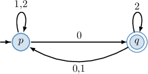
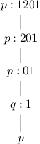
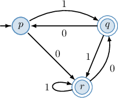
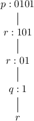
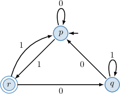
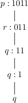
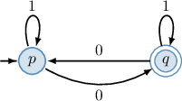
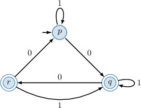

# Processing Strings Using Deterministic Finite Automata

Source: https://www.mathacademy.com/topics/5414?courseId=109
Topic ID: 5414

## Prerequisites

- [Deterministic Finite Automata](./3797-deterministic-finite-automata.md)

## Lesson

### Introduction

In a previous lesson, we claimed that a deterministic finite automaton (DFA) is an **acceptor**—an automaton that processes a sequence of symbols and decides whether to "accept" or "reject" them. In this lesson, we'll explore how a DFA performs this task.

A **string** is a finite sequence of symbols from an **alphabet** $\Sigma$, which is a nonempty finite set. For example, $\textrm{aab}$ is a string on the alphabet $\{\textrm{a}, \textrm{b} \}$, and $\textrm{100a11b}$ is a string on the alphabet $\{\textrm{0}, \textrm{1}, \textrm{a}, \textrm{b} \}$.

Let $\omega = a \beta$ be a string, where $a$ is the first symbol of $\omega$ and $\beta$ is the remainder of $\omega$ after removing the first symbol. Then, starting from the transition function $\delta: Q \times \Sigma \to Q$ of an automaton $A = (Q, \Sigma, \delta, q_0, F)$ whose set of input symbols is the alphabet $\Sigma$, we can extend $\delta$ to a function on strings on the alphabet $\Sigma$ recursively as follows:

$$

\begin{aligned}𝛿(𝑞,𝜀) & =𝑞 \\ 𝛿(𝑞,𝜔) & =𝛿(𝛿(𝑞,𝑎),𝛽)\end{aligned}

$$

where $\varepsilon$ denotes the empty string (the string containing no symbols) and $q$ is a state of an automaton.

To demonstrate, let's find $\delta(p, 1201),$ where $\delta: Q \times \Sigma \to Q$ is the transition function of the DFA represented by the diagram below.

According to the definition of the transition function $\delta,$ for $\omega = 1201$ we obtain the following:

$$

\begin{aligned}𝛿(𝑝,1201) & =𝛿(𝛿(𝑝,1),201) \\ & =𝛿(𝑝,201) \\ & =𝛿(𝛿(𝑝,2),01) \\ & =𝛿(𝑝,01) \\ & =𝛿(𝛿(𝑝,0),1) \\ & =𝛿(𝑞,1) \\ & =𝑝\end{aligned}

$$

Let's describe what is going on in the computations from a slightly different point of view.

- **Step 1.** The automaton is at the start state $p$ and observes the first letter of the string: From the diagram, $\delta(p,1)=p.$ So, the automaton switches to state $p$ (in this case, it does not change the state) and moves to the next letter of the string.

- **Step 2.** The automaton is at the state $p$ and observes the second letter of the string: From the diagram, $\delta(p,2)=p.$ So, the automaton switches to state $p$ (in this case, it does not change the state) and moves to the next letter of the string.

- **Step 3.** The automaton is at the state $p$ and observes the third letter of the string: From the diagram, $\delta(p,0)=q.$ So, the automaton switches to state $q$ and moves to the next letter of the string.

- **Step 4.** The automaton is at the state $q$ and observes the fourth letter of the string: From the diagram, $\delta(q,1)=p.$ So, the automaton switches to state $p$ and stops since the entire string has been processed.

The diagram below summarizes the process. It notes the state of the DFA and the part of the string left to process at each step.

### Example: Applying a Transition Function to a String Given a Diagram

#### Question

Consider the deterministic finite automaton represented by the above diagram. Given that $\delta: Q \times \Sigma \to Q$ is the transition function of the automaton, find $\delta(p, 0101).$

#### Explanation

Let $\omega = a \beta$ be a finite sequence of symbols (a string), where $a$ is the first symbol of $\omega$ and $\beta$ is the remainder of $\omega$ after removing the first symbol.

Then, we can extend the transition function $\delta$ of the automaton to strings recursively as

$$

\begin{aligned}𝛿(𝑞,𝜀) & =𝑞, \\ 𝛿(𝑞,𝜔) & =𝛿(𝛿(𝑞,𝑎),𝛽),\end{aligned}

$$

where $\varepsilon$ denotes the empty string (the string containing no symbols) and $q$ is a state of an automaton.

According to the definition of the transition function $\delta,$ for $\omega = 0101$ we obtain the following:

$$

\begin{aligned}𝛿(𝑝,0101) & =𝛿(𝛿(𝑝,0),101) \\ & =𝛿(𝑟,101) \\ & =𝛿(𝛿(𝑟,1),01) \\ & =𝛿(𝑟,01) \\ & =𝛿(𝛿(𝑟,0),1) \\ & =𝛿(𝑞,1) \\ & =𝑟\end{aligned}

$$

Let's describe what is going on in the computations from a slightly different point of view.

- ** The automaton is at the start state $p$ and observes the first letter of the string: From the diagram, $\delta(p,0)=r.$ So, the automaton switches to state $r$ and moves to the next letter of the string.

- ** The automaton is at the state $r$ and observes the second letter of the string: From the diagram, $\delta(r,1)=r.$ So, the automaton switches to state $r$ (in this case, does not change the state) and moves to the next letter of the string.

- ** The automaton is at the state $r$ and observes the third letter of the string: From the diagram, $\delta(r,0)=q.$ So, the automaton switches to state $q$ and moves to the next letter of the string.

- ** The automaton is at the state $q$ and observes the fourth letter of the string: From the diagram, $\delta(q,1)=r.$ So, the automaton switches to state $r$ and stops since the entire string has been processed.

We can summarize the process in the diagram below.

### Example: Applying a Transition Function to a String Given a Transition Table

#### Question

Consider the deterministic finite automaton represented by the transition table above. Given that $\delta: Q \times \Sigma \to Q$ is the transition function of the automaton, find $\delta(p, 1011).$

#### Explanation

The diagram corresponding to our automaton is shown below.

Let $\omega = a \beta$ be a finite sequence of symbols (a string), where $a$ is the first symbol of $\omega$ and $\beta$ is the remainder of $\omega$ after removing the first symbol.

Then we can extend the transition function $\delta$ of the automaton to strings recursively as

$$

\begin{aligned}𝛿(𝑞,𝜀) & =𝑞, \\ 𝛿(𝑞,𝜔) & =𝛿(𝛿(𝑞,𝑎),𝛽),\end{aligned}

$$

where $\varepsilon$ denotes the empty string (the string containing no symbols) and $q$ is a state of an automaton.

According to the definition of the transition function $\delta,$ for $\omega = 1011$ we obtain the following:

$$

\begin{aligned}𝛿(𝑝,1011) & =𝛿(𝛿(𝑝,1),011) \\ & =𝛿(𝑟,011) \\ & =𝛿(𝛿(𝑟,0),11) \\ & =𝛿(𝑞,11) \\ & =𝛿(𝛿(𝑞,1),1) \\ & =𝛿(𝑞,1) \\ & =𝑞\end{aligned}

$$

We can summarize the process in the diagram below.

### The Language of a DFA

A finite string is **accepted** by a deterministic finite automaton if the automation ends in one of its final states after processing the entire string. Otherwise, the string is rejected. The set of all accepted finite strings is the **language of the DFA**.

For example, consider the two strings $1010$ and $11000.$ Are either of these accepted by the DFA represented by the diagram below?

To find out, let's apply the extended transition function to our strings.

- Processing the string $1010,$ we get: The process terminates at the state $p.$ Since $p$ is not a final (accepting) state, the string $1010$ is rejected.

- Processing the string $11000,$ we get: The process terminates at the state $q.$ Since $q$ is a final (accepting) state, the string $11000$ is accepted.

The language of this DFA consists of all finite strings of $0$'s and $1$'s that contain an odd number of $0$'s.

We begin processing a string in state $p.$ Notice that when the automaton reads a $1,$ the state remains unchanged. However, when it encounters a $0,$ it switches to the accepting state $q.$ If the automaton is in $q$ and processes another $0,$ it transitions back to the non-accepting state $p.$

Therefore, the automaton will end in the accepting state $q$ if and only if the input contains an odd number of $0$'s (since all $1$'s are ignored).

### Example: Identifying Strings Accepted by a DFA

#### Question

Which of the following strings are accepted by the DFA represented by the transition table above?

1. $0001$

2. $1010$

3. $0011$

#### Explanation

The diagram corresponding to our automaton is shown below.

Let's apply the extended transition function to our strings.

- Consider the string $0001{:}$ The process is terminated at the state $p.$ Since $p$ is not a final (accepting) state, the string $0001$ is rejected.

- Consider the string $1010{:}$ The process is terminated at the state $r.$ Since $r$ is a final (accepting) state, the string $1010$ is accepted.

- Consider the string $0011{:}$ The process is terminated at the state $q.$ Since $q$ is a final (accepting) state, the string $0011$ is accepted.

Therefore, the correct answer is "II and III only."
