# Topological Ordering

Source: https://www.mathacademy.com/topics/5432?courseId=109
Topic ID: 5432

## Prerequisites

- [Directed Acyclic Graphs](./1296-directed-acyclic-graphs.md)
- [Connected Graphs](./2756-connected-graphs.md)
- [Proof by Contradiction](../methods-of-proof/3414-proof-by-contradiction.md)
- [Proving Biconditional Statements](../methods-of-proof/4925-proving-biconditional-statements.md)

## Lesson

### Introduction

A **topological ordering** (TO, or **topological sort**) of a directed acyclic graph is a linear ordering of its vertices such that for every directed edge $u \to v$ from vertex $u$ to vertex $v$, $u$ appears before $v$ in the ordering.

Alternatively, a topological ordering of a directed acyclic graph is a linear ordering of its vertices such that, if we arrange the vertices in order from left to right, each vertex has all its successors positioned to the right and all its predecessors to the left. Equivalently, all edges point from left to right.

For example, consider the graph below.

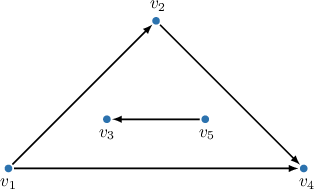

To obtain a topological ordering, the vertices of this graph can be rearranged as follows: $v_1, v_2, v_4, v_5, v_3.$ The image below illustrates this topological ordering.

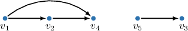

Note:

- A topological ordering is not a new graph but a different visual representation of the same graph.

- Topological orderings are not unique. Graphs usually have multiple topological orderings. For example, a graph with $n$ isolated vertices has $n!$ topological orderings since its vertices can be arranged in any order.

For another example, both images below represent valid topological orderings of the graph above.

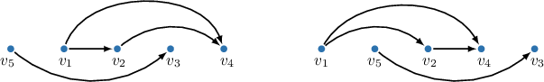

Notice that the two weakly connected components of the initial graph remain disconnected from each other in the topological orderings.

We have the following theorem:

*Theorem (DAG criterion): A directed graph is a directed acyclic graph if and only if it has a topological ordering.*

*Proof:*

*DAG $\Rightarrow$ TO. This direction is proven using ****, which will be discussed in a future topic. The algorithm provides a procedure for constructing a topological ordering for any DAG.*

*DAG $\Leftarrow$ TO. This direction can be proven by contradiction:*

*Suppose a topological ordering (TO) exists, but the graph is not a DAG and contains a cycle.*

*Since the TO exists, it includes all vertices of this cycle. Let $v$ be the first vertex of the cycle in the ordering. By the definition of a cycle, there must be an incoming edge to $v$ from another vertex $u$ within the cycle.*

*However, because this is a topological ordering, $u$ must appear earlier than $v$ in the ordering. This contradicts the assumption that $v$ is the first vertex of the cycle in the ordering.*

*This contradiction implies that our initial assumption is false, and therefore, the graph must be a DAG.*

### Another Example

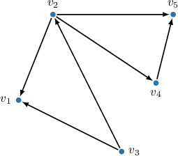

Let's look at another example. Suppose we have the graph shown above and we want to know which of the following options represents topological orderings of the graph.

1. $v_3, v_2, v_1, v_4, v_5$

2. $v_3, v_2, v_4, v_1, v_5$

3. $v_3, v_1, v_2, v_4, v_5$

With that in mind, let's examine the given options.

- Option I is a topological ordering because all edges are directed from a preceding vertex to a succeeding vertex in this list. The corresponding layout of the DAG representing this topological ordering is shown below.

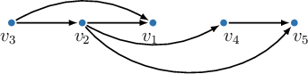

- Option II is a topological ordering because all edges are directed from a preceding vertex to a succeeding vertex in this list. The corresponding layout of the DAG representing this topological ordering is shown below.

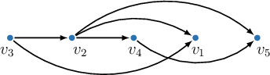

- Option III is *not* a topological ordering because $v_2$ succeeds $v_1,$ but our DAG contains the edge $v_2 \to v_1$ (opposite direction).

Therefore, only options I and II represent topological orderings for the graph.

### Example: Understanding Topological Orderings

#### Question

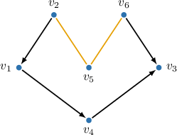

Some edges are depicted without arrows in the directed acyclic graph (DAG) shown above. Add the arrows in such a way that the resulting DAG can represent the following topological ordering:

$$

v_2, \: v_6, \: v_1,\: v_5, \: v_4, \: v_3

$$

#### Explanation

Recall that a ** (TO) of a directed acyclic graph is a linear ordering of its vertices such that for every directed edge $u \to v$ from vertex $u$ to vertex $v$, $u$ appears before $v$ in the ordering.

With that in mind, let's examine the highlighted edges.

- $v_2$ precedes $v_5$ in our TO, hence the first incomplete edge must be $v_2 \to v_5.$

- $v_6$ precedes $v_5$ in our TO, hence the second incomplete edge must be $v_6 \to v_5.$

The graph with restored arrows is shown below.

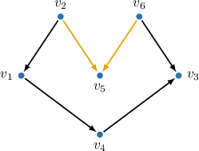

### Example: Identifying Topological Orderings

#### Question

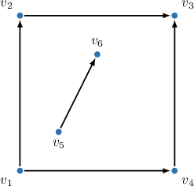

Which of the following represents a topological ordering of the directed acyclic graph shown above?

1. $v_5, v_1, v_4, v_2, v_6, v_3$

2. $v_5, v_4, v_1, v_2, v_6, v_3$

3. $v_6, v_1, v_4, v_2, v_5, v_3$

#### Explanation

Recall that a ** (TO) of a directed acyclic graph (DAG) is a linear ordering of its vertices such that for every directed edge $u \to v$ from vertex $u$ to vertex $v$, $u$ appears before $v$ in the ordering.

With that in mind, let's examine the given options.

- Option I is a topological ordering because all edges are directed from a preceding vertex to a succeeding vertex in this list. The corresponding layout of the DAG representing this topological ordering is shown below. Notice that the two components remain disconnected from each other in the TO image.

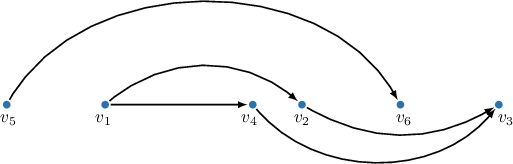

- Option II is ** a topological ordering because $v_4$ precedes $v_1,$ but our DAG contains the edge $v_1 \to v_4$ (opposite direction).

- Option III is ** a topological ordering because $v_6$ precedes $v_5,$ but our DAG contains the edge $v_5 \to v_6$ (opposite direction).

Therefore, the correct answer is "I only."

### Example: Constructing a Topological Ordering by Inspection

#### Question

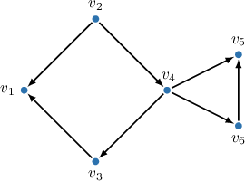

Complete the missing vertices in the topological ordering given for the above graph.

$$

𝑣_{2}

$$

#### Explanation

Recall that a ** (TO) of a directed acyclic graph (DAG) is a linear ordering of its vertices such that for every directed edge $u \to v$ from vertex $u$ to vertex $v$, $u$ appears before $v$ in the ordering.

Alternatively, we can say that in a topological ordering, each vertex must have all its successors positioned to the right and all its predecessors to the left.

Notice that the missing vertices are $v_2, v_3,$ and $v_5,$ and they should be ordered relative to each other.

By inspecting the graph, we can observe the following dependencies:

- The vertex $v_5$ has no successors. Hence, it is the rightmost vertex:

- The vertex $v_2$ has no predecessors. Hence, it is the leftmost vertex:

- The vertex $v_1$ is successor of $v_3.$ Hence, $v_3$ must be positioned to the left of $v_1{:}$

The corresponding layout of the DAG representing this topological ordering is shown below.

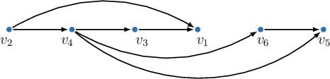

Therefore, the correct positions in the topological ordering are the following:

$$

\boxed{\color{blue}v_2}, \: v_4, \: \: \boxed{\color{blue}v_3} ,\:v_1, \: v_6, \boxed{\color{blue}v_5}

$$

### Practical Applications of Topological Ordering

Topological orderings of DAGs have many real-world applications:

- **Task Scheduling.** DAGs can be used in project management and job scheduling, where each task (job or project) is represented as a vertex, and directed edges indicate dependencies between tasks. For example, given several tasks for different departments in a company and the dependencies between the tasks (which may be represented as a DAG), we can reorder the tasks in topological order to help with project planning.

- **Data Flow Analysis.** DAGs can be used to model computational processes, where each computation module is represented as a vertex, and directed edges indicate the data flow between modules and the order of execution for the calculations. For example, given some cells in a spreadsheet and, for each cell, a list of cells used in its calculations, we can represent this as a DAG and reorder the cells in topological order. This tells us a valid order in which to calculate the output of each cell, ensuring that all cell outputs are calculated before they're needed in other cells.
