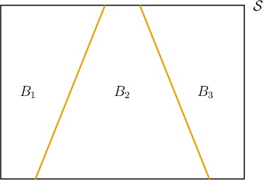
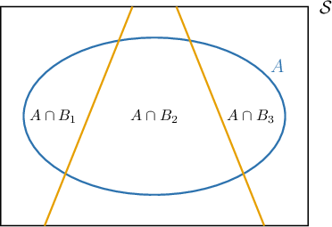

# Extending the Law of Total Probability

Source: https://www.mathacademy.com/topics/971?courseId=109
Topic ID: 971

## Prerequisites

- [The Law of Total Probability](./773-the-law-of-total-probability.md)

## Lesson

### Introduction

Suppose that three events, $B_1, B_2,$ and $B_3,$ exist within a sample space $\mathcal S$ such that

- $B_1, B_2,$ and $B_3$ are *mutually exclusive*, and

- the events $B_1, B_2,$ and $B_3$ cover the *entire* sample space.

When these two conditions are satisfied, we say that $\mathcal S$ is the **disjoint union** of $B_1, B_2,$ and $B_3,$ and we write

$$

\mathcal S = B_1 \sqcup B_2 \sqcup B_3.

$$

A diagram of this situation is shown below. Notice that $B_1, B_2,$ and $B_3$ cover the entire diagram but do not overlap.

Now suppose that we wish to compute the probability of an event $A$ that lies within $\mathcal S.$ Let's draw this event on our diagram and label its intersections with $B_1, B_2, B_3\mathbin{:}$

The **law of total probability** can be deduced from this diagram. It states that

$$

\begin{aligned}𝑃(𝐴) & =𝑃(𝐴∩𝐵_{1})+𝑃(𝐴∩𝐵_{2})+𝑃(𝐴∩𝐵_{3}).\end{aligned}

$$

In this lesson, we will only consider a disjoint union of $\mathcal S$ consisting of three events. However, it should be noted that the law of total probability can be extended to an arbitrary number of events, that is

$$

\begin{aligned}𝑃(𝐴) & =𝑃(𝐴∩𝐵_{1})+𝑃(𝐴∩𝐵_{2})+⋯ \\ & =\underset{𝑖}{∑}𝑃(𝐴∩𝐵_{𝑖})\end{aligned}

$$

where $\mathcal S = B_1 \sqcup B_2\sqcup \ldots$ is a disjoint union of $\mathcal S.$

### A Worked Example

Suppose that a particular garden is divided into three small plots. There are $10$ roses in the first plot, of which $5$ are red, $12$ roses in the second plot, of which $6$ are red, and $14$ roses in the third plot, of which $4$ are red. What is the probability that a randomly selected rose from the garden is red?

Let $A$ be the event that a chosen rose is red, and

- let $B_1$ be the event that the selected rose comes from the first plot,

- let $B_2$ be the event that the selected rose comes from the second plot,

- let $B_3$ be the event that the selected rose comes from the third plot.

Notice that the disjoint union

$$

B_1\sqcup B_2\sqcup B_3

$$

covers the entire sample space, and that there are a total of

$$

10+12+14=36

$$

roses in the garden.

- To calculate $P(A \cap B_1),$ we take the number of red roses in the first plot $(5)$ and divide by the total number of roses $(36).$ So, we have

- To calculate $P(A \cap B_2),$ we take the number of red roses in the second plot $(6)$ and divide by the total number of roses $(36).$ So, we have

- To calculate $P(A \cap B_3),$ we take the number of red roses in the third plot $(4)$ and divide by the total number of roses $(36).$ So, we have

So, to calculate the probability that a randomly chosen rose is red, we use the law of total probability:

$$

\begin{aligned}𝑃(𝐴) & =𝑃(𝐴∩𝐵_{1})+𝑃(𝐴∩𝐵_{2})+𝑃(𝐴∩𝐵_{3}) \\ & =\frac{5}{36}+\frac{6}{36}+\frac{4}{36} \\ & =\frac{15}{36} \\ & =\frac{5}{12}.\end{aligned}

$$

Note the following:

- You may have noticed that there is an easier way to solve this problem. That is, to sum the total number of red roses $(5+6+4 = 15)$ and divide by the total number of roses $(10+12+14 = 36).$ However, you're encouraged to work with the law of total probability as it's essential to get used to the concept.

- A little later in this lesson, we'll work with a version of the law of total probability that isn't intuitive. Understanding the law of total probability in its simplest form will help when things get trickier.

Let's see another example.

### Example: Applying the Law of Total Probability

#### Question

A store has $40$ employees, of which $21$ are female. The store is divided into three departments, $A, B,$ and $C.$ There are $7$ female workers in department $A,$ while there are $8$ female workers in department $C.$ What is the probability that a randomly selected store worker is a female that works in department $B?$

#### Explanation

Let $F$ be the event that the chosen worker is a female, and

- let $A$ be the event that the selected worker works department $A,$

- let $B$ be the event that the selected worker works department $B,$

- let $C$ be the event that the selected worker works department $C.$

Then the disjoint union $A \sqcup B \sqcup C$ covers the entire sample space.

Recall that the law of total probability states that

$$

P(F) = P(F \cap A) + P(F \cap B) + P(F \cap C).

$$

We wish to find $P(F \cap B)\mathbin{:}$

- To calculate $P(F \cap A),$ we take the number of females who work in department $A$ $(7)$ and divide by the total number of workers $(40).$ So, we have

- To calculate $P(F \cap C),$ we take the number of females who work in department $C$ $(8)$ and divide by the total number of workers $(40).$ So, we have

- Also, we're given that

Finally, substituting the above information into the law of total probability and solving for $P(F \cap B),$ we have

$$

\begin{aligned}𝑃(𝐹) & =𝑃(𝐹∩𝐴)+𝑃(𝐹∩𝐵)+𝑃(𝐹∩𝐶) \\ \frac{21}{40} & =\frac{7}{40}+𝑃(𝐹∩𝐵)+\frac{8}{40} \\ 𝑃(𝐹∩𝐵) & =\frac{21}{40}−\frac{7}{40}−\frac{8}{40}. \\ 𝑃(𝐹∩𝐵) & =\frac{6}{40} \\ 𝑃(𝐹∩𝐵) & =\frac{3}{20}.\end{aligned}

$$

### The Law of Total Probability in Terms of Conditional Probability

The law of total probability states that

$$

P(A) = P(A\cap B_1) + P(A\cap B_2) + P(A\cap B_3),

$$

where $B_1\sqcup B_2\sqcup B_3$ is a disjoint union of the sample space $\mathcal S.$

Often, it's more helpful to express this law using conditional probabilities.

From the multiplication law for conditional probability, we have

$$

\begin{aligned}𝑃(𝐴∩𝐵_{1}) & =𝑃(𝐴|𝐵_{1})𝑃(𝐵_{1}) \\ 𝑃(𝐴∩𝐵_{2}) & =𝑃(𝐴|𝐵_{2})𝑃(𝐵_{2}) \\ 𝑃(𝐴∩𝐵_{3}) & =𝑃(𝐴|𝐵_{3})𝑃(𝐵_{3}).\end{aligned}

$$

Substituting the above form into the law of total probability, we get

$$

P(A) = P(A|B_1)P(B_1)+ P(A|B_2)P(B_2) + P(A|B_3)P(B_3).

$$

Let's see an example of how to apply this.

### Example: Applying the Law of Total Probability in Terms of Conditional Probability

#### Question

Three factories produce the same spare part for a particular car model. Factory ${A}$ produces $32\%$ of the overall parts, of which $1.5\%$ are defective. Factory ${B}$ produces $33\%$ of the overall parts, of which $2\%$ are defective, and Factory ${C}$ produces $35\%$ of the overall parts, of which $1.4\%$ are defective. If one car part is selected randomly, what is the probability that it is defective?

#### Explanation

Let $D$ be the event that a randomly selected part is defective, and

- let $A$ be the event that the selected part was produced by Factory ${A},$

- let $B$ be the event that the selected part was produced by Factory ${B},$

- let $C$ be the event that the selected part was produced by Factory ${C}.$

Then the disjoint union $A \sqcup B \sqcup C$ covers the entire sample space.

To calculate the probability that a randomly selected part is defective, we can use the law of total probability:

$$

\begin{aligned}𝑃(𝐷) & =𝑃(𝐷∩𝐴)+𝑃(𝐷∩𝐵)+𝑃(𝐷∩𝐶) \\ & =𝑃(𝐷|𝐴)𝑃(𝐴)+𝑃(𝐷|𝐵)𝑃(𝐵)+𝑃(𝐷|𝐶)𝑃(𝐶)\end{aligned}

$$

Let's go through the problem statement and translate each piece of information into mathematical notation.

- Since Factory ${A}$ produces $32\%$ of the parts, Factory ${B}$ produces $33 \%$ of the parts, and Factory ${C}$ produces $35 \%$ of the parts, we have

- Since $1.5\%$ of the parts produced by Factory ${A},$ $2\%$ of the parts produced by Factory ${B},$ and $1.4\%$ of the parts produced by Factory ${C}$ are defective, we have

Substituting the above information into the law of total probability, the probability that a randomly selected part is defective is

$$

\begin{aligned}𝑃(𝐷) & =𝑃(𝐷|𝐴)𝑃(𝐴)+𝑃(𝐷|𝐵)𝑃(𝐵)+𝑃(𝐷|𝐶)𝑃(𝐶) \\ & =(0.015)(0.32)+(0.02)(0.33)+(0.014)(0.35) \\ & =0.004\,8+0.006\,6+0.004\,9 \\ & =0.016\,3.\end{aligned}

$$

### Example: Finding a Conditional Probability Using the Law of Total Probability

#### Question

Three baskets, $A, B,$ and $C,$ contain apples. It is known that $\dfrac25$ of the apples in basket $A$ and $\dfrac14$ of the apples in basket $B$ are red. A basket is selected at random, and an apple is randomly chosen from the basket. If the probability that the selected apple is red is $\dfrac13,$ what proportion of the apples from basket $C$ are red?

#### Explanation

Let $R$ be the event that the selected apple is red, and

- let $A$ be the event that the selected apple is from basket ${A},$

- let $B$ be the event that the selected apple is from basket ${B},$

- let $C$ be the event that the selected apple is from basket ${C}.$

Then the disjoint union $A \sqcup B \sqcup C$ covers the entire sample space.

To calculate the probability of selecting a red apple, we can use the law of total probability:

$$

\begin{aligned}𝑃(𝑅) & =𝑃(𝑅∩𝐴)+𝑃(𝑅∩𝐵)+𝑃(𝑅∩𝐶) \\ & =𝑃(𝑅|𝐴)𝑃(𝐴)+𝑃(𝑅|𝐵)𝑃(𝐵)+𝑃(𝑅|𝐶)𝑃(𝐶)\end{aligned}

$$

Let's go through the problem statement and translate each piece of information into mathematical notation.

- Since a basket is randomly selected and there are $3$ baskets, we have

- Since $\dfrac25$ of the apples in basket $A$ and $\dfrac14$ of the apples in basket $B$ are red, we have

- Since the probability of picking a red apple from any of the three baskets is $\dfrac13,$ we have

Substituting the above information into the law of total probability and solving for $P(R|C),$ we get

$$

\begin{aligned}𝑃(𝑅) & =𝑃(𝑅|𝐴)𝑃(𝐴)+𝑃(𝑅|𝐵)𝑃(𝐵)+𝑃(𝑅|𝐶)𝑃(𝐶) \\ \frac{1}{3} & =(\frac{2}{5})(\frac{1}{3})+(\frac{1}{4})(\frac{1}{3})+𝑃(𝑅|𝐶)(\frac{1}{3}) \\ \frac{1}{3} & =\frac{2}{15}+\frac{1}{12}+\frac{1}{3}⋅𝑃(𝑅|𝐶) \\ \frac{1}{3}⋅𝑃(𝑅|𝐶) & =\frac{1}{3}−\frac{2}{15}−\frac{1}{12} \\ \frac{1}{3}⋅𝑃(𝑅|𝐶) & =\frac{7}{60} \\ 𝑃(𝑅|𝐶) & =\frac{7}{20}.\end{aligned}

$$

Therefore, $\dfrac{7}{20}$ of the apples from basket $C$ are red.
