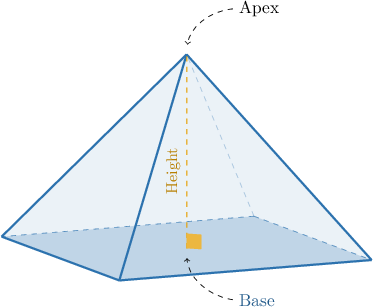
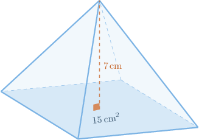
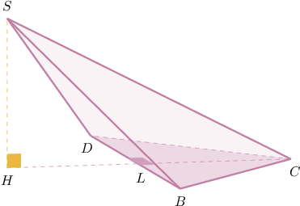
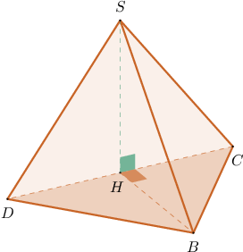
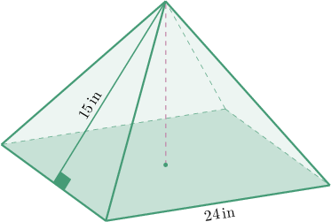
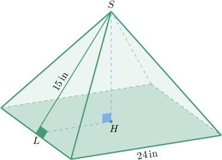

# Volumes of Pyramids

Source: https://www.mathacademy.com/topics/1035?courseId=126
Topic ID: 1035

## Prerequisites

- [The Pythagorean Theorem](./433-the-pythagorean-theorem.md)
- [Areas of Triangles](../prealgebra/1397-areas-of-triangles.md)
- [Faces, Vertices, and Edges of Polyhedrons](./2484-faces-vertices-and-edges-of-polyhedrons.md)

## Lesson

### Introduction

A pyramid is a polyhedron whose base is a polygon, while its lateral faces are triangles.

Consider the rectangular pyramid below.

A pyramid's **altitude** (or **height**) is the line segment perpendicular to the base and connects the base to the **apex** (shown above).

The volume $V$ of the pyramid is given by

$$

V = \dfrac{1}{3}Ah

$$

where $A$ is the area of the base, and $h$ is the height.

For example, suppose the base area of a pyramid is $12 \, \textrm{in}^2$ and its altitude is $4 \, \textrm{in}.$ Substituting

$$

A=12\,\textrm{in}^2, \qquad h=4\,\textrm{in}

$$

into the formula for $V,$ we get

$$

V = \dfrac{1}{3} (12) (4) = 16 \: \text{in}^3.

$$

### Example: Finding the Volume of a Pyramid Given its Base Area and Height

#### Question

Determine the volume of the pyramid shown below.

#### Explanation

We can find the volume of a pyramid using the formula

$$

V = \dfrac{1}{3}Ah,

$$

where $A$ is the area of the base and $h$ is the altitude of the pyramid.

Substituting $A=15\,\textrm{cm}^2$ and $h=7\,\textrm{cm}$ into the formula, we get

$$

V = \dfrac{1}{3} (15) (7) = 35 \: \text{cm}^3.

$$

### Example: Finding the Volume of a Pyramid Given its Dimensions

#### Question

Consider the pyramid $SBCD$ below, where $\triangle{BCD}$ is the base and $\overline{SH}$ is the altitude. Find the volume of the pyramid given that $BD=9\,\textrm{in},$ $CL=7\,\textrm{in},$ and $SH=8\,\textrm{in}.$

#### Explanation

We can find the volume of a pyramid using the formula

$$

V = \dfrac{1}{3}Ah,

$$

where $A$ is the area of the base and $h$ is the altitude of the pyramid.

Now, notice the following:

- We are told that $\overline{SH}$ is the altitude of the pyramid. So, we have

- The line segment $\overline{CL}$ is the height of $\triangle{BCD}$ corresponding to the side $\overline{BD}.$ So, we compute the area of $\triangle{BCD}$ as

Finally, substituting $A= \dfrac{63}{2}\,\textrm{in}^2$ and $h=8\,\textrm{in}$ into the formula, we get

$$

V = \dfrac{1}{3} \left( \dfrac{63}{2}\right) (8) = 84 \: \text{in}^3.

$$

### Example: Finding the Dimensions of a Pyramid Given its Volume

#### Question

Consider the pyramid $SBCD$ below, where $\triangle{BCD}$ is the base and $\overline{SH}$ is the altitude. Find $SH$ given that the volume of the pyramid is $385 \, \textrm{cm}^3,$ $BH = 10 \, \textrm{cm},$ and $CD=21\,\textrm{cm}.$

#### Explanation

Recall that we can find the volume of a pyramid using the formula

$$

V = \dfrac{1}{3}Ah,

$$

where $A$ is the area of the base and $h$ is the altitude of the pyramid.

Notice that $\overline{BH}$ is the height of $\triangle{BCD}$ corresponding to the side $\overline{CD}.$ So, we compute the area of $\triangle{BCD}$ as

$$

\begin{aligned}𝐴 & =\frac{𝐵𝐻⋅𝐶𝐷}{2} \\ & =\frac{10⋅21}{2} \\ & =105\,cm^{2}.\end{aligned}

$$

Next, we substitute

$$

V = 385 \, \textrm{cm}^3, \qquad A = 105 \, \textrm{cm}^2

$$

into the formula for $V$ and solve for $h,$ as follows:

$$

\begin{aligned}𝑉 & =\frac{1}{3}𝐴ℎ \\ 385 & =\frac{1}{3}(105)ℎ \\ 385 & =35ℎ \\ ℎ & =11\end{aligned}

$$

Therefore, $SH=h=11 \, \textrm{cm}.$

### Example: Finding the Volume of a Pyramid Using the Pythagorean Theorem

#### Question

Consider the pyramid above, where the base is a square, and the height passes through the center of the base. Find the volume of the pyramid.

#### Explanation

We can find the volume of a pyramid using the formula

$$

V = \dfrac{1}{3}Ah,

$$

where $A$ is the area of the base and $h$ is the altitude of the pyramid.

Notice that $\triangle{SHL}$ is a right triangle, and

$$

HL = \dfrac{24}{2} = 12 \, \textrm{in}.

$$

Using the Pythagorean theorem, we obtain the following:

$$

\begin{aligned}𝑆𝐻^{2}+𝐻𝐿^{2} & =𝑆𝐿^{2} \\ 𝑆𝐻^{2}+(12)^{2} & =(15)^{2} \\ 𝑆𝐻^{2}+144 & =225 \\ 𝑆𝐻^{2} & =81 \\ 𝑆𝐻 & =9\,in\end{aligned}

$$

The area of the base is given by

$$

A = 24^2 = 576 \, \textrm{in}^2.

$$

Therefore, the volume is

$$

V = \dfrac{1}{3}(576)(9)= 1\,728 \, \textrm{in}^3.

$$
