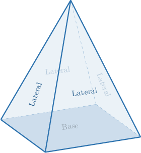
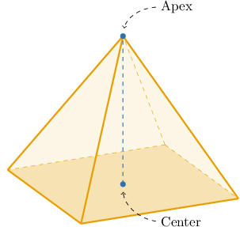
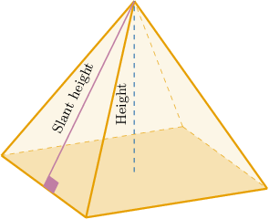
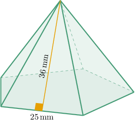
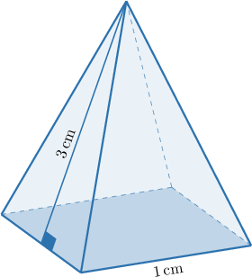
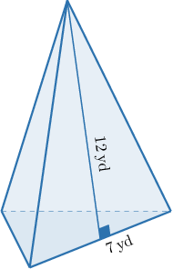

# Surface Areas of Pyramids

Source: https://www.mathacademy.com/topics/1068?courseId=126
Topic ID: 1068

## Prerequisites

- [Regular Polygons](../prealgebra/1322-regular-polygons.md)
- [Faces, Vertices, and Edges of Polyhedrons](./2484-faces-vertices-and-edges-of-polyhedrons.md)
- [The Area of an Equilateral Triangle](./2886-the-area-of-an-equilateral-triangle.md)

## Lesson

### Introduction

The lateral faces of a pyramid include all faces except the base.

The total surface area $(S)$ of a pyramid equals the sum of the lateral surface area $(S_L)$ and the base area $(S_B)\mathbin{:}$

$$

S = S_L + S_B

$$

For example, suppose the total surface area of a rectangular pyramid is $100 \, \textrm{in}^2$ and its base area is $36 \, \textrm{in}^2.$ What is the lateral surface area of this pyramid?

We are given that

$$

S = 100 \, \textrm{in}^2, \qquad S_B = 36 \, \textrm{in}^2.

$$

Therefore, we can compute the lateral surface area as follows:

$$

\begin{aligned}𝑆_{𝐿} & =𝑆−𝑆_{𝐵} \\ & =100−36 \\ & =64\,in^{2}\end{aligned}

$$

### Example: The Lateral Surface Area of a Pyramid

#### Question

Consider a square pyramid where all faces that make up the lateral surface have the same area. Given that the total surface area of the pyramid is $48 \, \textrm{yd}^2$ and the base area is $20 \, \textrm{yd}^2,$ find the area of a single face on the lateral surface.

#### Explanation

The total surface area $(S)$ of a pyramid equals the sum of the lateral surface area $(S_L)$ and the base area $(S_B)$ of the pyramid:

$$

S = S_L + S_B

$$

We are given that

$$

S = 48 \, \textrm{yd}^2, \qquad S_B = 20 \, \textrm{yd}^2.

$$

So, we can compute the lateral surface area as follows:

$$

\begin{aligned}𝑆_{𝐿} & =𝑆−𝑆_{𝐵} \\ & =48−20 \\ & =28\,yd^{2}\end{aligned}

$$

Since our pyramid is square-based, $4$ triangular faces make up the lateral surface. Also, since each lateral face has the same area, we can find the area of each face by dividing the lateral surface area by $4{:}$

$$

\dfrac{S_L}{4} = \dfrac{28}{4} = 7 \, \textrm{yd}^2

$$

### Regular Pyramids

A **regular pyramid** is a pyramid whose base is a regular polygon, and the **apex** lies directly above the center of the base.

For example, a regular square-based pyramid has a square as its base, and its apex lies directly above the center of the square (on the intersection of the square's diagonals).

Similarly, we can have regular triangular pyramids (with an equilateral triangle as the base), regular pentagonal pyramids (with a regular pentagon as the base), regular hexagonal pyramids, and so on.

The height of a lateral face is called the **slant height** of a pyramid.

### Example: The Lateral Surface Area of a Regular Pyramid

#### Question

Find the lateral surface area of the regular pentagonal pyramid shown above.

#### Explanation

First, we find the area of one face that makes up the lateral surface. Each face is a triangle with a base of $25\,\textrm{mm}$ and a height of $36\,\textrm{mm}.$ So, its area is given by

$$

A = \dfrac{1}{2} \cdot 25 \cdot 36 = 450 \, \textrm{mm}^2.

$$

Our pyramid has $5$ such faces on its lateral surface. Therefore, the lateral surface area of the pyramid is

$$

S_L = 5A = 5 \cdot 450 = 2\,250 \, \textrm{mm}^2.

$$

### The Formula for the Lateral Surface Area of a Regular Pyramid

We can find the lateral surface area of a regular pyramid using the formula

$$

S_L = \dfrac{1}{2} p l,

$$

where $p$ is the base's perimeter and $l$ is the pyramid's slant height.

For example, consider the square pyramid shown below.

We're given that the side length $s = 1 \, \textrm{cm}.$ Therefore, its perimeter is equal to

$$

\begin{aligned}𝑝 & =4𝑠=4(1)=4\,cm.\end{aligned}

$$

Now, substituting $p = 4 \, \textrm{cm}$ and $l = 3 \, \textrm{cm}$ into the formula for $S_L,$ we get

$$

S_L = \dfrac{1}{2}(4)(3) = 6 \, \textrm{cm}^2.

$$

Since the base of our pyramid is a square, we have

$$

S_B = s^2 = 1^2 = 1 \, \textrm{cm}^2.

$$

Finally, the total surface area of the pyramid is

$$

\begin{aligned}𝑆 & =𝑆_{𝐿}+𝑆_{𝐵} \\ & =6+1 \\ & =7\,cm^{2}.\end{aligned}

$$

### Example: Finding the Lateral Surface Area of a Regular Pyramid Using Perimeter of the Base

#### Question

Find the lateral surface area of a regular pentagonal pyramid if its slant height is $8 \, \textrm{m}$ and the side length of the base is $9 \, \textrm{m}.$

#### Explanation

We can find the lateral surface area of a regular pyramid using the formula

$$

S_L = \dfrac{1}{2} p l,

$$

where $p$ is the base's perimeter and $l$ is the pyramid's slant height.

Given the side $s = 9 \, \textrm{m}$ of the regular pentagonal base, its perimeter is equal to

$$

\begin{aligned}𝑝 & =5𝑠=5(9)=45\,m.\end{aligned}

$$

Finally, substituting

$$

p = 45 \, \textrm{m}, \qquad l = 8 \, \textrm{m}

$$

into the formula, we get

$$

S_L = \dfrac{1}{2}(45)(8) = 180 \, \textrm{m}^2.

$$

### Example: Finding the Total Surface Area of a Regular Pyramid

#### Question

Find the total surface area of a regular triangular pyramid if its slant height is $12 \, \textrm{yd}$ and the length of the base side is $7 \, \textrm{yd}.$

#### Explanation

The total surface area $(S)$ of a pyramid equals the sum of the lateral surface area $(S_L)$ and the base area $(S_B)$ of the pyramid:

$$

S = S_L + S_B

$$

With this in mind, let's find $S_L$ and $S_B$ in turn.

- We can find the lateral surface area of a regular pyramid using the formula where $p$ is the base's perimeter and $l$ is the pyramid's slant height. Given the side $s = 7 \, \textrm{cm}$ of the regular (equilateral) triangular base, its perimeter is equal to Now, substituting $p = 21 \, \textrm{yd}$ and $l = 12 \, \textrm{yd}$ into the formula, we get

- The base of the triangular pyramid is an equilateral triangle. In our cases, it's a triangle with side length $s = 7 \, \textrm{yd}.$ So, we have

Finally, the total surface area of the pyramid is

$$

\begin{aligned}𝑆 & =𝑆_{𝐿}+𝑆_{𝐵} \\ & =(126+\frac{49\sqrt{√3}}{4})\,yd^{2}.\end{aligned}

$$
