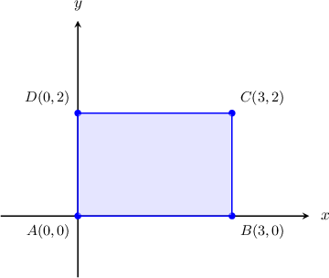
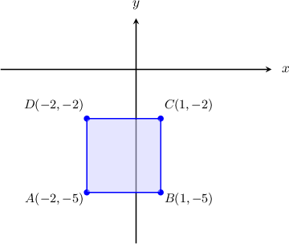
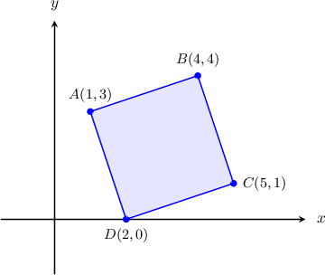

# Calculating Areas of Rectangles in the Plane

Source: https://www.mathacademy.com/topics/1478?courseId=126
Topic ID: 1478

## Prerequisites

- [The Distance Formula](./459-the-distance-formula.md)
- [Diagonals of Squares](./2887-diagonals-of-squares.md)

## Lesson

### Introduction

Suppose we have a rectangle with vertices $A(0,0),$ $B(3,0),$ $C(3,2),$ and $D(0,2),$ as shown below. How can we calculate its area?

If we find the lengths of the sides of the rectangle, then the area $\mathcal A$ of a rectangle is simply the product of the sides.

$$

\mathcal{A} = AB\cdot BC

$$

Since $\overline{AB}$ is horizontal, the length of this segment is simply the absolute value of the difference between the $x$-coordinates of the endpoints:

$$

AB = |x_B - x_A| = |3-0|=3

$$

Similarly, since $\overline{AD}$ is vertical, the length of this segment is simply the absolute value of the difference between the $y$-coordinates of the endpoints:

$$

AD = |y_D - y_A| = |2-0| = 2

$$

Therefore, the area of our rectangle is

$$

\mathcal{A} = 3\cdot 2 = 6.

$$

Let's now take a look at a similar example with a square.

### Example: Calculating the Area of a Square

#### Question

Sketch the square $ABCD$ with vertices $A(-2,-5),$ $B(1,-5),$ $C(1,-2),$ $D(-2,-2)$ in the coordinate plane, and calculate the area of the square.

#### Explanation

Let's plot the square using the given coordinates.

To calculate the area of the square, we need to find the length of its sides.

Since this square has horizontal and vertical sides, we can calculate the length of $\overline{AB}$ as follows:

$$

\begin{aligned}𝐴𝐵 & =|𝑥_{𝐵}−𝑥_{𝐴}| \\ & =|1−(−2)| \\ & =3\end{aligned}

$$

Therefore, the area of the square is

$$

\mathcal{A} = AB^2 = 3^2 = 9.

$$

### Using the Distance Formula

When the sides of a rectangle or square in the plane are *not* horizontal and vertical, we must use the distance formula to calculate the side lengths.

Recall that the distance $d$ between two points $A$ and $B$ with coordinates $(x_A, y_A)$ and $(x_B, y_B)$ respectively is given by

$$

d = \sqrt{(x_B - x_A)^2 + (y_B - y_A)^2}.

$$

Let's see how to apply this to compute areas of squares.

### Example: Calculating the Area of a Square Using the Distance Formula

#### Question

Sketch the square $ABCD$ with vertices $A(1,3),$ $B(4,4),$ $C(5,1),$ and $D(2,0)$ in the coordinate plane, and find the area of the square.

#### Explanation

Let's plot the square $ABCD\mathbin{:}$

To calculate the area of the square, we need to find the length of its side. For example, the length of the side $\overline{BC}$ can be found using the distance formula, as follows:

$$

\begin{aligned}𝐵𝐶 & =\sqrt{√(𝑥_{𝐶}−𝑥_{𝐵})^{2}+(𝑦_{𝐶}−𝑦_{𝐵})^{2}} \\ & =\sqrt{√(5−4)^{2}+(1−4)^{2}} \\ & =\sqrt{√1+9} \\ & =\sqrt{√10}\end{aligned}

$$

Therefore, the area of the square is

$$

\mathcal{A} = BC^2 = (\sqrt{10})^2 = 10.

$$

### Example: Calculating the Area of a Rectangle Using the Distance Formula

#### Question

The points $A(1,1)$ and $B(9,-5)$ are two consecutive vertices of a rectangle $ABCD.$ Given that $AB = 4 BC,$ what is the area of the rectangle?

#### Explanation

Since we are given two consecutive vertices, we find the length of the side $\overline{AB}$ using the distance formula, as follows:

$$

\begin{aligned}𝐴𝐵 & =\sqrt{√(𝑥_{𝐵}−𝑥_{𝐴})^{2}+(𝑦_{𝐵}−𝑦_{𝐴})^{2}} \\ & =\sqrt{√(9−1)^{2}+(−5−1)^{2}} \\ & =\sqrt{√64+36} \\ & =\sqrt{√100} \\ & =10\end{aligned}

$$

Now, since $AB=4BC,$ we obtain

$$

\begin{aligned}𝐵𝐶 & =\frac{𝐴𝐵}{4} \\ & =\frac{10}{4} \\ & =\frac{5}{2}.\end{aligned}

$$

Therefore, the area of the rectangle is

$$

\begin{aligned}A & =𝐴𝐵⋅𝐵𝐶 \\ & =10⋅\frac{5}{2} \\ & =25.\end{aligned}

$$

### Example: Calculating the Area of a Square Given Two Opposite Vertices

#### Question

Given that $A(1,2)$ and $C(-1,3)$ are the coordinates of two opposite vertices of a square $ABCD,$ what is the area of the square?

#### Explanation

We need to calculate the measure of the sides of the square. To do that, we first calculate the measure of the diagonal $\overline{AC}\mathbin{:}$

$$

\begin{aligned}𝐴𝐶 & =\sqrt{√(𝑥_{𝐶}−𝑥_{𝐴})^{2}+(𝑦_{𝐶}−𝑦_{𝐴})^{2}} \\ & =\sqrt{√(−1−1)^{2}+(3−2)^{2}} \\ & =\sqrt{√4+1} \\ & =\sqrt{√5}\end{aligned}

$$

The diagonal $d$ and the side length $s$ of a square are related by the formula

$$

s = \dfrac{d}{\sqrt 2}.

$$

In our case, we obtain

$$

s = \dfrac{AC}{\sqrt{2}} = \dfrac{\sqrt{5}}{\sqrt{2}} .

$$

Therefore, the area of the square is

$$

\begin{aligned}A & =𝑠^{2}=(\frac{\sqrt{√5}}{\sqrt{√2}})^{2}=\frac{5}{2}.\end{aligned}

$$
