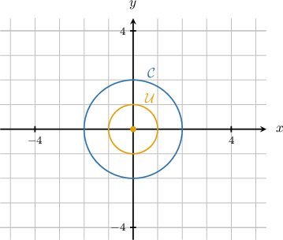
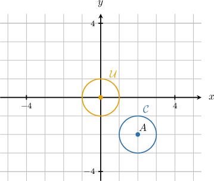
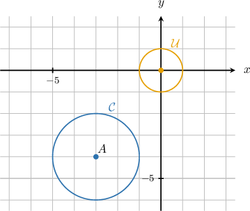

# Proving Circle Similarity

Source: https://www.mathacademy.com/topics/1497?courseId=126
Topic ID: 1497

## Prerequisites

- [Circle Similarity](./1503-circle-similarity.md)
- [Proving Alternate Angle Theorems](./5488-proving-alternate-angle-theorems.md)

## Lesson

### Introduction

Our goal for this lesson is to prove the following theorem:

*All circles are similar.*

First, we define the **unit circle**.

*The unit circle is a circle of radius centered at the origin.*

Throughout this lesson, we'll denote the unit circle with the symbol (curly-).

Now, consider the following diagram, which shows the unit circle and a circle of radius centered at the origin

We want to prove that is similar to

Recall that two geometric figures are similar if there exists a sequence of similarity transformations (translations, rotations, reflections, and dilations) that map one figure onto another.

So, we begin our proof as follows:

*To prove that is similar to we construct a sequence of similarity transformations that map onto*

We can map onto using a dilation of scale factor and center.

*A dilation of scale factor and center maps the circle onto the circle*

This proves that is similar to So, we state our conclusion:

*Therefore,*

Now that we've figured out the details, let's write down the full proof.

### Stating the Full Proof

The diagram shows a circle of radius centered at the origin and the unit circle

*Claim:*

*Proof:*

*To prove that is similar to we construct a sequence of similarity transformations that map onto*

*A dilation of scale factor and center maps the circle onto the circle*

*Therefore,*

Let's take a look at another example.

### Example: Proving a Circle is Similar to the Unit Circle: One Transformation Only

#### Question

The diagram above shows a circle of radius centered at and the unit circle centered at the origin Prove that is similar to

#### Explanation

Two geometric figures are similar if there exists a sequence of similarity transformations (translations, rotations, reflections, and dilations) that map one figure onto another.

We'll use a constructive proof to show that the circles are similar. So, start as follows:

To prove that is similar to we construct a sequence of similarity transformations that map onto

We translate our circle so that its center is at the origin of the coordinate system.

A translation of units left and units up maps the circle onto the circle

This proves that is similar to So, we state our conclusion:

Therefore,

### The Reflexive, Symmetric, and Transitive Properties of Similarity

So far, we've proved that a circle $\mathcal C$ is similar to the unit circle $\mathcal U$ in cases involving just a single similarity transformation.

Before we move on to more complex cases, we note that similarity in two-dimensional figures possesses the properties of reflexivity, symmetricity, and transitivity.

More formally, suppose that $\mathcal F_1, \mathcal F_2,$ and $\mathcal F_3$ are two-dimensional geometric figures. Then, the following properties hold:

- The **reflexive** property of similarity: This states that every figure is similar to itself.

- The **symmetric** property of similarity: This states that if the first figure is similar to the second, the second must be similar to the first.

- The **transitive** property of similarity: This states that if the first figure is similar to the second, and the second is similar to the third, the first must be similar to the third.

Let's see how these properties are used to prove that a circle is similar to the unit circle in cases where two similarity transformations are needed.

### Example: Proving a Circle is Similar to the Unit Circle

#### Question

The diagram above shows a circle of radius centered at and the unit circle centered at the origin Prove that is similar to

#### Explanation

Two geometric figures are similar if there exists a sequence of similarity transformations (translations, rotations, reflections, and dilations) that map one figure onto another.

We'll use a constructive proof to show that the circles are similar. So, start as follows:

To prove that is similar to we construct a sequence of similarity transformations that map onto

We first translate our circle so that its center is at the origin of the coordinate system.

First, a translation of units right and units up maps the circle onto the circle with center and radius

Next, we scale the new circle so that its radius equals

Then, a dilation of scale factor and center maps the circle onto the circle

Since and we have by the transitive property of similarity. So, finally, we state our conclusion:

The sequence of transformations map onto Therefore,

### A Strategy for Proving Circle Similarity

To prove that *any* two circles $\mathcal C_1$ and $\mathcal C_2$ are similar, we can use the following strategy:

- **Step 1:** Find a similarity transformation that maps $\mathcal C_1$ onto $\mathcal U.$ This shows that $\mathcal C_1 \sim \mathcal U.$

- **Step 2:** Find a similarity transformation that maps $\mathcal C_2$ onto $\mathcal U.$ This shows that $\mathcal C_2 \sim \mathcal U.$

- **Step 3:** Since similarity is *symmetric*, we can write the similarity statement from step 2 as $\mathcal U \sim \mathcal C_2.$

- **Step 4:** Since $\mathcal C_1 \sim \mathcal U$ and $\mathcal U \sim \mathcal C_2,$ by the transitive property of similarity, we have $\mathcal C_1 \sim\mathcal C_2,$ as required.

Let's see an example.

### Example: Proving That Two Circles are Similar

#### Question

Consider a circle $\mathcal{C}_1$ of radius $\dfrac{1}{2}$ centered at $A(5,7)$ and a circle $\mathcal{C}_2$ of radius $3$ centered at $B(-6,-2).$ Prove that $\mathcal{C}_1$ and $\mathcal{C}_2$ are similar.

#### Explanation

We start by showing that both circles are similar to the unit circle. To do this, we construct a sequence of similarity transformations for each circle that map each of them onto $\mathcal U.$

First, we consider the circle $\mathcal{C}_1{:}$

First, we'll show that

$$

\mathcal{C}_1\sim\mathcal U.

$$

For the circle $\mathcal{C}_1$ of radius $\dfrac{1}{2}$ centered at $A(5,7),$ applying a translation by $5$ units left and $7$ units down followed by a dilation of scale factor $2$ and center $O$ maps $\mathcal C_1$ onto $\mathcal U.$

Next, we consider the circle $\mathcal{C}_2{:}$

Next, we'll show that

$$

\mathcal{C}_2 \sim \mathcal{U}.

$$

For the circle $\mathcal{C}_2$ of radius $3$ centered at $B(-6,-2),$ applying a translation by $6$ units right and $2$ units up followed by a dilation of scale factor $\dfrac{1}{3}$ and center $O$ maps $\mathcal C_2$ onto $\mathcal U.$

Since similarity is symmetric, we can swap the order of the circles in our expressions.

Now, by the symmetric property of similarity, we have

$$

\mathcal{U} \sim \mathcal{C}_2.

$$

Finally, we'll use the transitivity of similarity, namely, if $\mathcal{C}_1 \sim \mathcal{U}$ and $\mathcal{U} \sim \mathcal{C}_2,$ then $\mathcal{C}_1 \sim \mathcal{C}_2.$

Therefore, by the transitive property of similarity, we obtain that

$$

\mathcal{C}_1 \sim \mathcal{C}_2.

$$

### Proof That All Circles Are Similar

We're now ready to state and prove the main result of this lesson.

*Theorem:*

*All circles are similar.*

*Proof:*

*Consider a circle $\mathcal{C}_1$ of radius $R_1$ centered at $A(x_1,y_1)$ and a circle $\mathcal{C}_2$ of radius $R_2$ centered at $B(x_2,y_2).$ Let $\mathcal{U}$ be the unit circle centered at the origin.*

*First, we will show that*

$$

\mathcal{C}_1 \sim \mathcal{U}.

$$

*For the circle $\mathcal{C}_1$ of radius $R_1$ centered at $A(x_1,y_1),$ applying the translation $(x,y)\mapsto (x - x_1, y-y_1)$ followed by a dilation of scale factor $\dfrac{1}{R_1}$ and center $O$ maps $\mathcal C_1$ onto $\mathcal U.$*

*Next, we'll show that*

$$

\mathcal{C}_2 \sim \mathcal{U}.

$$

*For the circle $\mathcal{C}_2$ of radius $R_2$ centered at $B(x_2,y_2),$ applying the translation $(x,y)\mapsto (x - x_2, y-y_2)$ followed by a dilation of scale factor $\dfrac{1}{R_2}$ and center $O$ maps $\mathcal C_2$ onto $\mathcal U.$*

*Now, by the symmetric property of similarity,*

$$

\mathcal{U} \sim \mathcal{C}_2.

$$

*Therefore, by the transitive property of similarity,*

$$

\mathcal{C}_1 \sim \mathcal{C}_2.

$$
