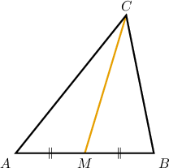
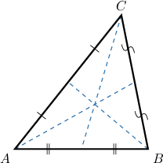
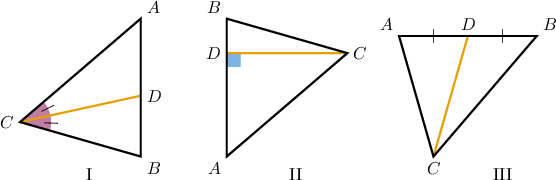
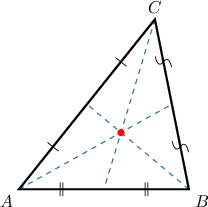
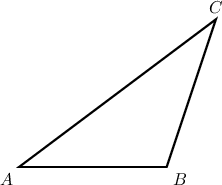
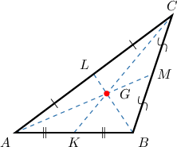
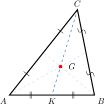
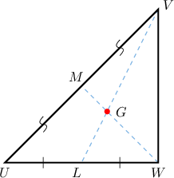
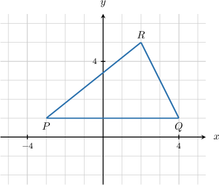

# Medians and Centroids of Triangles

Source: https://www.mathacademy.com/topics/1524?courseId=126
Topic ID: 1524

## Prerequisites

- [Midpoints in the Coordinate Plane](./485-midpoints-in-the-coordinate-plane.md)
- [Writing Ratios Using Fractions](../prealgebra/552-writing-ratios-using-fractions.md)
- [Polygons](../prealgebra/1317-polygons.md)

## Lesson

### Introduction

A **median** in a triangle is a line segment joining a vertex to the midpoint of the opposite side.

For example, in the diagram below, $M$ is the midpoint of the side $\overline{AB}.$ Therefore, $\overline{CM}$ is a median of $\triangle ABC.$

Any triangle has exactly three medians, one for each side. All three medians of $\triangle ABC$ are shown in the diagram below.

You'll notice that the medians intersect at a single point. This is true for *all* triangles. We'll discuss this in more detail shortly.

### Example: Identifying a Median

#### Question

Which of the above triangles shows the median $\overline{CD}?$

#### Explanation

A ** in a triangle is a line segment joining a vertex to the midpoint of the opposite side.

With that in mind, let's examine our triangles.

- In triangle I, the line segment $\overline{CD}$ is ** a median since $D$ is not the midpoint of $\overline{AB}.$

- In triangle II, the line segment $\overline{CD}$ is ** a median since $D$ is not the midpoint of $\overline{AB}.$

- In triangle III, the line segment $\overline{CD}$ is a median. Indeed, $D$ is the midpoint of $\overline{AB}.$ So, $\overline{CD}$ connects the vertex $C$ with the midpoint $D$ of the opposite side $\overline{AB}.$

Therefore, the correct answer is "III only."

### The Centroid Theorem

Given any triangle, all three medians intersect at a single point called the **centroid** of the triangle.

The centroid of a triangle is also its center of mass. In other words, the centroid is where we'd have to place a pencil tip to balance the triangle perfectly.

More formally, the **centroid theorem** states the following:

*For any triangle, the three medians are ****, meaning they intersect at a single point. This point of intersection is called the **** of the triangle.*

We'll prove the centroid theorem in a future lesson.

### Example: Identifying a Centroid

#### Question

Given the triangle $\triangle ABC$ shown above, draw the centroid $G.$

#### Explanation

The centroid is the intersection point of the medians $\overline{AM},$ $\overline{BL},$ and $\overline{CK}$ of the triangle.

### The Centroid Ratio Theorem

The centroid has an important property that is often called the **centroid ratio theorem**:

*The centroid of a triangle splits any median in the proportion $2:1,$ starting from the corresponding vertex.*

For example, in the diagram below, $G$ is the centroid, and $\overline{CK}$ is one of the medians.

According to the centroid theorem,

$$

CG : GK = 2 : 1.

$$

The same proportion holds for the other medians of the triangle. Just remember that the longer partition always contains the vertex.

We'll prove the centroid ratio theorem in a future lesson.

### Example: Applying the Centroid Ratio Theorem

#### Question

In the diagram below, $\overline{VL}$ and $\overline{WM}$ are medians of $\triangle UVW.$ Find $GM$ given that $WG=16\: \textrm{cm}.$

#### Explanation

All three medians of a triangle intersect at a point called the **** of the triangle.

In our case, $G$ is the intersection of the medians $\overline{VL}$ and $\overline{WM}.$ So, $G$ is the centroid.

The centroid of the triangle splits any median in the proportion $2:1,$ starting from the corresponding vertex.

So, we get that

$$

WG : GM = 2 : 1.

$$

Therefore, we have

$$

\begin{aligned}𝐺𝑀 & =\frac{1}{2}𝑊𝐺 \\ & =\frac{1}{2}⋅16 \\ & =8\,cm.\end{aligned}

$$

### Coordinates of the Centroid

The coordinates of a triangle's centroid can be calculated by taking the average of the vertices' $x$- and $y$-coordinates.

Namely, if $A(x_A,y_A),$ $B(x_B,y_B),$ and $C(x_C,y_C)$ are the coordinates of the vertices of a triangle and $G(x_G,y_G)$ is the centroid, then

$$

\begin{aligned}𝑥_{𝐺}=\frac{𝑥_{𝐴}+𝑥_{𝐵}+𝑥_{𝐶}}{3},\,𝑦_{𝐺}=\frac{𝑦_{𝐴}+𝑦_{𝐵}+𝑦_{𝐶}}{3}.\end{aligned}

$$

We'll prove this result in a future lesson. But for now, let's see some examples.

### Example: Finding the Coordinates of a Centroid

#### Question

What are the coordinates of the centroid $G$ of $\triangle PQR.$

#### Explanation

The coordinates of the centroid for a triangle can be calculated by taking the average of the $x$- and $y$-coordinates of the vertices.

In our case, the vertices of the triangle are

$$

P(-3,1), \qquad Q(4,1), \qquad R(2,5).

$$

The averages are the following:

$$

\begin{aligned}\frac{𝑥_{𝑃}+𝑥_{𝑄}+𝑥_{𝑅}}{3} & =\frac{−3+4+2}{3}=\frac{3}{3}=1 \\ \frac{𝑦_{𝑃}+𝑦_{𝑄}+𝑦_{𝑅}}{3} & =\frac{1+1+5}{3}=\frac{7}{3}\end{aligned}

$$

Therefore, the centroid is $G\left(\boxed{\color{blue}1}, \boxed{\color{blue}\dfrac 73}\right).$
