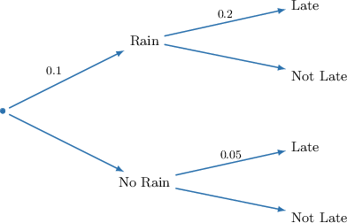
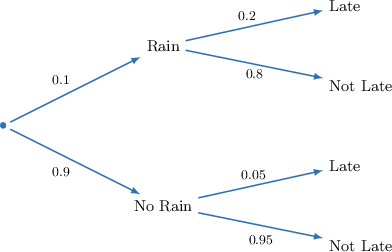
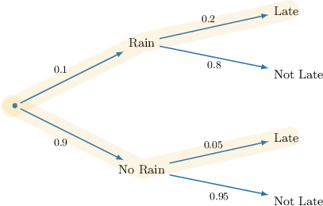
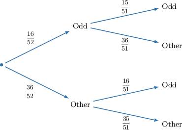
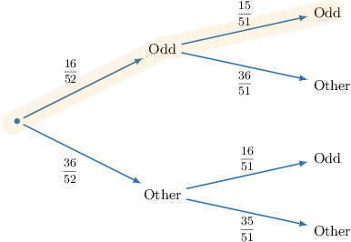
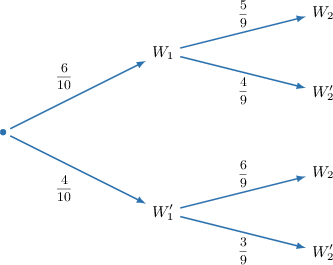
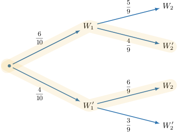

# Tree Diagrams for Dependent Events: Applications

Source: https://www.mathacademy.com/topics/3658?courseId=126
Topic ID: 3658

## Prerequisites

- [Tree Diagrams for Dependent Events](./739-tree-diagrams-for-dependent-events.md)

## Lesson

### Introduction

Suppose that Alice has a $20\%$ chance of being late for work if it rains and a $5\%$ chance of being late for work if it doesn't. Where Alice lives, the probability that it rains on a randomly selected day is $10\%.$

Alice's boss wants to determine the probability that Alice will be late on a randomly selected day.

One way of modeling this situation is to use a tree diagram.

Before we draw our tree diagram, let's summarize what we know:

$$

P(\textrm{Rain}) = 0.1, \qquad P(\textrm{Late|Rain}) = 0.2, \qquad P(\textrm{Late|No Rain}) = 0.05.

$$

We're given probability data on Alice being late *given* whether or not it rains, which suggests that we set up our tree diagram as shown below.

We now fill in the missing probabilities:

- For the missing probability on the first level of our diagram, we have

- For the missing probabilities on the second level, we have

We add these probabilities to our diagram.

To calculate the probability that Alice will be late on a randomly selected day, we first highlight the relevant branches.

Remember that we multiply *across* the branches and add *between* them. Therefore,

$$

\begin{aligned}𝑃(Late) & =𝑃(Rain)⋅𝑃(Late|Rain)+𝑃(No Rain)⋅𝑃(Late|No Rain) \\ & =(0.1)(0.2)+(0.9)(0.05) \\ & =0.065 \\ & =6.5\%.\end{aligned}

$$

Therefore, there is a $6.5\%$ chance that Alice will be late on a randomly selected day.

### Example: Calculating the Intersection of Two Events Using a Tree Diagram

#### Question

Two cards are randomly drawn, one after the other and without replacement, from a standard $52$-card deck. What is the probability that both cards are labeled with an odd number?

#### Explanation

Let's represent all of the possible outcomes and their associated probabilities using a tree diagram.

To compute $P(\textrm{Odd} \cap \textrm{Odd}),$ we multiply the probabilities across the appropriate branches, shown below:

Therefore, the probability that both cards are labeled with an odd number is

$$

P(\textrm{Odd} \cap \textrm{Odd}) = \dfrac{16}{52} \cdot \dfrac{15}{51} = \dfrac{20}{221}.

$$

### Example: Calculating the Union of Two Events Using a Tree Diagram

#### Question

A bag contains $6$ white balls and $4$ red balls. A ball is drawn at random from the bag and then set aside. Then a second ball is drawn at random. What is the probability that the balls have different colors?

#### Explanation

Let $W_1$ be the event "the first ball is white," and let $W_2$ be the event "the second ball is white."

Let's represent all of the possible outcomes and their associated probabilities using a tree diagram.

The possible outcomes that give two balls of different colors are highlighted below.

The probability of picking a white ball first and a red ball second is

$$

P(W_1 \cap W_2') = \dfrac{6}{10} \cdot \dfrac{4}{9} = \dfrac{4}{15}.

$$

Similarly, the probability of picking a red ball first and a white ball second is

$$

P(W_1' \cap W_2) = \dfrac{4}{10} \cdot \dfrac{6}{9} = \dfrac{4}{15}.

$$

Therefore, the probability that the balls have different colors is

$$

\begin{aligned}𝑃(𝑊_{1}∩𝑊_{′2}^{})+𝑃(𝑊_{′1}^{}∩𝑊_{2}) & =\frac{4}{15}+\frac{4}{15} \\ & =\frac{8}{15}.\end{aligned}

$$
