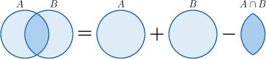
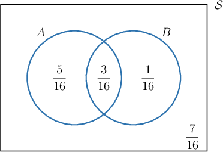
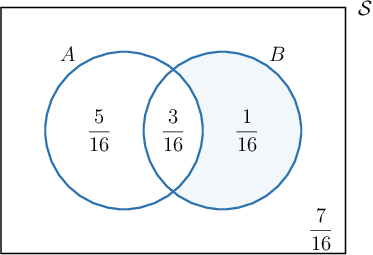
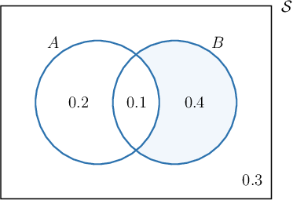
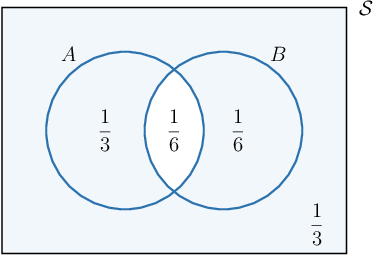

# Applying the Addition Law With Event Complements

Source: https://www.mathacademy.com/topics/4315?courseId=126
Topic ID: 4315

## Prerequisites

- [The Addition Law of Probability](./740-the-addition-law-of-probability.md)

## Lesson

### Introduction

Recall that the addition law for probability states that

$$

P(A\cup B)= P(A)+P(B)-P(A\cap B).

$$

We can use the addition law with Venn diagrams to calculate probabilities involving event complements.

For example, suppose we wish to find $P(A' \cap B),$ where

$$

P(A) = \dfrac{1}{2}, \qquad P(B) = \dfrac{1}{4}, \qquad P(A \cap B) = \dfrac{3}{16}.

$$

To solve this problem, we proceed as follows:

- First, we calculate $P(A\cup B)$ using the addition law.

- Next, we draw a Venn diagram.

- Finally, we shade the region corresponding to $A' \cap B,$ deduce the required probability.

So, we start by calculating $P(A \cup B)$ using the addition law:

$$

\begin{aligned}𝑃(𝐴∪𝐵) & =𝑃(𝐴)+𝑃(𝐵)−𝑃(𝐴∩𝐵) \\ & =\frac{1}{2}+\frac{1}{4}−\frac{3}{16} \\ & =\frac{8}{16}+\frac{4}{16}−\frac{3}{16} \\ & =\frac{9}{16}\end{aligned}

$$

Next, we construct our Venn diagram as usual. This gives the following:

Then, we shade the region corresponding to the event $A' \cap B.$ Remember that this region represents the overlap between all events *not* in $A$ with $B.$

Finally, we have

$$

P(A' \cap B) = \dfrac{1}{16}.

$$

### Example: Finding the Probability of an Intersection

#### Question

Given $P(A)=0.3,$ $P(B)=0.5,$ and $P(A\cup B)=0.7,$ find $P(A'\cap B).$

#### Explanation

First, we calculate $P(A\cap B)$ using the addition law:

$$

\begin{aligned}𝑃(𝐴∪𝐵) & =𝑃(𝐴)+𝑃(𝐵)−𝑃(𝐴∩𝐵) \\ 0.7 & =0.3+0.5−𝑃(𝐴∩𝐵) \\ 𝑃(𝐴∩𝐵) & =0.3+0.5−0.7 \\ 𝑃(𝐴∩𝐵) & =0.1\end{aligned}

$$

Then, we construct the corresponding Venn diagram and shade the region $A'\cap B.$

Finally, we have

$$

P(A'\cap B) = 0.4.

$$

### Example: Finding the Probability of a Union

#### Question

Given that $P(A)=\dfrac12,$ $P(A \cap B)=\dfrac16,$ and $P(A \cup B)=\dfrac23,$ find $P(A'\cup B').$

#### Explanation

First, we calculate $P(B)$ using the addition law:

$$

\begin{aligned}𝑃(𝐴∪𝐵) & =𝑃(𝐴)+𝑃(𝐵)−𝑃(𝐴∩𝐵) \\ \frac{2}{3} & =\frac{1}{2}+𝑃(𝐵)−\frac{1}{6} \\ 𝑃(𝐵) & =\frac{2}{3}+\frac{1}{6}−\frac{1}{2} \\ 𝑃(𝐵) & =\frac{1}{3}\end{aligned}

$$

Then, we construct the corresponding Venn diagram and shade the region $A'\cup B'.$

Finally, we have

$$

P(A'\cup B') = \dfrac1{3} + \dfrac{1}{6} + \dfrac{1}{3} = \dfrac56.

$$

### Example: Finding the Probability of a Complement

#### Question

Given that $P(B)=0.6,$ $P(A\cap B)=0.4,$ and $P(A\cup B)=0.9,$ find $P(A').$

#### Explanation

First, we calculate $P(A)$ using the addition law:

$$

\begin{aligned}𝑃(𝐴∪𝐵) & =𝑃(𝐴)+𝑃(𝐵)−𝑃(𝐴∩𝐵) \\ 0.9 & =𝑃(𝐴)+0.6−0.4 \\ 𝑃(𝐴) & =0.9+0.4−0.6 \\ 𝑃(𝐴) & =0.7\end{aligned}

$$

Therefore,

$$

\begin{aligned}𝑃(𝐴^{′}) & =1−𝑃(𝐴) \\ & =1−0.7 \\ & =0.3.\end{aligned}

$$
