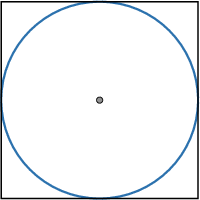
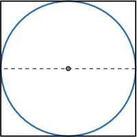
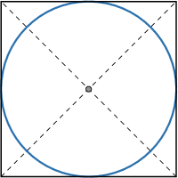
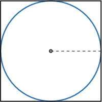
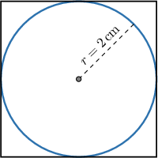
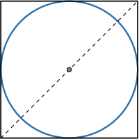

# Circles Inscribed in Squares

Source: https://www.mathacademy.com/topics/479?courseId=126
Topic ID: 479

## Prerequisites

- [The Circumference of a Circle](./460-the-circumference-of-a-circle.md)
- [Areas of Circles](./1745-areas-of-circles.md)
- [Diagonals of Squares](./2887-diagonals-of-squares.md)

## Lesson

### Introduction

When a circle is drawn inside a square and touches all four sides, the circle is said to be **inscribed** in the square. An example of a circle inscribed in a square is shown below.

Whenever a circle is inscribed in a square, the *length of a diameter* of the circle equals the *side length* of the square, as shown.

The center of a square is simply the point where the two diagonals meet. Whenever a circle is inscribed in a square, the centers of the circle and the square coincide.

Whenever we have information about a square, we can use this to determine key characteristics of a circle that's inscribed within it.

Let's see an example.

### Example: Solving for a Circle's Parameters

#### Question

Find the area of a circle inscribed in a square with sides of length $18\,\textrm{m}.$

#### Explanation

The side of the square is $18 \: \textrm{m},$ which means that the diameter $d$ of the circle is

$$

d = 18 \: \textrm{m}.

$$

Thus, the radius $r$ of the circle is

$$

r = \dfrac{d}{2} = \dfrac{18}{2} = 9 \: \textrm{m}.

$$

Therefore, the area of the circle is

$$

\begin{aligned}𝐴 & =𝜋𝑟^{2} \\ & =𝜋(9)^{2} \\ & =81𝜋\,m^{2}.\end{aligned}

$$

### Determining Properties of a Square Given Data on Its Inscribed Circle

Whenever we have information about a circle, we can use this to determine key characteristics of the square that inscribes it.

For example, suppose we have a circle with radius $r=2\:\textrm{cm}$ inscribed in a square, as shown below. What is the area of the square?

If $s$ is the length of the square's sides, then $s$ equals the diameter of the inscribed circle, and the diameter is twice the radius. Therefore,

$$

s = 2r = 2(2) = 4\,\textrm{cm}.

$$

Now, the area of the square is given by $\mathcal{A} = s^2.$ Substituting the known side length, we get the following:

$$

\begin{aligned}A & =𝑠^{2} \\ & =4^{2} \\ & =16\,cm^{2}\end{aligned}

$$

Therefore, the area of the square is $16\,\textrm{cm}^2.$

Let's look at another example.

### Example: Solving for a Square's Parameters

#### Question

The circumference of a circle inscribed in a square is $7\pi.$ What is the area of the square?

#### Explanation

The formula for a circle's circumference is $C = \pi d,$ where $d$ is the diameter. So, we can find the diameter as follows:

$$

\begin{aligned}𝑑 & =\frac{𝐶}{𝜋} \\ & =\frac{7𝜋}{𝜋} \\ & =7\end{aligned}

$$

The diameter of the circle is $7,$ which means that the side $s$ of the square is

$$

s = 7.

$$

Therefore, the area of the square is

$$

\mathcal{A} = s^2 = (7)^2 = 49.

$$

### Example: Problems Involving Diagonals of Squares

#### Question

The area of a circle inscribed in a square is $32\pi \,\textrm{mm}^2.$ Find the diagonal of the square.

#### Explanation

The area of a circle is given by $\mathcal{A} = \pi r^2.$ Substituting the known area and solving for the radius $r,$ we get

$$

\begin{aligned}A & =𝜋𝑟^{2} \\ 32𝜋 & =𝜋𝑟^{2} \\ 32𝜋 & =𝜋𝑟^{2} \\ 32 & =𝑟^{2}\end{aligned}

$$

and taking the square root gives

$$

\begin{aligned}𝑟 & =\sqrt{√32} \\ & =\sqrt{√16⋅2} \\ & =\sqrt{√16}⋅\sqrt{√2} \\ & =4\sqrt{√2}.\end{aligned}

$$

Therefore, the radius of the circle equals $4\sqrt 2\,\textrm{mm}.$

The length $s$ of the square's side equals the diameter of the inscribed circle, and the diameter is twice the radius. Therefore,

$$

\begin{aligned}𝑠 & =2𝑟 \\ & =2(4\sqrt{√2}) \\ & =8\sqrt{√2}\,mm.\end{aligned}

$$

Finally, the length $d$ of the square's diagonal is

$$

\begin{aligned}𝑑 & =𝑠\sqrt{√2} \\ & =8\sqrt{√2}⋅\sqrt{√2} \\ & =8⋅2 \\ & =16\,mm.\end{aligned}

$$
