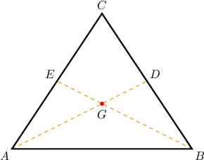
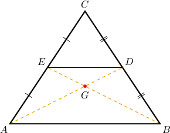
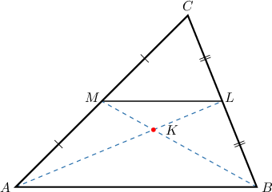
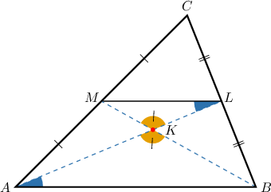
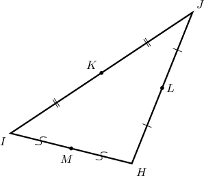
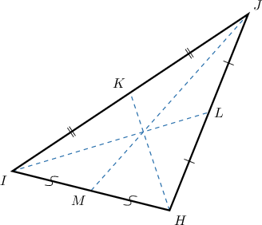
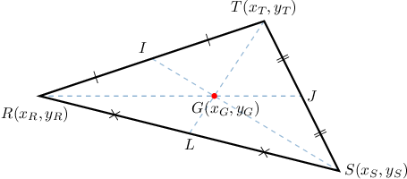
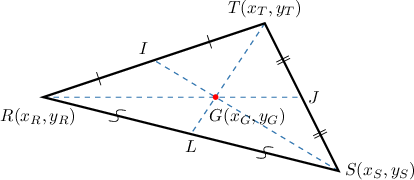

# Proofs Involving Medians and Centroids

Source: https://www.mathacademy.com/topics/5158?courseId=126
Topic ID: 5158

## Prerequisites

- [Partitioning Line Segments](./527-partitioning-line-segments.md)
- [Medians and Centroids of Triangles](./1524-medians-and-centroids-of-triangles.md)
- [Proving the Midpoint Theorem](./5159-proving-the-midpoint-theorem.md)

## Lesson

### Introduction

In this lesson, we'll learn how to prove results concerning medians and centroids of triangles.

We'll start by proving the centroid ratio theorem.

*The centroid of a triangle splits any median in the proportion $2:1$ starting from the corresponding vertex.*

To prove this result, consider the diagram below, where $G$ is the point of intersection of the medians $\overline{AD}$ and $\overline{BE}.$

We wish to prove the following statement:

$AG: GD = 2: 1$

Our strategy is to show that $\triangle{ABG}$ and $\triangle{DEG}$ are similar and then use the properties of similar triangles to prove the desired result.

We proceed as follows:

- **Step 1**: We are given that $\overline{AD}$ and $\overline{BE}$ are medians of $\triangle{ABC}.$

- **Step 2**: By the *definition of a median*, $D$ and $E$ are the midpoints of $\overline{BC}$ and $\overline{AC},$ respectively. Let's add this information to our diagram.

- **Step 3**: Now, consider the line $\overline{DE},$ shown below By the *midpoint theorem for triangles*, we have Let's mark the parallel lines on our diagram.

- **Step 4**: Note that $\angle{ABG}$ and $\angle{DEG},$ as well as $\angle{BAG}$ and $\angle{EDG},$ are pairs of alternate interior angles. Then, by the *alternate interior angles theorem,* since $\overline{AB} \parallel \overline{DE},$ we get

- **Step 5**: In step 4, we showed that triangles $\triangle{ABG}$ and $\triangle{DEG}$ have two pairs of congruent angles. Therefore, by *the AA similarity criterion for triangles.*

- **Step 6**: From steps 3 and 5, we have Therefore, since corresponding parts of similar triangles are in proportion (*CPSTP*), we conclude that as required.

### Stating the Full Proof Using the Two-Column Format

The table below shows the proof of the centroid ratio theorem in a two-column format.

Let's look at a slightly different proof that uses the vertical angles theorem.

### Example: Proving the Centroid Ratio Theorem

#### Question

In the diagram above, $K$ is the point of intersection of the medians $\overline{AL}$ and $\overline{BM}.$

Consider the following statement:

**

The table below gives the proof of the statement. Fill in the table and thus complete the proof.

#### Explanation

The correct proof is shown below.

Let's examine the rows of the table with missing parts in turn.

- Consider row 5. From rows 2 and 4, we have that $L$ and $M$ are the midpoints of $\overline{BC}$ and $\overline{AC},$ respectively. Then, by the midpoint theorem for triangles, $\overline{LM} \parallel \overline{AB}$ and $LM: AB = 1: 2.$

- Consider row 7. Notice that $\angle{AKB}$ and $\angle{LKM}$ are vertical angles. Therefore, $\angle{AKB} \cong \angle{LKM}$ by the vertical angles theorem.

- Consider row 9. From rows 8 and 5, we have $\triangle{ABK} \sim \triangle{LMK}$ and $LM: AB = 1: 2.$ Therefore, since corresponding parts of similar triangles are in proportion (CPSTP), we have that $LK: KA = 1: 2.$

### The Centroid Theorem

Let's restate the centroid theorem.

*For any triangle, the three medians are concurrent, meaning they intersect at a single point. This point of intersection is called the centroid of the triangle.*

To prove this theorem, let's consider the following triangle.

Here, $K, L,$ and $M$ are the midpoints of the sides, as shown.

Our strategy for proving this theorem is as follows:

- First, we define the point $O$ as the intersection of the medians $\color{red}\overline{HK}$ and $\overline{IL}.$

- Then, we define the point $P$ as the intersection of the medians $\color{red}\overline{HK}$ and $\overline{JM}.$

- Then, applying the centroid ratio theorem to both cases, we obtain the following: The point $O$ splits $\color{red}\overline{HK}$ in the ratio $2:1,$ starting from the point $H.$ The point $P$ splits $\color{red}\overline{HK}$ in ratio $2:1,$ starting from the point $H.$

- Since only one point can split the segment $\overline{HK}$ in the ratio $2:1,$ we must have $O=P.$

- Finally, we conclude that all three medians intersect at a single point.

That's the strategy. Now let's discuss how to construct a formal proof.

### Example: Proving the Centroid Theorem

#### Question

In the diagram above, $\overline{HK},$ $\overline{IL},$ and $\overline{JM}$ are the medians of $\triangle HIJ.$

Prove the following statement:

**

#### Explanation

The strategy for this proof is as follows:

- Define the intersection of the medians $\overline{HK}$ and $\overline{IL}$ as the point $O.$

- Define the intersection of the medians $\overline{HK}$ and $\overline{JM}$ as the point $P.$

- Use the centroid ratio theorem to show that the points $O$ and $P$ are the same.

We proceed as follows:

Let $O$ be the point of intersection of $\overline{HK}$ and $\overline{IL},$ and let $P$ be the point of intersection of $\overline{HK}$ and $\overline{JM}.$

Now, we apply the centroid ratio theorem to both points. First, the point $O{:}$

Since $\overline{HK}$ and $\overline{IL}$ are medians of $\triangle{HIJ},$ by the centroid ratio theorem, we have that $O$ splits $\overline{HK}$ in the ratio $2:1,$ starting from the point $H.$

Next, the point $P{:}$

Also, since $\overline{HK}$ and $\overline{JM}$ are medians, by the centroid ratio theorem, we have that $P$ splits $\overline{HK}$ in ratio $2:1,$ starting from the point $H.$

Both points split $\overline{HK}$ in the same ratio, starting from point $H.$ So, they must be the same!

Finally, we make our conclusion.

Finally, since only one point splits a given line segment in a given ratio, we obtain that $O= P.$ Therefore, all three medians intersect at a single point.

The full proof is stated below:

Let $O$ be the point of intersection of $\overline{HK}$ and $\overline{IL},$ and let $P$ be the point of intersection of $\overline{HK}$ and $\overline{JM}.$

Since $\overline{HK}$ and $\overline{IL}$ are medians of $\triangle{HIJ},$ by the centroid ratio theorem, we have that $O$ splits $\overline{HK}$ in the ratio $2:1,$ starting from the point $H.$

Also, since $\overline{HK}$ and $\overline{JM}$ are medians, by the centroid ratio theorem, we have that $P$ splits $\overline{HK}$ in ratio $2:1,$ starting from the point $H.$

Finally, since only one point splits a given line segment in a given ratio, we obtain that $O= P.$ Therefore, all three medians intersect at a single point.

### The Coordinates of the Centroid

In a previous lesson, we saw that the coordinates of $G$ are given by

$$

\left(x_G,y_G\right) = \left( \dfrac{x_1+x_2+x_3}{3}, \dfrac{y_1+y_2+y_3}{3}\right).

$$

We can prove this result by partitioning the line segment $\overline{RJ}$ in the ratio $2:1$ as follows:

- **Step 1**: Use the *midpoint formula* to find the coordinates of $J$ in terms of the coordinates of $S$ and $T.$

- **Step 2**: Partition the segment $\overline{RJ}$ in the ratio $2:1.$ To do this, we can use the following formulas (derived in a previous lesson).

- **Step 3**: Use the result from step 1 to write $x_G$ and $y_G$ in terms of the coordinates of the vertices only.

Let's now look at the full proof.

### Example: Proving the Centroid Coordinates Formula

#### Question

In the diagram above, $\overline{RJ},$ $\overline{SI},$ and $\overline{TL}$ are the medians of $\triangle{RST}$ and $G$ is its centroid. Prove that

$$

x_G = \dfrac{x_R+x_S+x_T}{3}, \qquad y_G = \dfrac{y_R+y_S+y_T}{3}.

$$

#### Explanation

First, we find the coordinates of the point $J$ in terms of the coordinates of $S$ and $T{:}$

Since $\overline{RJ}$ is a median, we have that $J$ is the midpoint of $\overline{ST}.$ So, if $(x_J,y_J)$ are the coordinates of $J,$ by the midpoint formula, we have

$$

\begin{aligned}𝑥_{𝐽}=\frac{𝑥_{𝑆}+𝑥_{𝑇}}{2},\,𝑦_{𝐽}=\frac{𝑦_{𝑆}+𝑦_{𝑇}}{2}.\end{aligned}

$$

Next, we write the coordinates of the centroid using the formula for partitioning a line segment in a given ratio:

By the centroid ratio theorem, the point $G$ splits the median $\overline{RJ}$ in the ratio $2:1,$ starting from the point $R.$ Now, by partitioning the segment $\overline{RJ}$ in a given ratio, we obtain that

$$

\begin{aligned}𝑥_{𝐺} & =\frac{𝑥_{𝑅}+2𝑥_{𝐽}}{3} \\ & =\frac{𝑥_{𝑅}+2⋅\frac{𝑥_{𝑆}+𝑥_{𝑇}}{2}}{2} \\ & =\frac{𝑥_{𝑅}+𝑥_{𝑆}+𝑥_{𝑇}}{3}, \\ 𝑦_{𝐺} & =\frac{𝑦_{𝑅}+2𝑦_{𝐽}}{3} \\ & =\frac{𝑦_{𝑅}+2⋅\frac{𝑦_{𝑆}+𝑦_{𝑇}}{2}}{2} \\ & =\frac{𝑦_{𝑅}+𝑦_{𝑆}+𝑦_{𝑇}}{3}.\end{aligned}

$$
