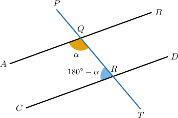
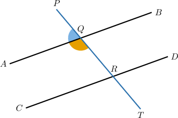
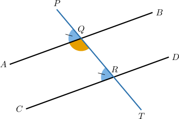
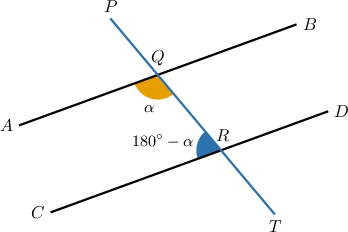
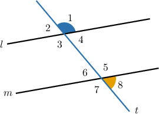
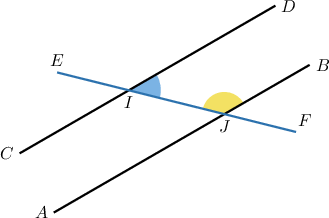

# Further Proving Consecutive Angle Theorems

Source: https://www.mathacademy.com/topics/5272?courseId=126
Topic ID: 5272

## Prerequisites

- [Proving Consecutive Angle Theorems](./5137-proving-consecutive-angle-theorems.md)

## Lesson

### Introduction

In this lesson, we'll learn how to prove the converse consecutive angle theorems and consolidate our knowledge of proving all consecutive angle theorems and their converses.

Consider the diagram below, where the lines $\overset{\longleftrightarrow}{AB}$ and $\overset{\longleftrightarrow}{CD}$ are crossed by a transversal $\overset{\longleftrightarrow}{PT},$ $m\angle AQR=\alpha$ and $m\angle QRC=180^\circ - \alpha.$

Suppose we wish to *prove* the following statement:

*$\overset{\longleftrightarrow}{AB}$ and $\overset{\longleftrightarrow}{CD}$ are parallel.*

Before we begin, note that in addition to the tools we've used previously, we'll need to make use of the *converse corresponding angles postulate,* which we state below:

*If a transversal cuts two lines and the corresponding angles are congruent, then the lines are parallel.*

### Proving the Converse Consecutive Interior Angle Theorems

We wish to prove the following statement:

*$\overset{\longleftrightarrow}{AB}$ and $\overset{\longleftrightarrow}{CD}$ are parallel.*

Notice that, according to the given information, the angles $\angle{AQR}$ and $\angle{QRC}$ are supplementary. Thus, the statement we want to prove is the converse consecutive interior angles theorem!

Our strategy is to use the fact that $\angle AQR$ and $\angle AQP$ form a linear pair (and are therefore supplementary) and show this implies that the corresponding angles $\angle AQP$ and $\angle QRC$ must be congruent. By the converse corresponding angles postulate, this is enough to prove that the lines are parallel.

We can divide the proof into steps as follows:

- **Step 1**: We are *given* that $m\angle{AQR=\alpha}$ and $m\angle{QRC}= 180^\circ - \alpha.$

- **Step 2**: By the *linear pair postulate*, $\angle{AQR}$ and $\angle{AQP}$ are supplementary. Let's add this to our diagram.

- **Step 3**: Since $\angle{AQR}$ and $\angle{AQP}$ are supplementary, we have by the *definition of supplemetary angles*.

- **Step 4**: Using the *addition principle*, we can subtract $m\angle AQR$ from both sides of the equality from step 3. This gives

- **Step 5**: From step 1, we have Therefore, by *substituting* this into the result from step 4, we get

- **Step 6**: From step 1, we have and in step 5, we showed that Therefore, by the *transitive property of equality*, we have

- **Step 7**: Using the *definition of congruent angles*, we get Let's add this to our diagram.

- **Step 8**: Finally, note that $\angle AQP$ and $\angle{QRC}$ are corresponding angles, and they are congruent from step 7. Consequently, by the *converse corresponding angles postulate,* *$\overset{\longleftrightarrow}{AB}$ and $\overset{\longleftrightarrow}{CD}$ are parallel,* as required.

It's **highly recommended** that you practice reconstructing this proof. Try to do this *without* referring to these notes.

### Stating the Full Proof Using the Two-Column Format

The table below shows the proof of the converse of the consecutive interior angles theorem in a two-column format.

Now, let's consider a proof of the converse consecutive *exterior* angles theorem.

### Example: Proving Converse Consecutive Angle Theorems

#### Question

In the diagram above, $\angle 1$ and $\angle 8$ are supplementary.

Consider the following statement:

**

The table below provides proof of the statement. Please complete the proof by filling in the missing entries.

#### Explanation

The correct proof is shown below.

Let's examine the rows of the table with missing parts in turn.

- Consider row 2. Notice from the diagram that $\angle 7$ and $\angle 8$ form a linear pair. The linear pair postulate states that such angles must be supplementary. Therefore, $\angle{7}$ and $\angle{8}$ are supplementary angles.

- Consider row 7. From rows 3 and 6, we have Therefore, by the transitive property of equality, we have

- Consider row 9. From row 8, we have that $m\angle 7 = m\angle 1.$ Therefore, by the definition of congruent angles, these angles are congruent:

- Consider row $11.$ From row $10,$ we have $\angle 7 \cong \angle 3.$ Since these are corresponding angles, by the converse corresponding angles postulate, the lines $l$ and $m$ are parallel.

### Example: Constructing Complete Proofs of the Consecutive Angle Theorems

#### Question

In the diagram above, the parallel lines $\overset{\longleftrightarrow}{AB}$ and $\overset{\longleftrightarrow}{CD}$ are crossed by the transversal $\overset{\longleftrightarrow}{EF}.$

Consider the following statement:

$\angle{BJI}$ and $\angle{DIJ}$ are supplementary.

The table below provides proof of the statement. Complete the proof by filling in the missing entries.

#### Explanation

The correct proof is shown below.

Let's examine each row in turn.

1. Note that $\angle AJF$ and $\angle BJI$ are vertical angles. Therefore, these angles are congruent by the vertical angles theorem.

2. Note that $\angle {CIJ}$ and $\angle{AJF}$ are corresponding angles. Therefore, these angles are congruent by the corresponding angles postulate.

3. From rows 2 and 1, we have Therefore, by the transitive property of congruence, we have

4. From row 3, we have $\angle{CIJ} \cong \angle{BJI}.$ Therefore, we have that $m\angle{CIJ} = m\angle{BJI}$ by the definition of congruent angles.

5. Note that $\angle {CIJ}$ and $\angle {DIJ}$ form a linear pair. Therefore, these angles are supplementary by the linear pair postulate.

6. From row 5, we have that $\angle {CIJ}$ and $\angle {BJI}$ are supplementary angles. Therefore, by the definition of supplementary angles,

7. From row 6, we have From row 4, we have ${\color{blue}{m\angle{CIJ}}} = m\angle{BJI}.$ Substituting this into the above, we have

8. From row 7, we have that $m\angle{BJI} + m\angle{DIJ} = 180^\circ.$ Therefore, these angles are supplementary by the definition of supplementary angles.
