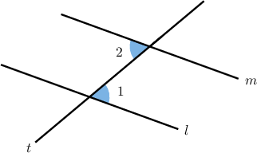
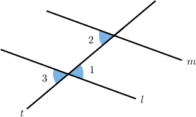
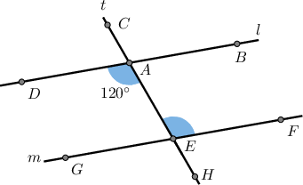
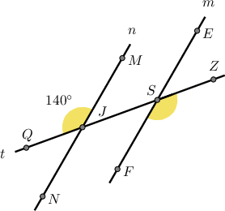
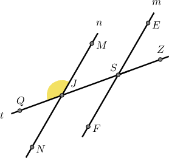
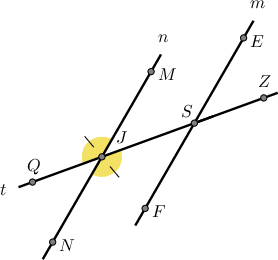
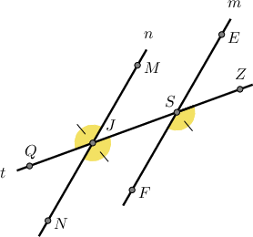

# Proving Alternate Angle Theorems

Source: https://www.mathacademy.com/topics/5488?courseId=126
Topic ID: 5488

## Prerequisites

- [Properties of Congruence](./502-properties-of-congruence.md)
- [Identifying Angle Theorems](./5434-identifying-angle-theorems.md)

## Lesson

### Introduction

A **mathematical proof** is a rigorous argument that a theorem (or some other mathematical statement) is true based on a set of postulates (or **axioms**), definitions, and *previously established results*. The previously established results could be other theorems or smaller results that have been proven.

Mathematical proofs follow a logical sequence of steps, starting from these foundational principles and building upon them using algebraic techniques and logic to arrive at a conclusion. Any mathematical proof aims to provide a watertight, convincing argument that a statement holds true.

By the end of this lesson, you'll know how to prove the following theorems:

- The alternate interior angles theorem

- The alternate exterior angles theorem

Our proofs of the alternate angle theorems will depend on the vertical angles theorem. We'll prove the vertical angles theorem in a separate lesson.

Let's start by proving the alternate interior angles theorem, assuming the vertical angles theorem.

### The Alternate Interior Angles Theorem

Consider the diagram below, where the parallel lines $l$ and $m$ are cut by the transversal $t.$

Suppose we want to *prove* the following statement:

$\angle 1 \cong \angle 2$

In other words, we want to prove the alternate interior angles theorem!

To prove this theorem, we start with $\angle 1$ and construct a sequence of statements to show that it must be congruent to $\angle 2.$ Our strategy is to use the following tools:

- the vertical angles theorem

- the corresponding angles postulate

- the transitive property of congruence

We complete the proof as follows:

- **Step 1**: First, consider the angle $\angle 3,$ shown in the diagram. By the *vertical angles theorem*, $\angle 1$ and $\angle 3$ are congruent. Let's mark this on our diagram.

- **Step 2**: By the *corresponding angles postulate,* $\angle 3$ and $\angle 2$ are congruent.

- **Step 3**: In steps 1 and 2 respectively, we showed that Therefore, by the *transitive property of congruence*, we conclude that as required.

The key idea is that we connect $\angle 1$ to $\angle 2$ through a third angle, $\angle 3,$ whose relationships are already known.

It's **highly recommended** that you practice reconstructing this proof. Try to do this without referring to these notes.

### Stating the Proof Using a Two-Column Format

When stating geometry proofs, we often present them in a so-called two-column format.

The table below shows the proof of the **alternate interior angles theorem** in this format.

Let's see another example, where we prove that two alternate interior angles have the same measure.

### Example: Proving the Alternate Interior Angles Theorem

#### Question

In the diagram above, the parallel lines $l$ and $m$ are crossed by the transversal $t.$

Consider the following statement:

**

The table below gives the proof of the statement. Select the correct options in the table and thus complete the proof.

#### Explanation

The correct proof is shown below.

Let's examine the rows of the table with missing parts in turn.

- Consider row 1. Notice from the diagram that $\angle DAE$ and $\angle CAB$ are two vertical angles. The vertical angles theorem states that such angles must be congruent:

- Consider row 3. From rows 1 and 2, we have Therefore, by the transitive property of congruence, we have

- Consider row 5. From row 4, we have that $\angle AEF\cong \angle DAE.$ Therefore, by the definition of congruent angles, these angles have equal measure: Finally, since $m \angle DAE = 120^\circ,$ we have

### Example: Proving the Alternate Exterior Angles Theorem

#### Question

In the diagram above, the parallel lines $n$ and $m$ are crossed by the transversal $t.$

Consider the following statement:

$m\angle ZSF=140^\circ$

The table below gives the proof of the statement. Determine the missing entries in the table and thus complete the proof.

#### Explanation

The completed proof is shown below.

Let's go through this proof. First, we'll redraw the diagram.

We wish to prove the following statement:

$m\angle ZSF=140^\circ$

First, consider the angle $\angle MJQ.$

Let's go through the proof in steps.

- ****: By the **, $\angle MJQ$ and $\angle SJN$ are congruent.

- ****: By the ** $\angle SJN$ and $\angle ZSF$ are congruent.

- ****: In steps 1 and 2 respectively, we showed that Therefore, by the **, we conclude that

- ****: In step 3, we showed that $\angle MJQ \cong \angle ZSF.$ Therefore, by the **, we conclude that

- ****: From step 4, we have that $\angle ZSF\cong \angle MJQ.$ Therefore, by the **, these angles have equal measure: Finally, since $m\angle MJQ= 140^\circ,$ we have
