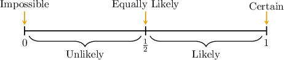

# The Likelihood of an Event

Source: https://www.mathacademy.com/topics/7221?courseId=126
Topic ID: 7221

## Prerequisites

- [Sample Spaces and Events in Probability](./1121-sample-spaces-and-events-in-probability.md)
- [Comparing Fractions, Percents, and Decimals](../prealgebra/2457-comparing-fractions-percents-and-decimals.md)

## Lesson

### Introduction

Given the probability of an event, we can describe the likelihood using words.

Every probability is a number between $0$ and $1.$ We use these values to describe how likely an event is:

- If the probability is $0,$ the event is **impossible**.

- If the probability is close to $0,$ the event is **unlikely**.

- If the probability is $\dfrac12,$ the event is **as equally likely to happen as not**.

- If the probability is close to $1,$ the event is **likely**.

- If the probability is $1,$ the event is **certain**.

For example, suppose the probability of an event is $\dfrac{3}{4}.$

In this case, the probability of the event occurring is a relatively large number, closer to $1.$ Since

$$

\dfrac12 < \dfrac{3}{4} < 1,

$$

this event is likely.

### Example: Describing the Likelihood Given a Probability

#### Question

A spinner is divided into $5$ equal sections. The spinner is spun once, and the color it lands on is recorded. Determine the likelihood of the following events.

$\qquad$Landing on red $\Big($probability $\dfrac{2}{5}\Big)$ is $\boxed{\phantom{\text{unlikely}}}.$

$\qquad$Landing on blue or yellow $\Big($probability $\dfrac{3}{5}\Big)$ is $\boxed{\phantom{\text{likely}}}.$

$\qquad$Landing on a primary color $\Big($probability $1\Big)$ is $\boxed{\phantom{\text{certain}}}.$

#### Explanation

We describe how likely an event is based on its probability:

- If the probability is $0,$ the event is **.

- If the probability is less than $\dfrac12,$ the event is **.

- If the probability is $\dfrac12,$ the event is **.

- If the probability is greater than $\dfrac12,$ the event is **.

- If the probability is $1,$ the event is **.

Now, let's consider each event in turn.

- The probability of landing on red is a relatively small number, $\dfrac{2}{5},$ closer to $0.$ Since this event is $\boxed{\text{unlikely}}.$

- The probability of landing on blue or yellow is a relatively large number, $\dfrac{3}{5},$ closer to $1.$ Since this event is $\boxed{\text{likely}}.$

- The probability of landing on a primary color is $1,$ so this event is $\boxed{\text{certain}}.$

### Example: Describing the Likelihood of an Event

#### Question

A student practices piano on $9$ out of $12$ days. Based on this information, describe the likelihood that the student will practice piano on the next day.

#### Explanation

We describe how likely an event is based on its probability:

- If the probability is $0,$ the event is **.

- If the probability is less than $\dfrac12,$ the event is **.

- If the probability is $\dfrac12,$ the event is **.

- If the probability is greater than $\dfrac12,$ the event is **.

- If the probability is $1,$ the event is **.

First, to calculate the experimental probability, we divide the number of days the student practiced piano $(9)$ by the total number of days $(12).$ This gives

$$

P(\text{practices piano}) = \dfrac{9}{12} = \dfrac{3}{4}.

$$

This is a relatively large number, closer to $1.$ Since

$$

\dfrac12 < \dfrac34 < 1,

$$

this event is likely.

### Likelihood Comparison

We can compare how likely two events are by comparing their probabilities.

- An event with a greater probability is **more likely**.

- An event with a smaller probability is **less likely**.

- If two events have the same probability, they are **equally likely**.

For example, suppose a student records how often it rains during a month and finds that it rains on $6$ out of $20$ days.

So, the experimental probability of rain is

$$

P(\text{rain}) = \dfrac{6}{20} = \dfrac{3}{10}.

$$

Since it rains on $6$ out of $20$ days, it *doesn't* rain on $14$ out of $20$ days. So, the experimental probability that it does not rain is

$$

P(\text{no rain}) = \dfrac{14}{20} = \dfrac{7}{10}.

$$

The experimental probability of rain is less than the experimental probability of no rain:

$$

P(\text{rain}) = \dfrac{3}{10} < \dfrac{7}{10} = P(\text{no rain})

$$

Therefore, it is *less likely* that it will rain than that it will not rain.

### Example: Comparing Two Events by Likelihood

#### Question

A scientist records how long it takes for a chemical reaction to complete. The experiment is conducted $40$ times. The table below shows the results.

Based on the experimental probabilities of these results, complete the following statements.

$\qquad$A reaction completing in more than $30$ seconds is $\boxed{\phantom{\text{unlikely}}}.$

$\qquad$A reaction completing in less than $20$ seconds is $\boxed{\phantom{\text{as likely as not}}}.$

$\qquad$A reaction completing in more than $30$ seconds is $\boxed{\phantom{\text{less likely than}}}$ a reaction completing in less than $20$ seconds.

#### Explanation

One event is more likely than another if it has a greater probability of occurring. If two events have the same probability, they are equally likely.

Let's consider each statement in turn.

- To compute the experimental probability of a reaction completing in more than $30$ seconds, we divide the number of times a reaction took more than $30$ seconds $(7+5=12)$ by the total number of trials $(40).$ This gives This probability is a small number, closer to $0.$ Since this event is $\boxed{\text{unlikely}}.$

- To compute the experimental probability of a reaction completing in less than $20$ seconds, we divide the number of times a reaction took less than $20$ seconds $(6+14=20)$ by the total number of trials $(40).$ This gives Since the probability is $\dfrac12,$ this event is $\boxed{\text{as likely as not}}.$

- The experimental probability of a reaction completing in more than $30$ seconds is less than the experimental probability of a reaction completing in less than $20$ seconds: Therefore, a reaction completing in more than $30$ seconds is $\boxed{\text{less likely than}}$ a reaction completing in less than $20$ seconds.
