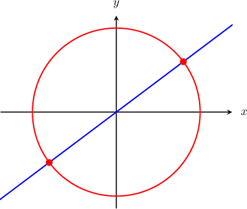
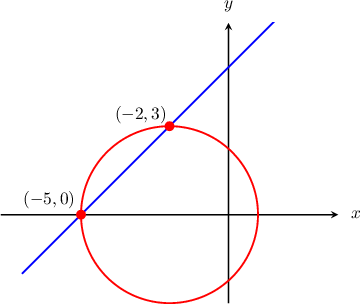
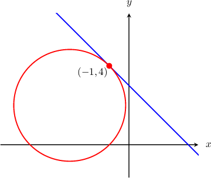
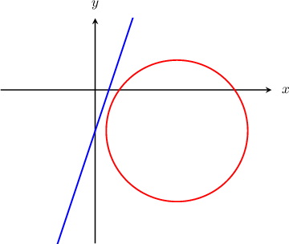
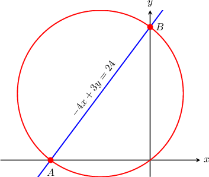

# Intersections of Circles with Lines

Source: https://www.mathacademy.com/topics/845?courseId=126
Topic ID: 845

## Prerequisites

- [Equations of Circles](./843-equations-of-circles.md)
- [Finding Intersections of Lines and Quadratic Functions](../algebra-i/6341-finding-intersections-of-lines-and-quadratic-functions.md)

## Lesson

### Introduction

Let's look at the circle $x^2 + y^2 = 25$ and the line $y = \dfrac{3}{4}x,$ sketched below. We can see from the diagram that the circle and line intersect at two points. How can we find these intersection points?

To find $x$-coordinates of the intersection points, we need to substitute $y = \dfrac{3}{4}x$ into the equation of the circle and solve the resulting equation for $x,$ as follows:

$$

\begin{aligned}𝑥^{2}+𝑦^{2} & =25 \\ 𝑥^{2}+(\frac{3}{4}𝑥)^{2} & =25 \\ 𝑥^{2}+\frac{9}{16}𝑥^{2} & =25 \\ \frac{(16+9)}{16}𝑥^{2} & =25 \\ \frac{25}{16}𝑥^{2} & =25 \\ 𝑥^{2} & =\frac{16}{25}⋅25 \\ 𝑥^{2} & =16 \\ 𝑥 & =±4.\end{aligned}

$$

To find $y$-coordinates of the intersection points, we need to plug in the solutions $x = - 4$ and $x=4$ into the equation of the line and compute $y$-values.

- Substituting $x = -4,$ we get

- Substituting $x = 4,$ we get

Therefore, there are two points of intersection: $(-4,-3)$ and $(4,3).$

### Example: Finding the Points of Intersection of a Circle with a Line

#### Question

Find the points where the line $y = x +5$ intersects the circle $(x+2)^2 + y^2 = 9.$

#### Explanation

To find $x$-coordinate of the intersection points, we need to substitute $y = x + 5$ into the equation of the circle and solve the resulting equation for $x,$ as follows:

$$

\begin{aligned}(𝑥+2)^{2}+𝑦^{2} & =9 \\ (𝑥+2)^{2}+(𝑥+5)^{2} & =9 \\ 𝑥^{2}+4𝑥+4+𝑥^{2}+10𝑥+25 & =9 \\ 2𝑥^{2}+14𝑥+29 & =9 \\ 2𝑥^{2}+14𝑥+20 & =0 \\ 𝑥^{2}+7𝑥+10 & =0 \\ (𝑥+2)(𝑥+5) & =0 \\ 𝑥 & =−2,−5.\end{aligned}

$$

To find $y$-coordinates of the intersection points, we need to substitute each of $x = -2$ and $x=-5$ into the equation of the line and compute $y$-value.

- Substituting $x=-2,$ we get This corresponds to an intersection point $(-2,3).$

- Substituting $x=-5,$ we get This corresponds to an intersection point $(-5,0).$

Therefore, the line $y = x + 5$ intersects the circle $(x+2)^2 + y^2 = 9$ at the points $(-2,3)$ and $(-5,0).$

A sketch of the circle and the line is shown below.

### Example: Finding a Single Point of Intersection of a Circle with a Line

#### Question

Find the point where the line $y = -x + 3$ intersects the circle $(x+3)^2 + (y-2)^2 = 8.$

#### Explanation

To find $x$-coordinate of the intersection point, we need to substitute $y = -x + 3$ into the equation of the circle and solve the resulting equation for $x,$ as follows:

$$

\begin{aligned}(𝑥+3)^{2}+(𝑦−2)^{2} & =8 \\ (𝑥+3)^{2}+((−𝑥+3)−2)^{2} & =8 \\ (𝑥+3)^{2}+(−𝑥+1)^{2} & =8 \\ 𝑥^{2}+6𝑥+9+𝑥^{2}−2𝑥+1 & =8 \\ 2𝑥^{2}+4𝑥+10 & =8 \\ 𝑥^{2}+2𝑥+5 & =4 \\ 𝑥^{2}+2𝑥+1 & =0 \\ (𝑥+1)^{2} & =0 \\ 𝑥+1 & =0 \\ 𝑥 & =−1.\end{aligned}

$$

To find $y$-coordinate of the intersection point, we need to plug in $x = -1$ into the equation of the line and compute $y$-value as follows:

$$

\begin{aligned}𝑦 & =−𝑥+3 \\ & =−(−1)+3 \\ & =1+3 \\ & =4.\end{aligned}

$$

Therefore, the line $y = -x + 3$ intersects the circle $(x+3)^2 + (y-2)^2 = 8$ at the point $(-1,4).$

A sketch of the circle and the line is shown below.

### Example: Identifying When a Circle Does Not Intersect with a Line

#### Question

Find the points where the circle $(x-2)^2 + (y+1)^2 = 3$ intersects the line $y = 3x - 1.$

#### Explanation

To find $x$-coordinates of the intersection points, we need to substitute $y = 3x - 1$ into the equation of the circle and solve the resulting equation for $x$, if possible:

$$

\begin{aligned}(𝑥−2)^{2}+(𝑦+1)^{2} & =3 \\ (𝑥−2)^{2}+((3𝑥−1)+1)^{2} & =3 \\ (𝑥−2)^{2}+(3𝑥)^{2} & =3 \\ 𝑥^{2}−4𝑥+4+9𝑥^{2} & =3 \\ 10𝑥^{2}−4𝑥+1 & =0.\end{aligned}

$$

If we compute the discriminant $\mathcal{D}$ of the above quadratic equation, then we get

$$

\begin{aligned}D & =(−4)^{2}−4⋅10⋅1 \\ & =16−40 \\ & =−24.\end{aligned}

$$

Since $\mathcal{D} = -24 < 0$, there are no real solutions to the equation $10x^2 - 4x + 1 = 0.$

Therefore, we conclude that the circle $(x-2)^2 + (y+1)^2 = 3$ does not intercept the line $y = 3x - 1$ at any point.

The corresponding diagram is shown below.

### Example: Finding the Equation of a Circle Given a Line Covering a Diameter

#### Question

The line $-4x+3y=24$ intersects the $x$- and $y$-axes at points $A$ and $B$, respectively. If the segment $\overline{AB}$ is a diameter, find the equation of the circle.

#### Explanation

To find the $x$-coordinate of $A$, we set $y=0$ and solve $-4x+3y=24$ for $x$ to get

$$

\begin{aligned}−4𝑥+3(0) & =24 \\ −4𝑥 & =24 \\ 𝑥 & =−6.\end{aligned}

$$

Similarly, to find the $y$-coordinate of $B$, we set $x=0$ and solve for $y$:

$$

\begin{aligned}−4(0)+3𝑦 & =24 \\ 3𝑦 & =24 \\ 𝑦 & =8.\end{aligned}

$$

So, $A$ and $B$ have coordinates $(-6,0)$ and $(0,8)$, respectively.

If the segment $\overline{AB}$ is a diameter of the circle, then the midpoint must be the center of the circle. Using the midpoint formula, we find that the center of the circle is at

$$

\left( \dfrac{-6+0}{2}, \dfrac{0+8}{2}\right) = (-3,4).

$$

Now, to find the radius of the circle, we compute the distance between the center $(-3,4)$ and a point on the circle, say $B(0,8),$ as follows:

$$

\begin{aligned}𝑟 & =\sqrt{√(0−(−3))^{2}+(8−4)^{2}} \\ & =\sqrt{√3^{2}+4^{2}} \\ & =\sqrt{√25} \\ & =5\end{aligned}

$$

Therefore, since the circle has center $(-3,4)$ and radius $r=5,$ the equation of the circle is

$$

\begin{aligned}(𝑥−(−3))^{2}+(𝑦−4)^{2} & =5^{2} \\ (𝑥+3)^{2}+(𝑦−4)^{2} & =25.\end{aligned}

$$
