# Combining Congruence Criteria for Triangles

Source: https://www.mathacademy.com/topics/966?courseId=126
Topic ID: 966

## Prerequisites

- [The SSS Congruence Criterion](./531-the-sss-congruence-criterion.md)
- [The ASA Congruence Criterion](./532-the-asa-congruence-criterion.md)
- [The AAS Congruence Criterion](./582-the-aas-congruence-criterion.md)
- [Vertical Angles](../prealgebra/1507-vertical-angles.md)
- [The SAS Congruence Criterion](./1520-the-sas-congruence-criterion.md)
- [The HL Congruence Criterion](./1521-the-hl-congruence-criterion.md)

## Lesson

### Introduction

The five congruence criteria for triangles are often needed when proving geometric results. Therefore, it's essential to identify which congruence criterion is being applied in a particular situation.

Let's start by briefly reviewing the five criteria that we have learned.

- The *Side-Side-Side (SSS)* criterion: Two triangles are congruent if and only if three sides of one triangle are congruent to three sides of the other triangle.

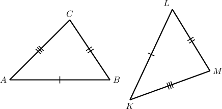

- The *Side-Angle-Side (SAS)* criterion: Two triangles are congruent if and only if two sides and the included angle of one triangle are congruent to two sides and the included angle of the other triangle.

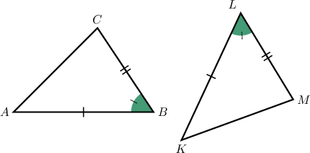

- The *Angle-Side-Angle (ASA)* criterion: Two triangles are congruent if and only if two angles and the included side of one triangle are congruent to two angles and the included side of the other triangle.

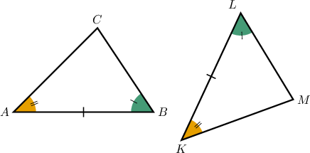

- The *Angle-Angle-Side (AAS)* criterion: Two triangles are congruent if and only if two angles and the non-included side of one triangle are congruent to two angles and the non-included side of the other triangle.

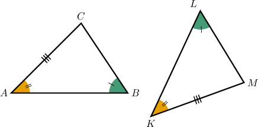

- The *Hypotenuse-Leg (HL)* criterion: Two right triangles are congruent if and only if they have congruent hypotenuses and a pair of congruent legs.

Let's now get some practice at correctly identifying these criteria.

### Example: Identifying Congruent Triangles

#### Question

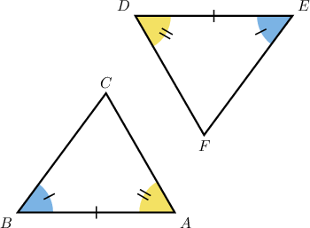

By which congruence criterion does it follow that $\triangle ABC \cong \triangle DEF?$

#### Explanation

First, we recall the ASA (Angle-Side-Angle) congruence criterion:

**

Now, we have

$$

\underbrace{\angle A \cong \angle D}_{\textrm{Angle}}, \qquad \underbrace{\overline{AB}\cong \overline{DE}}_{\textrm{(included) Side}}, \qquad \underbrace{\angle B \cong \angle E}_{\textrm{Angle}}.

$$

Therefore, $\triangle ABC$ and $\triangle DEF$ are congruent by ASA.

### Example: Cases With Vertical Angles

#### Question

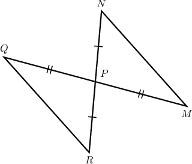

By which congruence criterion does it follow that $\triangle PQR\cong \triangle PMN?$

#### Explanation

First, we recall the SAS (Side-Angle-Side) congruence criterion:

**

Notice that $\angle QPR \cong \angle MPN$ since these two angles are vertical.

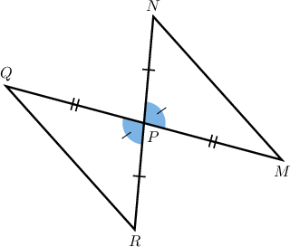

Now, we have

$$

\underbrace{\overline{PR}\cong \overline{PN}}_{\textrm{Side}}\,, \qquad \underbrace{\angle QPR \cong \angle MPN}_{\textrm{(included) Angle}}\,, \qquad \underbrace{\overline{PQ}\cong \overline{PM}}_{\textrm{Side}}\,.

$$

Therefore, $\triangle PQR$ and $\triangle PMN$ are congruent by SAS.

### Example: Cases With Common Sides

#### Question

By which congruence criterion does it follow that $\triangle ABC \cong \triangle ABD?$

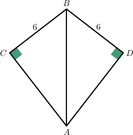

#### Explanation

First, we recall the HL (Hypotenuse-Leg) congruence criterion:

**

Notice that the triangles have a common side, $\overline{AB}.$ To determine which criterion applies, it's helpful to think of this as two separate triangles, as shown below.

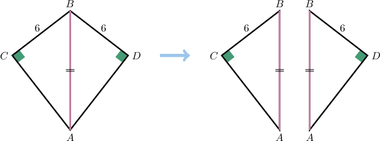

Next, we have

$$

\underbrace{m\angle{C} = m\angle{D} = 90^\circ}_{\textrm{Right angle}}\,, \qquad \underbrace{\overline{AB} \cong \overline{AB}}_{\textrm{Hypotenuse}}\,, \qquad \underbrace{\overline{BC}\cong \overline{BD}}_{\textrm{Leg}}\,.

$$

Therefore, $\triangle ABC$ and $\triangle ABD$ are congruent by HL.

### Why Is There No SSA Criterion?

The SAS congruence criterion states that if two triangles have two pairs of congruent sides and the *included* angles are also congruent, the triangles are congruent.

Why, then, is there no SSA congruence criterion? In other words, if two triangles have two pairs of congruent sides and a pair of congruent *non-included* angles, why is this not enough to conclude that they're congruent?

To understand why there is no SSA criterion, we'll construct two triangles that are not congruent yet have two pairs of congruent sides and a pair of congruent, non-included angles.

Consider the following diagram.

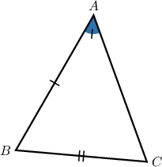

Let's create another triangle $\triangle KLM$ such that

$$

\overline{AB} \cong \overline{KL}, \qquad \overline{BC} \cong \overline{LM}, \qquad \angle{A} \cong \angle{K}.

$$

We draw the congruent angle and segment $\overline{KL}.$

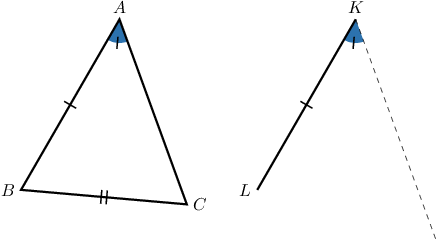

The vertex $M$ must lie on the dashed line.

Now, here's the key point. There are *two possible ways* to pick the third vertex: $M_1$ and $M_2,$ as shown below.

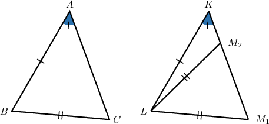

Clearly,

- $\triangle KLM_1$ is congruent to $\triangle ABC,$ and

- $\triangle KLM_2$ is *not* congruent to $\triangle ABC.$
