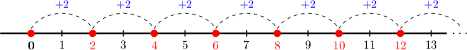
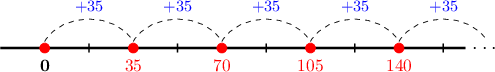

# The Multiples of a Number

Source: https://www.mathacademy.com/topics/2206?courseId=75
Topic ID: 2206

## Prerequisites

- [Adding Three Multi-Digit Numbers](./3881-adding-three-multi-digit-numbers.md)
- [The Factors of a Number](./3942-the-factors-of-a-number.md)

## Lesson

### Introduction

A **multiple** of $\color{blue}2$ is any number that can be written as

$$
𝐴
$$

where $𝐴$ is a whole number.

For example, let's take a look at the first few entries of the ${\color{blue}{2}}\times$ multiplication table:

$$
\begin{aligned}2×1 & = & 2 \\ 2×2 & = & 4 \\ 2×3 & = & 6 \\ 2×4 & = & 8 \\ 2×5 & = & 10\end{aligned}
$$

The multiples of $\color{blue}2$ are given by the following products:

$$
{\color{red}2}, \quad {\color{red}4}, \quad {\color{red}6}, \quad {\color{red}8}, \quad {\color{red}10}, \quad \ldots
$$

We can picture all of the multiples of $\color{blue}2$ using a number line:

### Example: Finding Multiples in the Simplest Cases

#### Question

What is the sum of the first three positive multiples of $110?$

#### Explanation

To find the first three positive multiples of $110,$ we multiply $110$ by $1$, $2$ and $3$, respectively:

$$
\begin{aligned} & 110×1=110 \\ & 110×2=110+110=220 \\ & 110×3=220+110=330\end{aligned}
$$

So, the sum is $110+220+330 = 660.$

### Example: Finding Multiples in More Challenging Cases

#### Question

List the first three positive multiples of $31$ in ascending order.

#### Explanation

To find the first three positive multiples of $31,$ we multiply $31$ by $1$, $2$ and $3$, respectively:

$$
\begin{aligned} & 31×1=31 \\ & 31×2=31+31=62 \\ & 31×3=62+31=93\end{aligned}
$$

So, the first three positive multiples of $31$ are

$$
\bbox[3pt,Gainsboro]{\color{blue}31}, \quad \bbox[3pt,Gainsboro]{\color{blue}62}, \quad \bbox[3pt,Gainsboro]{\color{blue}93}.
$$

### Example: Recognizing Multiples of One-Digit Numbers

#### Question

Which of the following numbers are multiples of $3?$

$$
6, \quad 12, \quad 16
$$

#### Explanation

Let's start by listing the first few multiples of $3\mathbin{:}$

$$
3, \quad 6, \quad 9, \quad 12, \quad 15, \quad 18, \quad \ldots
$$

Now, let's examine our numbers in turn.

- $6$ is a multiple of $3.$

- $12$ is a multiple of $3.$

- $16$ is ** a multiple of $3,$ since it does not appear in our list.

Therefore, the correct answer is "$6$ and $12$ only."

### Example: Recognizing Multiples of Two-Digit Numbers

#### Question

Which of the following numbers are multiples of $35?$

$$
70, \quad 90, \quad 105
$$

#### Explanation

We start by drawing a number line. Then, we move along our number line in jumps of $35,$ starting from zero:

So, the first few multiples of $35$ are as follows:

$$
35, \quad 70, \quad 105, \quad 140, \quad \ldots
$$

Now, let's examine our numbers in turn.

- $70$ is a multiple of $35.$

- $90$ is ** a multiple of $35,$ since it does not appear in our list.

- $105$ is a multiple of $35.$

Therefore, the correct answer is "$70$ and $105$ only."
