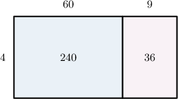

# Estimating Multi-Digit Multiplication

Source: https://www.mathacademy.com/topics/2287?courseId=75
Topic ID: 2287

## Prerequisites

- [Two-Digit by One-Digit Multiplication Using Area Models](./2415-two-digit-by-one-digit-multiplication-using-area-models.md)
- [Rounding Up the Digit 9](./3900-rounding-up-the-digit-9.md)

## Lesson

### Introduction

When multiplying two numbers, it's often faster and more convenient to estimate the result.

Let's estimate the product $18\times 63$ by rounding each factor to the nearest ten.

$$
\begin{aligned}18 & × & 63 \\ & & \\ 20 & × & 60\end{aligned}
$$

We now need to find the value of $20 \times 60,$ which is much easier!

First, we figure out the non-zero parts and the blocks of zeros for both numbers:

$$
\begin{aligned}20 & \,⟶\,20 \\ 60 & \,⟶\,60\end{aligned}
$$

We can see that there are $2$ zeros in total.

Next, we multiply the non-zero parts:

$$
\bbox[2px, lightgray]{2} \times \bbox[2px, lightgray]{6} = {\color{red}{12}}
$$

Finally, we join the above with the block of zeros:

$$
{\color{red}12}{\color{blue}00} = 1,200
$$

Therefore, $18 \times 63$ is approximately $1,200.$

The actual answer is $1,134,$ so our estimate is pretty good!

### Example: Estimating Two-Digit by Two-Digit Multiplication

#### Question

Michael bought thirteen T-shirts for his children. The T-shirts cost $\[math]17$ each. By rounding the number of T-shirts and the cost of each shirt to the nearest ten, estimate the total amount that Michael paid for the T-shirts.

#### Explanation

To estimate the total amount that Michael paid, we need to estimate the product $13 \times 17.$

We round both factors to the nearest ten:

$$
\begin{aligned}13 & × & 17 \\ & & \\ 10 & × & 20\end{aligned}
$$

So, we now need to find the value of $10 \times 20.$

First, we figure out the non-zero parts and the blocks of zeros for both numbers:

$$
\begin{aligned}10 & \,⟶\,10 \\ 20 & \,⟶\,20\end{aligned}
$$

We can see that there are $2$ zeros in total.

Next, we multiply the non-zero parts:

$$
\bbox[2px, lightgray]{1} \times \bbox[2px, lightgray]{2} = \color{red}{2}
$$

Finally, we join the above with the block of zeros:

$$
{\color{red}2}{\color{blue}00}
$$

Therefore, Michael paid approximately $\[math]200$ for the T-shirts.

### Example: Estimating Three-Digit by Two-Digit Multiplication

#### Question

A tools factory made $694$ tools each day for $38$ days. By rounding the number of tools and the number of days to the nearest ten, estimate the total number of tools that the factory produced.

#### Explanation

To estimate the total number of tools produced, we need to estimate the product $694 \times 38.$

We round both factors to the nearest ten, as required:

$$
\begin{aligned}694 & × & 38 \\ & & \\ 690 & × & 40\end{aligned}
$$

Hence, we need to find the value of $690 \times 40.$

First, we figure out non-zero parts and blocks of zeros for both numbers:

$$
\begin{aligned}690 & \,⟶\,690 \\ 40 & \,⟶\,40\end{aligned}
$$

We can see that there are $2$ zeros in total.

Next, we multiply the non-zero parts. We can do this using an area model:

So, $69\times 4 = 240+36 = {\color{red}{276}}.$

Finally, we join the above with the block of zeros:

$$
{\color{red}276}{\color{blue}00} = 27,600
$$

Therefore, the tools factory produced approximately $27,600$ tools.

### Estimating Multiplication of Larger Numbers by Rounding to Different Place Values

In the last few examples, we rounded a three-digit number to the nearest ten, but the resulting multiplication was still a bit tricky. We can make the estimation easier by rounding the factors to different place values.

For example, let's estimate $684 \times 38$ by rounding the *first* factor to the nearest *hundred*, and the *second* factor to the nearest *ten*:

$$
\begin{aligned}684 & × & 38 \\ & & \\ 700 & × & 40\end{aligned}
$$

Hence, we need to find the value of $700 \times 40.$

First, we figure out the non-zero parts and the blocks of zeros for both numbers:

$$
\begin{aligned}700 & \,⟶\,700 \\ 40 & \,⟶\,40\end{aligned}
$$

We can see that there are $3$ zeros in total.

Next, we multiply the non-zero parts:

$$
\bbox[2px, lightgray]{7} \times \bbox[2px, lightgray]{4} = \color{red}{28}
$$

Finally, we join the above with the block of zeros:

$$
{\color{red}28}{\color{blue}000} = 28,000
$$

Therefore, $684\times 38$ is approximately $28,000.$

This estimation is less accurate than if we rounded both numbers to the nearest $10$, but it is much easier to calculate.

### Example: Estimating Two-Digit by Three-Digit Multiplication by Rounding to Different Place Values

#### Question

By rounding the first factor to the nearest ten and the second factor to the nearest hundred, estimate $23 \times 785.$

#### Explanation

We round the first factor to the nearest ten and the second factor to the nearest hundred:

$$
\begin{aligned}23 & × & 785 \\ & & \\ 20 & × & 800\end{aligned}
$$

Hence, we need to find the value of $20 \times 800.$

First, we figure out the non-zero parts and the blocks of zeros for both numbers:

$$
\begin{aligned}20 & \,⟶\,20 \\ 800 & \,⟶\,800\end{aligned}
$$

We can see that there are $3$ zeros in total.

Next, we multiply the non-zero parts:

$$
\bbox[2px, lightgray]{2} \times \bbox[2px, lightgray]{8} = \color{red}{16}
$$

Finally, we join the above with the block of zeros:

$$
{\color{red}16}{\color{blue}000} = 16,000
$$

Therefore, $23 \times 785$ is approximately $16,000.$

### Example: Estimating Four-Digit by Two-Digit Multiplication by Rounding to Different Place Values

#### Question

Estimate $3,586 \times 43$ by rounding the first factor to the nearest thousand and the second factor to the nearest ten.

#### Explanation

We round the first factor to the nearest thousand and the second factor to the nearest ten:

$$
\begin{aligned}3,586 & × & 43 \\ & & \\ 4,000 & × & 40\end{aligned}
$$

Hence, we need to find the value of $4,000 \times 40.$

First, we figure out the non-zero parts and the blocks of zeros for both numbers:

$$
\begin{aligned}4,000 & \,⟶\,4000 \\ 40 & \,⟶\,40\end{aligned}
$$

We can see that there are $4$ zeros in total.

Next, we multiply the non-zero parts:

$$
\bbox[2px, lightgray]{4} \times \bbox[2px, lightgray]{4} = \color{red}{16}
$$

Finally, we join the above with the block of zeros:

$$
{\color{red}16}{\color{blue}0000} = 160,000
$$

So, the estimate is $160,000.$
