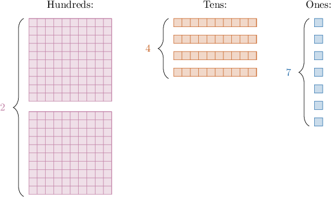

# Place Value With Numbers Up to Four Digits

Source: https://www.mathacademy.com/topics/2312?courseId=75
Topic ID: 2312

## Prerequisites

- None listed on the topic page.

## Lesson

### Introduction

When we write down a whole number, the position of each digit has a name.

For example, let's look at the following three-digit whole number:

$$
{\color{purple}2}{\color{Salmon}4}{\color{SteelBlue}7}
$$

For this number:

- the digit $\color{purple}2$ is in the **hundreds place**

- the digit $\color{Salmon}4$ is in the **tens place**

- the digit $\color{SteelBlue}7$ is in the **ones place**

This tells us that we can rearrange ${\color{purple}2}{\color{Salmon}4}{\color{SteelBlue}7}$ objects in the following way:

It's more compact to write the place values of a number in a **place value chart**. The place value chart for ${\color{purple}2}{\color{Salmon}4}{\color{SteelBlue}7}$ is shown below.

This tells us that ${\color{purple}2}{\color{Salmon}4}{\color{SteelBlue}7}$ is the same as

$$
2
$$

Hundreds, tens, and ones are known as **place values**.

### Example: Identifying Place Values in Three-Digit Numbers

#### Question

For the number $984,$ which digit is in the tens place?

#### Explanation

Let's start by writing down the place values.

So in the tens place, we have $8.$

### Place Values for Whole Numbers with Four Digits

The place value chart for the four-digit whole number $3,724$ is shown below:

This place value chart has a new **thousands** column.

For this number:

- the digit $3$ is in the **thousands place**

- the digit $7$ is in the hundreds place

- the digit $2$ is in the tens place

- the digit $4$ is in the ones place

This tells us that $3,724$ is the same as $3$ thousands, plus $7$ hundreds, plus $2$ tens, plus $4$ ones.

When writing down four-digit whole numbers, we separate the thousands and hundreds using a comma "$,$" to make it easier to read.

### Example: Identifying Place Values in Four-Digit Numbers

#### Question

In $5,372,$ which digit is in the thousands place?

#### Explanation

Let's start by writing down the place values.

So in the thousands place, we have $5.$

### Example: Writing Down Numbers from Place Value Descriptions

#### Question

What number has $5$ thousands, $1$ ten, and $2$ ones?

#### Explanation

Let's start by writing down the place values. Notice that we have zero hundreds.

So, our number is $5,012.$
