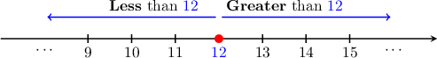

# Comparing Whole Numbers

Source: https://www.mathacademy.com/topics/2324?courseId=75
Topic ID: 2324

## Prerequisites

- [Place Value With Numbers Up to Seven Digits](https://www.mathacademy.com/topics/place-value-with-numbers-up-to-seven-digits-3890)

## Lesson

### Introduction

In this lesson, we'll learn the symbols used to compare the sizes of numbers.

One important symbol is the **greater than** symbol "$>$." We use this symbol to show that one number is larger than another.

For example, we can write the fact that $2$ is larger than $1$ as follows:

$$
2 > 1
$$

In words, we'd say "$2$ is greater than $1$" or "$2$ is larger than $1.$"

When using the greater than symbol, the *bigger* number always goes on the left. The following mnemonic might help you remember this.

### The "Less Than" Symbol

Another important symbol is the **less than** symbol "$<$." We use this symbol to show that one number is smaller than another.

For example, we can write the fact that $3$ is smaller than $5$ as follows:

$$
3 < 5
$$

In words, we'd say "$3$ is less than $5$" or "$3$ is smaller than $5.$"

When using the less than symbol, the *smaller* number always goes on the left. The following mnemonic might help you remember this.

### Comparing Numbers With Different Numbers of Digits

When comparing multi-digit whole numbers, we have the following handy rule:

*A whole number is greater than another whole number if it has more digits.*

For example, $107$ has *more* digits than $25$. Therefore, we can write

$$
107 > 25.
$$

Similarly, $52,546.$ has *fewer* digits than $345,752.$ Therefore, we can write

$$
52,546 < 345,752.
$$

### Example: Comparing Multi-Digit Whole Numbers Using the "Greater Than" Symbol

#### Question

Which of the following statements are true?

1. $702 > 1,024$

2. $7,104 > 896$

3. $11,359 > 8,937$

#### Explanation

Remember that "$>$" means "greater than."

We can compare whole numbers with different numbers of digits by counting the digits. So, let's count the number of digits in each number.

- Statement I is false. Since $\underbrace{702}_{\color{blue}3\,\text{digits}}$ has fewer digits than $\underbrace{1,024}_{\color{blue}4\,\text{digits}}$, we conclude that $702 < 1,024.$

- Statement II is true. Since $\underbrace{7,104}_{\color{blue}4\,\text{digits}}$ has more digits than $\underbrace{896}_{\color{blue}3\,\text{digits}}$, we conclude that $7,104 > 896.$

- Statement III is true. Since $\underbrace{11,359}_{\color{blue}5\,\text{digits}}$ has more digits than $\underbrace{8,937}_{\color{blue}4\,\text{digits}}$, we conclude that $11,359 > 8,937.$

Therefore, the correct answer is "II and III only."

### Example: Comparing Multi-Digit Whole Numbers Using the "Less Than" Symbol

#### Question

Which of the following statements are true?

1. $389 < 87$

2. $2,100 < 58,162$

3. $25,644 < 116,004$

#### Explanation

Remember that "$<$" means "less than."

We can compare whole numbers with different numbers of digits by counting the digits. So, let's count the number of digits in each number.

- Statement I is false. Since $\underbrace{389}_{\color{blue}3\,\text{digits}}$ has more digits than $\underbrace{87}_{\color{blue}2\,\text{digits}},$ we conclude that $389 > 87.$

- Statement II is true. Since $\underbrace{2,100}_{\color{blue}4\,\text{digits}}$ has fewer digits than $\underbrace{58,162}_{\color{blue}5\,\text{digits}}$, we conclude that $2,100 < 58,162.$

- Statement III is true. Since $\underbrace{25,644}_{\color{blue}5\,\text{digits}}$ has fewer digits than $\underbrace{116,004}_{\color{blue}6\,\text{digits}}$, we conclude that $25,644 < 116,004.$

Therefore, the correct answer is "II and III only."

### Number Lines

A **number line** is a line on which each point represents a number. The numbers are written ascending order *from left to right*, as shown below.

Number lines help to visualize which numbers are greater and which are smaller than a given number.

For example, all numbers *to the left* of $12$ are *less* than $12.$ Similarly, all numbers to the *right* of $12$ are *greater* than $12.$

### Example: Comparing Whole Numbers Using Number Lines

#### Question

The diagram above shows a number line. Which of the following numbers could be placed into the empty box?

1. $690$

2. $72$

3. $19,730$

#### Explanation

Since the missing number lies to the ** of $3,500,$ it must be ** this number. Therefore,

$$
0000
$$

With that in mind, let's examine our numbers in turn.

- The number $690$ satisfies the condition since it has fewer digits than $3,500.$

- The number $72$ also satisfies the condition since it has fewer digits than $3,500.$

- The number $19,730$ does ** satisfy the condition since it has more digits than $3,500.$

Therefore, the correct answer is "I and II only."
