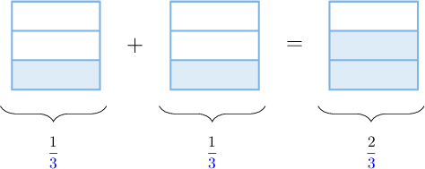

# Adding Fractions With Like Denominators

Source: https://www.mathacademy.com/topics/2351?courseId=75
Topic ID: 2351

## Prerequisites

- [Converting Improper Fractions to Mixed Numbers](https://www.mathacademy.com/topics/converting-improper-fractions-to-mixed-numbers-2359)
- [Adding Fractions With Like Denominators Using Models](https://www.mathacademy.com/topics/adding-fractions-with-like-denominators-using-models-2370)

## Lesson

### Introduction

When adding two fractions with the *same* denominator, we

- add their numerators, and

- keep the denominator the same.

For example, let's compute the following sum:

$$
\dfrac 1 3 + \dfrac 1 3
$$

To add these numbers, we add the numerators and keep the denominators the same. Therefore,

$$
\begin{aligned}\frac{1}{3}+\frac{1}{3}=\frac{1+1}{3}=\frac{2}{3}.\end{aligned}
$$

We can use a fraction model to confirm this result:

### Example: Adding Fractions

#### Question

Find the value of $\dfrac 2 9 + \dfrac 3 9.$

#### Explanation

To add two fractions with like denominators, we add the numerators and keep the denominators the same. Therefore,

$$
\begin{aligned}\frac{2}{9}+\frac{3}{9}=\frac{2+3}{9}=\frac{5}{9}.\end{aligned}
$$

### Example: Adding Fractions and Simplifying the Result

#### Question

What is the value of $\dfrac 3 8 + \dfrac 1 8?$

#### Explanation

To add two fractions with like denominators, we add the numerators and keep the denominators the same. Therefore,

$$
\begin{aligned}\frac{3}{8}+\frac{1}{8}=\frac{3+1}{8}=\frac{4}{8}.\end{aligned}
$$

We can simplify this fraction by dividing the numerator and the denominator by $4{:}$

$$
\dfrac{4}{8} = \dfrac{4\div 4}{8\div 4} = \dfrac{1}{2}
$$

Therefore, we conclude that

$$
\dfrac 3 8 + \dfrac 1 8 = \dfrac 1 2.
$$

### Example: Adding Fractions and Converting the Result to a Mixed Number

#### Question

Find the value of $\dfrac 2 3 + \dfrac 2 3.$

#### Explanation

To add two fractions with like denominators, we add the numerators and keep the denominators the same. Therefore,

$$
\begin{aligned}\frac{2}{3}+\frac{2}{3}=\frac{2+2}{3}=\frac{4}{3}.\end{aligned}
$$

We then convert $\dfrac 4 3$ to a mixed number:

$$
4\div 3 = 1\,\textrm{R}1 = 1\,\dfrac 1 3
$$

Therefore, we conclude that

$$
\dfrac 2 3 + \dfrac 2 3 = 1\,\dfrac 1 3.
$$
