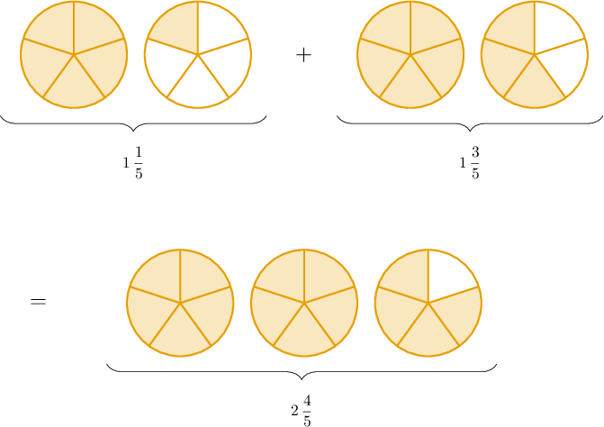

# Adding Mixed Numbers With Like Denominators

Source: https://www.mathacademy.com/topics/2352?courseId=75
Topic ID: 2352

## Prerequisites

- [Adding Fractions With Like Denominators](https://www.mathacademy.com/topics/adding-fractions-with-like-denominators-2351)

## Lesson

### Introduction

To add two mixed numbers, we add whole numbers to whole numbers and fractions to fractions.

For example, let's consider the following addition problem:

$$
{\color{red}1}\,{\color{blue}\dfrac 1 5} + {\color{red}1}\,{\color{blue}\dfrac 3 5}
$$

Adding the whole numbers, we get

$$
{\color{red}1}+{\color{red}1} = {\color{red}{2}}.
$$

Adding the fractions, we get

$$
{\color{blue}\dfrac 1 5} + {\color{blue}\dfrac 3 5} = {\color{blue}{\dfrac{1+3}{5}}} = {\color{blue}{\dfrac 4 5}}.
$$

Finally, we add the resulting whole number and the fraction:

$$
1\,\frac 1 5 + 1\,\dfrac 3 5 = {\color{red}{2}} + {\color{blue}{\dfrac 4 5}} = 2\,\dfrac 4 5
$$

We can check this result using a fraction model.

### Example: Adding Mixed Numbers

#### Question

Find the value of $\dfrac 1 3 + 5\,\dfrac 1 3.$

#### Explanation

To add two mixed numbers, we add

- whole numbers to whole numbers, and

- fractions to fractions.

First, we notice that the first fraction $\left(\dfrac13\right)$ has a whole number part of zero.

With that in mind, let's add our numbers.

- Adding the whole numbers, we get

- Adding the fractions, we get

Finally, we combine our results:

$$
\dfrac 1 3 + 5\,\dfrac 1 3 = {\color{red}5} + {\color{blue}{\dfrac 2 3}} =5\,\dfrac 2 3
$$

### Example: Adding Mixed Numbers When Simplification Is Needed

#### Question

Find the value of $2\,\dfrac 5 {10} + 4\,\dfrac 3 {10}.$

#### Explanation

To add two mixed numbers, we add

- whole numbers to whole numbers, and

- fractions to fractions.

With that in mind let's add our mixed numbers.

- Adding the whole numbers, we get

- Adding the fractions, we get We can simplify this fraction by dividing the numerator and denominator by $2{:}$

Therefore,

$$
2\,\dfrac 5 {10} + 4\,\dfrac 3 {10} = {\color{red}{6}} + {\color{blue}{\dfrac 4 5}} = 6\,\dfrac 4 5.
$$

### Fractional Parts Whose Sum Gives a Whole

When adding mixed numbers, we sometimes get a result greater than (or equal to) $1$ when adding the fractional parts.

To demonstrate, let's compute the value of the following sum:

$$
4\,\dfrac 2 5 + 3\,\dfrac 4 5
$$

As before, we add whole numbers to whole numbers and fractions to fractions:

- Adding the whole numbers, we get

- Adding the fractions, we get This is an improper fraction because the numerator $(6)$ is larger than the denominator $(5).$ However, we can convert this improper fraction to a mixed number as follows: Notice that this gives us an additional whole number part.

Combining our results, we get

$$
4\,\dfrac 2 5 + 3\,\dfrac 4 5 = {\color{red}{7}} + {\color{blue}{1\,\dfrac 1 5}} = 8\,\dfrac 1 5.
$$

### Example: Adding Mixed Numbers When the Fractional Parts Sum to a Whole

#### Question

What is the value of $2\,\dfrac 1 4 + 2\,\dfrac 3 4?$

#### Explanation

To add two mixed numbers, we add

- whole numbers to whole numbers, and

- fractions to fractions.

With that in mind let's add our mixed numbers.

- Adding the whole numbers, we get

- Adding the fractions, we get

Therefore,

$$
2\,\dfrac 1 4 + 2\,\dfrac 3 4 = {\color{red}{4}} + {\color{blue}{1}} = 5.
$$
