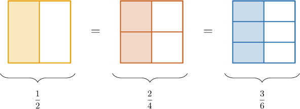

# Equivalent Fractions

Source: https://www.mathacademy.com/topics/2363?courseId=75
Topic ID: 2363

## Prerequisites

- [Improper Fractions](./2367-improper-fractions.md)
- [Finding Equivalent Fractions Using Area Models](./2368-finding-equivalent-fractions-using-area-models.md)
- [The Factors of a Number](./3942-the-factors-of-a-number.md)

## Lesson

### Introduction

Let's consider the following fraction:

$$
\dfrac12
$$

We can generate equivalent fractions by multiplying the numerator and denominator by any whole number.

For example, multiplying the numerator and denominator by ${\color{red}{2}},$ we get

$$
\dfrac12 = \dfrac{1\times {\color{red}{2}}}{2\times {\color{red}{2}}} = \dfrac{2}{4}.
$$

Similarly, by multiplying the numerator and denominator by ${\color{blue}{3}},$ we get

$$
\dfrac12 = \dfrac{1\times {\color{blue}{3}}}{2\times {\color{blue}{3}}} = \dfrac{3}{6}.
$$

Therefore, the following fractions are all equivalent:

$$
\dfrac12, \qquad\dfrac24, \qquad \dfrac36
$$

We can check that these fractions are equivalent using fraction models:

All three models have the same shape and the same shaded area. Therefore, they represent equivalent fractions.

### Example: Finding Equivalent Fractions Using Multiplication

#### Question

Create a fraction equivalent to $\dfrac{4}{3}$ with a denominator of $9.$

#### Explanation

To make an equivalent fraction with a denominator of $9,$ we multiply the numerator and the denominator of $\dfrac{4}{3}$ by $3.$

$$
\dfrac{4}{3} = \dfrac{4 \times 3}{3 \times 3}=\dfrac{12}{9}
$$

Therefore, $\dfrac{4}{3}=\dfrac{12}{9}.$

### Finding Equivalent Fractions by Division

We can also *divide* the numerator and denominator of a fraction by the same number to give an equivalent fraction.

For example, let's consider the following fraction:

$$
\dfrac{6}{12}
$$

Let's create some equivalent fractions by dividing:

- Notice that $6$ and $12$ both have ${\color{blue}{2}}$ as a factor. Therefore, we can divide our fraction by ${\color{blue}{2}}$ to create an equivalent fraction:

$$
\dfrac{6}{12} = \dfrac{6\div {\color{blue}{2}} }{12 \div {\color{blue}{2}}} = \dfrac36
$$

- Similarly, $6$ and $12$ both have ${\color{red}{3}}$ as a factor. Therefore, we can divide our fraction by ${\color{red}{3}}$ to create an equivalent fraction:

$$
\dfrac{6}{12} = \dfrac{6\div {\color{red}{3}} }{12 \div {\color{red}{3}}} = \dfrac24
$$

- Finally, $6$ and $12$ also have ${\color{purple}{6}}$ as a factor. Therefore, we can divide our fraction by ${\color{purple}{6}}$ to create an equivalent fraction:

$$
\dfrac{6}{12} = \dfrac{6\div {\color{purple}{6}} }{12 \div {\color{purple}{6}}} = \dfrac12
$$

Therefore, the following fractions are all equivalent:

$$
\dfrac{6}{12}, \qquad \dfrac{3}{6}, \qquad \dfrac{2}{4}, \qquad \dfrac12
$$

### Example: Finding Equivalent Fractions Using Division

#### Question

Create a fraction equivalent to $\dfrac{12}{8}$ with a denominator of $2.$

#### Explanation

To make a denominator of $2$, we divide the numerator and the denominator of $\dfrac{12}{8}$ by $4.$

$$
\dfrac{12}{8} = \dfrac{12 \div 4}{8 \div 4} =\dfrac{3}{2}
$$

Therefore, $\dfrac{12}{8} = \dfrac{3}{2}.$

### Whole Numbers as Fractions

To express a whole number as a fraction, we use the number itself as the numerator and put it over a denominator of $1.$

For example, the number $3$ can be written as a fraction in the following way:

$$
3 = \dfrac{3}{1}
$$

We can now find some equivalent fractions. For example:

- multiplying our fraction by ${\color{blue}{2}},$ we get

- multiplying our fraction by ${\color{red}{3}},$ we get

Therefore, the following numbers are all equivalent:

$$
3, \qquad \dfrac31, \qquad \dfrac62, \qquad \dfrac93
$$

### Example: Writing Whole Numbers as Fractions

#### Question

What is the missing digit in the following equality?

$$
0
$$

#### Explanation

Let's write $5$ as a fraction with denominator $1$:

$$
5 = \dfrac{5}{1}
$$

To make a denominator of $4,$ we multiply the numerator and the denominator of $\dfrac{5}{1}$ by $4.$

$$
\dfrac{5}{1} = \dfrac{5 \times 4}{1 \times 4} = \dfrac{\color{blue}20}{4}
$$

Therefore, the missing number is ${\color{blue}{20}}.$
