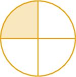
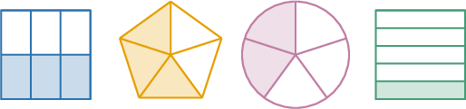

# Fraction Models

Source: https://www.mathacademy.com/topics/2366?courseId=75
Topic ID: 2366

## Prerequisites

- None listed on the topic page.

## Lesson

### Introduction

A **fraction** is a number that represents part of a whole.

Let's take a look at the shape below.

This circle is an example of a **fraction model**.

Note that

- the *entire* circle represents **one whole,**

- the circle has been split into ${\color{blue}4}$ equal parts, and

- only $\color{red}1$ part of the circle is shaded.

We can use the following fraction to represent the amount of circle that is shaded:

$$
\dfrac{\color{red}1}{\color{blue}4}
$$

The two numbers that make up the fraction have special names:

- The number on top of the fraction (${\color{red}1}$) is called the **numerator**. It represents the number of shaded parts.

- The number on the bottom (${\color{blue}4}$) is called the **denominator**. It represents the total number of parts.

### Example: Representing a Fraction Using a Fraction Model

#### Question

What fraction of the shape is shaded?

#### Explanation

There are $\color{blue}5$ parts of the shape in total, and $\color{red}4$ parts are shaded.

Therefore, $\dfrac{\color{red}4}{\color{blue}5}$ of the shape is shaded.

### Example: Selecting a Fraction Model Representing a Fraction

#### Question

Which of the following shapes represents the fraction $\dfrac{3}{5}?$

#### Explanation

Notice that $\dfrac{\color{red}3}{\color{blue}5}$ means we must have $\color{blue}5$ parts in total, and only $\color{red}3$ of them can be shaded.

Therefore, the correct shape is the following:

