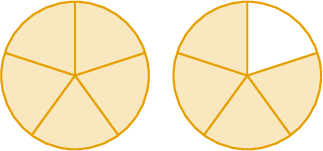
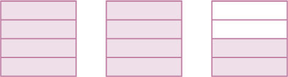
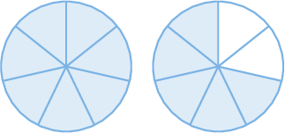
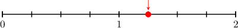
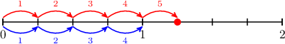
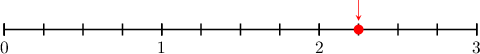
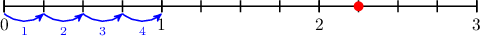
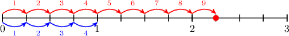

# Improper Fractions

Source: https://www.mathacademy.com/topics/2367?courseId=75
Topic ID: 2367

## Prerequisites

- [Modeling Fractions Using Number Lines](./7003-modeling-fractions-using-number-lines.md)

## Lesson

### Introduction

Let's look at the following fraction model, where each circle represents one whole.

Each whole has been split into $\color{blue}5$ parts. Of these parts, $\color{red}9$ are shaded. Therefore, this picture represents the following fraction:

$$

\dfrac{\color{red}9}{\color{blue}5}

$$

This type of fraction is called an **improper fraction** because the numerator (${\color{red}9}$) is larger than the denominator (${\color{blue}5}$). Improper fractions are used to represent numbers greater than or equal to one whole.

Improper fractions are sometimes called **top-heavy fractions.**

### Example: Representing Improper Fractions Using Area Models

#### Question

What improper fraction is shown in the picture below?

#### Explanation

Each shape consists of $\color{blue}4$ parts, and there are $2\times {\color{blue}4} +2 = \color{red}10$ shaded parts in total.

Therefore, the picture represents the improper fraction $\dfrac{\color{red}10}{\color{blue}4}.$

### Example: Selecting an Area Model Representing an Improper Fraction

#### Question

Draw a fraction model that represents the improper fraction $\dfrac{12}{7}.$

#### Explanation

The improper fraction $\dfrac{\color{red}12}{\color{blue}7}$ means

- a "whole" is made up of $\color{blue}7$ parts, and

- $\color{red}12$ parts must be shaded.

Therefore, a correct picture is the following:

### Number Line Models for Improper Fractions

We can also represent improper fractions using number lines.

For example, let's find the improper fraction represented by the number line below.

Notice that the line segment from $0$ to $1$ is split into $\color{blue}4$ equal parts. Each part represents $\dfrac{1}{\color{blue}4}$ of a whole.

The number we are interested in is located $\color{red}5$ steps from $0$ (left to right).

Therefore, the picture represents the improper fraction $\dfrac{\color{red}5}{\color{blue}4}.$

### Example: Representing Improper Fractions Using Number Lines

#### Question

What improper fraction is shown on the number line?

#### Explanation

Notice that the line segment from $0$ to $1$ is split into $\color{blue}4$ equal parts. Each part represents $\dfrac{1}{\color{blue}4}$ of a whole.

The number we are interested in is located $2\times {\color{blue}4} +1 = \color{red}9$ steps from $0$ (left to right).

Therefore, the picture represents $\dfrac{\color{red}9}{\color{blue}4}.$
