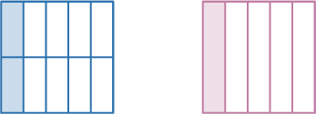
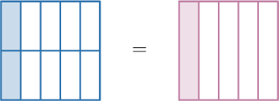
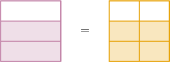
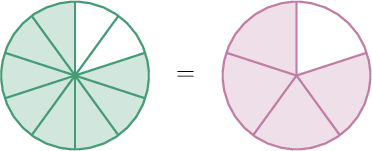
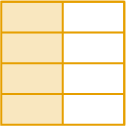
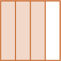
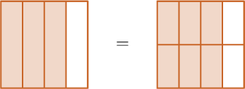

# Finding Equivalent Fractions Using Area Models

Source: https://www.mathacademy.com/topics/2368?courseId=75
Topic ID: 2368

## Prerequisites

- [Modeling Fractions Using Number Lines](./7003-modeling-fractions-using-number-lines.md)

## Lesson

### Introduction

Two fractions are **equivalent** (e-quiv-a-lent) if their area models have the same shape and have the same shaded area.

For example, let's take a look at the fractions below.

Notice that

- both models have the *same* shape, and

- they have the *same* shaded area.

Therefore, these fractions are equivalent. This means they represent the same number, and we can put an "equals" sign between them.

### Writing an Equation Containing Equivalent Fractions

We have the following equivalent fractions:

Let's use this to write down an equation with numbers.

- For the shape on the left: There are $10$ parts of the shape in total. Of them, $2$ parts are shaded. So, $\color{SteelBlue}\dfrac{2}{10}$ of the shape is shaded.

- For the shape on the right: There are $5$ parts of the shape in total. Of them, $1$ part is shaded. So, $\color{Purple}\dfrac{1}{5}$ of the shape is shaded.

Since the two fractions are equivalent, they represent the same number, and we can write down the following equation:

$$
{\color{SteelBlue}\dfrac{2}{10}} = {\color{Purple}\dfrac{1}{5}}
$$

### Example: Determining the Missing Value Given Two Equivalent Fraction Models

#### Question

What number is missing from the statement below?

$$
\,0\,
$$

#### Explanation

Let's compare the two shapes.

- For the shape on the left: There are $3$ parts of the shape in total. Of them, $2$ parts are shaded. So, $\dfrac{2}{3}$ of the shape is shaded.

- For the shape on the right: There are $6$ parts of the shape in total. Of them, $4$ parts are shaded. So, $\dfrac{4}{6}$ of the shape is shaded.

Both shaded regions have the same area. Therefore, the two fractions are equivalent, and we obtain the following:

$$
\,4\,
$$

Therefore, the missing value is $\color{blue}4.$

### Example: Determining a Fraction Given Two Equivalent Fraction Models

#### Question

Given the picture above, what fraction is equivalent to $\dfrac{8}{10}?$

#### Explanation

Let's compare the two shapes.

- For the shape on the left: There are $10$ parts of the shape in total. Of them, $8$ parts are shaded. So, $\dfrac{8}{10}$ of the shape is shaded.

- For the shape on the right: There are $5$ parts of the shape in total. Of them, $4$ parts are shaded. So, $\dfrac{4}{5}$ of the shape is shaded.

Both shaded regions have the same area. Therefore, the two fractions are equivalent, and we obtain the following:

$$
\dfrac{8}{10} = {\color{blue}\dfrac{4}{5}}
$$

### Creating Equivalent Fractions by Adding More Parts

The following fraction model represents $\dfrac12\mathbin{:}$

We can generate equivalent fractions by splitting the shape into more equal parts.

For example, if we draw a horizontal line, we get the following model representing $\dfrac24\mathbin{:}$

We can continue to split the fraction into equal parts to generate more equivalent fractions.

For example, if we draw two more horizontal lines, we get a model representing $\dfrac48\mathbin{:}$

Therefore, the following fractions are all equivalent:

$$
\dfrac12, \qquad \dfrac24, \qquad \dfrac48
$$

**Watch Out!** Whenever we split a fraction model into more equal parts to generate equivalent fractions, *all* parts must have the same area!

### Example: Determining an Equivalent Fraction Given a Fraction Model

#### Question

The fraction given below is equivalent to the fraction shown in the picture. What number is missing?

$$
\,0\,
$$

#### Explanation

There are $4$ equal parts in the given shape in total. Of them, $3$ parts are shaded. So, $\dfrac{3}{4}$ of the shape is shaded.

Since we are looking for a fraction of the form $\,0\,$, we now draw another shape that has the same shaded area but is divided into $8$ equal parts. To do that, we subdivide each part into $2$ equal pieces:

The shape on the right is divided into $8$ equal parts. Of them, $6$ parts are shaded. So, $\dfrac{6}{8}$ of the shape is shaded.

Hence, we obtain

$$
\,6\,
$$

Therefore, the missing number is $\color{blue}6.$
