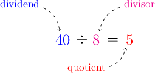
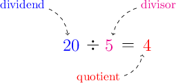
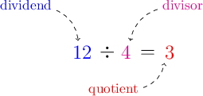
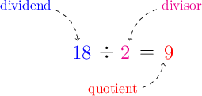
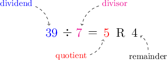
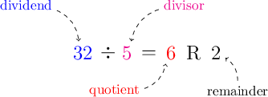

# Dividends, Divisors, Quotients, and Remainders

Source: https://www.mathacademy.com/topics/2390?courseId=75
Topic ID: 2390

## Prerequisites

- [Understanding Remainders Using Models](https://www.mathacademy.com/topics/understanding-remainders-using-models-3888)

## Lesson

### Introduction

Each number in a division problem has a special name:

- the number we divide is called the **dividend**

- the number we divide by is called the **divisor**

- the result of the division is called the **quotient**

For example, let's label each number in the division problem $40 \div 8 = 5{:}$

So, we have that

- the dividend is ${\color{blue}{40}},$

- the divisor is ${\color{magenta}{8}},$ and

- the quotient is ${\color{red}{5}}.$

### Example: Identifying Dividends

#### Question

What is the dividend in the division problem below?

$$
20 \div 5 = 4
$$

#### Explanation

In a division problem,

- the number we divide is called the **,

- the number we divide by is called the **,

- the result of the division is called the **.

In our example above, the dividend is ${\color{blue}{20}}.$

### Example: Identifying Divisors

#### Question

What is the divisor in the division problem below?

$$
12 \div 4 = 3
$$

#### Explanation

In a division problem,

- the number we divide is called the **,

- the number we divide by is called the **,

- the result of the division is called the **.

In our example above, the divisor is ${\color{magenta}{4}}.$

### Example: Identifying Quotients

#### Question

What is the quotient in the division problem below?

$$
18 \div 2 = 9
$$

#### Explanation

In a division problem,

- the number we divide is called the **,

- the number we divide by is called the **,

- the result of the division is called the **.

In our example above, the quotient is ${\color{red}{9}}.$

### Dividing With Remainders

Let's consider the following division problem:

$$
39 \div 7 = 5 \: \textrm{R} \: 4
$$

We also have the amount left over, which is called the **remainder**.

Therefore, in our example above:

- the dividend is $\color{blue}39$

- the divisor is $\color{magenta}7$

- the quotient is $\color{red}5$

- the remainder is $4$

### Example: Identifying Remainders

#### Question

What is the remainder in the division problem below?

$$
32 \div 5 = 6 \: \textrm{R} \: 2
$$

#### Explanation

In a division with remainder problem,

- the number we divide is called the **,

- the number we divide by is called the **,

- the whole number part of the result is called the **,

- the amount left over is called the **.

In our example above, the remainder is $2.$
