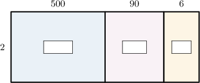
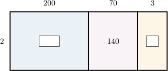
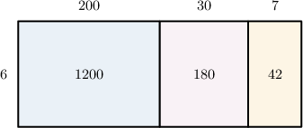
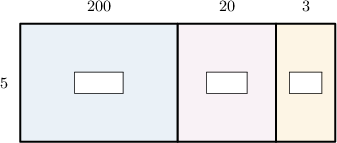
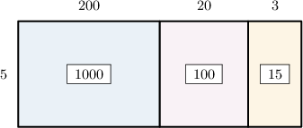
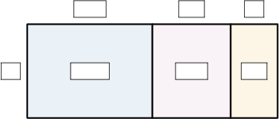
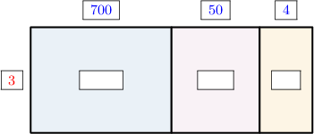

# Multi-Digit by One-Digit Multiplication Using Area Models

Source: https://www.mathacademy.com/topics/2393?courseId=75
Topic ID: 2393

## Prerequisites

- [Two-Digit by One-Digit Multiplication Using Area Models](./2415-two-digit-by-one-digit-multiplication-using-area-models.md)
- [Adding Three Multi-Digit Numbers](./3881-adding-three-multi-digit-numbers.md)

## Lesson

### Introduction

Let's consider the following area model:

To complete this area model, we need to look at the blue, pink, and orange rectangles:

- Let's first look at the blue rectangle (the one on the left-hand side). Its length is $500,$ and its width is $2.$ Therefore, the area of this rectangle must be Let's add this to our model.

- Now, let's look at the pink rectangle (the one in the center). Its length is $90,$ and its width is $2.$ Therefore, the area of this rectangle must be Let's add this to our model.

- Finally, let's look at the orange rectangle (the one on the right-hand side). Its length is $6,$ and its width is $2.$ Therefore, the area of this rectangle must be Let's add this to our model.

And we're done!

**Note**: Remember, area models are usually not drawn to scale.

### Example: Completing an Area Model

#### Question

From left to right, find the missing numbers in the area model below.

#### Explanation

We need to look at the blue and orange rectangles:

- Let's first look at the blue rectangle (the one on the left-hand side). Its length is $200,$ and its width is $2.$ Therefore, the area of this rectangle must be Let's add this to our model.

- Now, let's look at the orange rectangle (the one on the right-hand side). Its length is $3,$ and its width is $2.$ Therefore, the area of this rectangle must be Let's add this to our model:

Therefore, from left to right, the missing numbers are $400$ and $6.$

### Example: Interpreting an Area Model

#### Question

The area model above can be used to represent the following multiplication problem:

$$

00

$$

What is the missing number?

#### Explanation

Let's look at the big rectangle:

- its length is $200 + 30 + 7 = 237$

- its width is $6$

- its area is $1,200 + 180 + 42 = 1,422$

Hence, this area model can be used to represent the following multiplication problem:

$$

1,422

$$

Therefore, the missing number is $1,422.$

### Example: Multiplying Numbers Using a Partially Filled Area Model

#### Question

Using the area model below, find the value of $223 \times 5.$

#### Explanation

First, we compute the areas of the blue, pink, and orange rectangles. This gives the following picture:

Now, notice the following regarding the big rectangle:

- its length is $200 + 20 + 3 = 223$

- its width is $5$

- its area is $1,000 + 100 + 15 = 1,115$

Therefore, this area model can be used to represent the following multiplication problem:

$$

223 \times 5 = 1,115

$$

### Example: Multiplying Three-Digit Numbers by One-Digit Numbers

#### Question

Using the area model below, find the value of $754 \times 3.$

#### Explanation

First, we set up the model. The number $754$ can be expressed in expanded form as ${\color{blue}700} + {\color{blue}50} + {\color{blue}4}.$ So, we place ${\color{blue}700},$ ${\color{blue}50},$ and ${\color{blue}4}$ above the left, center, and right rectangles, respectively, and ${\color{red}3}$ to the left of the big rectangle.

Next, we compute the areas of the blue, pink, and orange rectangles. This gives the following picture:

Now, notice the following regarding the big rectangle:

- its length is $700 + 50 + 4 = 754$

- its width is $3$

- its area is $2,100+150 + 12 = 2,262$

Therefore, this area model can be used to represent the following multiplication problem:

$$

754 \times 3 = 2,262

$$
