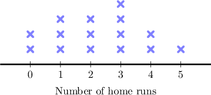
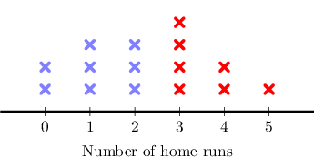
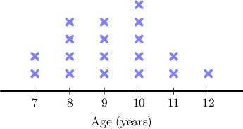
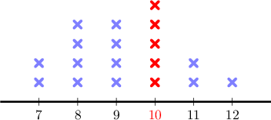
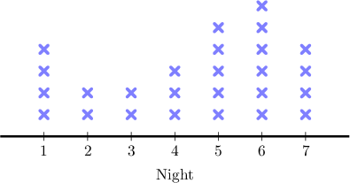
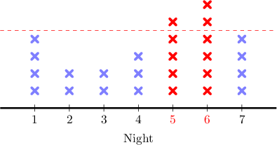
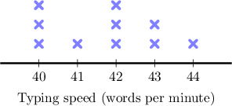
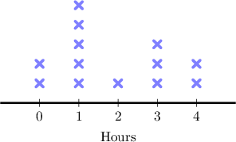

# Creating and Interpreting Line Plots

Source: https://www.mathacademy.com/topics/2400?courseId=75
Topic ID: 2400

## Prerequisites

- None listed on the topic page.

## Lesson

### Introduction

When we have a range of measurements, we can use a **line plot** to visualize the data. It shows a count of how many times certain numbers appear in the data.

The following line plot shows the number of home runs each player in a baseball team hit during a season.

Each number is divided into equidistant marks on a horizontal line. Every cross above each number represents a different player who has hit that many home runs.

We can use the line plot to analyze the data. For instance, how many players hit at least $3$ home runs?

The plot tells us that:

- ${\color{blue}2}$ players have hit $0$ home runs

- ${\color{blue}3}$ players have hit $1$ home run

- ${\color{blue}3}$ players have hit $2$ home runs

- ${\color{red}4}$ players have hit $3$ home runs

- ${\color{red}2}$ players have hit $4$ home runs

- ${\color{red}1}$ player has hit $5$ home runs

Therefore, a total of $4+2+1=7$ players have hit at least $3$ home runs.

### Example: Finding the Most Common Value in a Line Plot

#### Question

The line plot below shows the ages of the members in a judo class. Each cross represents a different member. What is the most common age of a member in this class?

#### Explanation

The plot tells us that:

- there are ${\color{blue}2}$ members who are $7$-years-old,

- there are ${\color{blue}4}$ members who are $8$-years-old,

- there are ${\color{blue}4}$ members who are $9$-years-old.

- there are ${\color{red}5}$ members who are $10$-years-old,

- there are ${\color{blue}2}$ members who are $11$-years-old,

- there is ${\color{blue}1}$ member who is $12$-years-old.

Therefore, $10$ is the most common age of a member of the judo class.

### Example: Finding a Count of Values in a Line Plot

#### Question

A local meal delivery service kept track of the number of promotional pizzas delivered, at nights, in the last week. The line plot below shows the results, where each cross represents one pizza. How many nights did they deliver $5$ or more pizzas?

#### Explanation

The plot tells us that:

- on the first night, ${\color{blue}4}$ pizzas were delivered

- on the second night, ${\color{blue}2}$ pizzas were delivered

- on the third night, ${\color{blue}2}$ pizzas were delivered

- on the fourth night, ${\color{blue}3}$ pizzas were delivered

- on the fifth night, ${\color{red}5}$ pizzas were delivered

- on the sixth night, ${\color{red}6}$ pizzas were delivered

- on the seventh night, ${\color{blue}4}$ pizzas were delivered

They delivered five or more pizzas on the fifth night and the sixth night.

Therefore, in total, they delivered five or more pizzas on $2$ nights.

### Example: Constructing a Line Plot Given Ordered Data

#### Question

The following table reports the typing speed, in words per minute, of ten students after an online typing test.

Make a line plot to represent the given table.

#### Explanation

From the table:

- There are $3$ students with a typing speed of $40$ words per minute. So, there will be $3$ crosses over $40.$

- There is $1$ student with a typing speed of $41$ words per minute. So, there will be $1$ cross over $41.$

- There are $3$ students with a typing speed of $42$ words per minute. So, there will be $3$ crosses over $42.$

- There are $2$ students with a typing speed of $43$ words per minute. So, there will be $2$ crosses over $43.$

- There is $1$ student with a typing speed of $44$ words per minute. So, there will be $1$ crosses over $44.$

Therefore, we get the line plot shown below:

### Example: Constructing a Line Plot Given Unordered Data

#### Question

During the last weekend, the number of hours spent doing homework by the students of a math class was

$$

1,\,0,\,1,\,2,\,3,\,3,\,1,\,3,\,1,\,4,\,4,\,1,\,0.

$$

Make a line plot to represent the given data.

#### Explanation

Let's look at the given scores:

$$

{\color{blue}1}\quad {0} \quad{\color{blue}1} \quad { 2} \quad{\color{red}3} \quad{\color{red}3}\quad{\color{blue}1} \quad{\color{red}3}\quad{\color{blue}1}\quad {\bf 4} \quad {\bf 4} \quad{\color{blue}1} \quad { 0}

$$

We see that:

- $2$ students spent ${\ 0}$ hours doing homework. So, there will be $2$ crosses over $0.$

- $5$ students spent ${\color{blue}1}$ hour doing homework. So, there will be $5$ crosses over $1.$

- $1$ student spent $2$ hours doing homework. So, there will be $1$ cross over $2.$

- $3$ students spent ${\color{red}3}$ hours doing homework. So, there will be $3$ crosses over $3.$

- $2$ students spent ${\bf 4}$ hours doing homework. So, there will be $2$ crosses over $4.$

Therefore, we get the line plot shown below:

