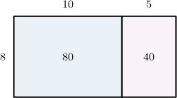
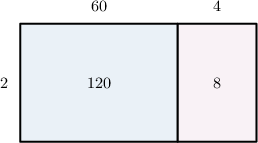
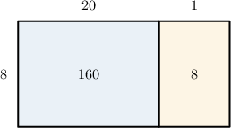

# Converting Units of Volume to Smaller Units

Source: https://www.mathacademy.com/topics/2402?courseId=75
Topic ID: 2402

## Prerequisites

- [Two-Digit by One-Digit Multiplication Using Area Models](./2415-two-digit-by-one-digit-multiplication-using-area-models.md)
- [Units of Volume](./4198-units-of-volume.md)

## Lesson

### Introduction

The **volume** of an object is the amount of three-dimensional space that the object takes up.

We encounter volume in many everyday life situations. For example, foodstuffs such as water, cooking oil, and soda are all sold at fixed volumes.

In this lesson, we'll learn how to convert between different volume units.

For customary units, some important units of conversion for volume are as follows:

- $1$ gallon $=8$ pints

- $1$ pint $=2$ cups

- $1$ cup $=8$ fluid ounces

We can visualize equivalent units of volume using measuring jugs filled with water.

For example, the two jugs below show the equivalence between $1$ gallon and $8$ pints.

Let's get some practice at converting between different units of volume.

### Example: Converting From Gallons to Pints

#### Question

How many pints are in $15$ gallons?

#### Explanation

We start with the unit conversion between gallons and pints:

$$
1\, \textrm{gallon} =8\, \textrm{pints}
$$

We want to figure out how many pints are in $15$ gallons. So, we multiply both sides of the above equation by $15{:}$

$$
\begin{aligned}15×1\,gallon & =15×8\,pints \\ 15\,gallons & =15×8\,pints\end{aligned}
$$

We can compute $15\times 8$ using an area model:

According to our model,

$$
15\times 8 = 80+40 = 120.
$$

Therefore, $15$ gallons equals $120$ pints.

### Example: Converting From Pints to Cups

#### Question

A container can hold $64$ pints of water. How many cups of water is this?

#### Explanation

We start with the unit conversion between pints and cups:

$$
1\, \textrm{pint} =2\, \textrm{cups}
$$

We want to figure out how many cups are in $64$ pints. So, we multiply both sides of the above equation by $64{:}$

$$
\begin{aligned}64×1\,pint & =64×2\,cups \\ 64\,pints & =64×2\,cups\end{aligned}
$$

We can compute $64\times 2$ using an area model:

According to our model,

$$
64\times 2 = 120+8 = 128.
$$

Therefore, the container can hold $128$ cups of water.

### Example: Converting From Cups to Fluid Ounces

#### Question

How many fluid ounces are in $21$ cups?

#### Explanation

We start with the unit conversion between fluid ounces and cups:

$$
1 \,\textrm{cup}=8 \,\textrm{fluid ounces}
$$

We want to figure out how many fluid ounces are in $21$ cups. So, we multiply both sides of the above equation by $21{:}$

$$
\begin{aligned}21×1\,cup & =21×8\,fluid ounces \\ 21\,cups & =21×8\,fluid ounces\end{aligned}
$$

We can compute $21\times 8$ using an area model:

According to our model,

$$
21\times 8 = 160+8 = 168.
$$

Therefore, $21$ cups equals $168$ fluid ounces.

### Metric Units of Volume

For metric units of volume, there is one primary conversion that we need to be aware of:

$$
1 \,\textrm{liter} =1,000 \,\textrm{milliliters}
$$

The unit symbol for liters is $\textrm{L},$ and the symbol for milliliters is $\textrm{mL}.$ So, we can express our unit conversion using unit symbols as follows:

$$
1 \,\textrm{L} =1,000 \,\textrm{mL}
$$

Suppose we wish to determine how many milliliters are in $2$ liters. To do this, we multiply both sides of the above equation by $2{:}$

$$
\begin{aligned}2×1\,L & =2×1,000\,mL \\ 2\,L & =2,000\,mL\end{aligned}
$$

Therefore, $2\,\textrm{L}$ liters equals $2,000\,\textrm{mL}.$

### Example: Converting From Liters to Milliliters

#### Question

Dylan's car consumed $14.5$ liters of gasoline while traveling between two cities. How much is this in milliliters?

#### Explanation

We start with the unit conversion between liters and milliliters:

$$
1\, \textrm{liter} =1,000\, \textrm{milliliters}
$$

We want to figure out how many milliliters are in $14.5$ liters. So, we multiply both sides of the above equation by $14.5{:}$

$$
\begin{aligned}14.5×1\,liter & =14.5×1,000\,milliliters \\ 14.5\,liters & =14,500\,milliliters\end{aligned}
$$

Therefore, $14.5$ liters equals $14,500$ milliliters.
