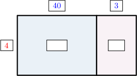
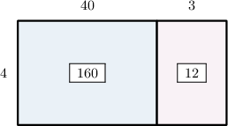

# Two-Digit by One-Digit Multiplication Using Place Value

Source: https://www.mathacademy.com/topics/2416?courseId=75
Topic ID: 2416

## Prerequisites

- [Two-Digit by One-Digit Multiplication Using Area Models](https://www.mathacademy.com/topics/two-digit-by-one-digit-multiplication-using-area-models-2415)

## Lesson

### Introduction

Let's use an area model to solve the following multiplication problem:

$$
{43} \times 4
$$

The number $43$ in expanded form is ${\color{blue}{43}} = {\color{blue}40}+{\color{blue}3}.$ So, we draw an area model, place ${\color{blue}40}$ and ${\color{blue}3}$ above the left and right rectangles, and ${\color{red}4}$ to the left of the big rectangle.

Next, we compute the areas of the blue and pink rectangles. This gives the following picture:

The area of the big rectangle is

$$
160+12 = 172.
$$

Therefore, we conclude that

$$
{43} \times 4 = 172.
$$

We'll now describe a similar process that allows us to carry out this multiplication *without* using models.

### Multiplication Without Models

Let's once again consider the following multiplication problem:

$$
{43} \times {\color{red}{4}}
$$

To evaluate this product without models, we follow a three-step process:

- First, we write our two-digit number $(43)$ in expanded form:

- Then, we multiply each of the numbers from the expanded form by ${\color{red}{4}}\mathbin{:}$

$$
\begin{aligned}40×4 & =160 \\ 3×4 & =12\end{aligned}
$$

- Finally, we add the results:

$$
\begin{aligned} & \,\,\,\,1\,\,\,\, & \,\,\,\,6\,\,\,\, & \,\,\,\,0\,\,\,\, \\ \,\,\,\,+\,\,\,\, & \,\,\,\,\,\,\,\, & \,\,\,\,1\,\,\,\, & \,\,\,\,2\,\,\,\, \\ & \,\,\,\,1\,\,\,\, & \,\,\,\,7\,\,\,\, & \,\,\,\,2\,\,\,\,\end{aligned}
$$

So, we conclude that

$$
43 \times 4 = 172.
$$

### Example: Multiplying a Two-Digit Number by a One-Digit Number Given a Decomposition

#### Question

Kyle wishes to find the value of $8\times 62.$ He proceeds as follows:

$$
\begin{aligned}8×60 & =[math]\phantom{000}[/math] \\ 8×2 & =[math]\phantom{00}[/math]\end{aligned}
$$

Find the missing numbers, and use your answers to find the value of $8\times 62.$

#### Explanation

Notice that $62$ in expanded form is

$$
62 = 60+2.
$$

So, we can compute $8\times 62$ by filling in the missing numbers and adding the results.

First, let's find the missing values:

$$
\begin{aligned}8×60 & =[math]\,480\,[/math] \\ 8×2 & =[math]\,16\,[/math]\end{aligned}
$$

Let's now add these results:

$$
\begin{aligned} & \,\,\,\,4\,\,\,\, & \,\,\,\,8\,\,\,\, & \,\,\,\,0\,\,\,\, \\ \,\,\,\,+\,\,\,\, & \,\,\,\,\,\,\,\, & \,\,\,\,1\,\,\,\, & \,\,\,\,6\,\,\,\, \\ & \,\,\,\,4\,\,\,\, & \,\,\,\,9\,\,\,\, & \,\,\,\,6\,\,\,\,\end{aligned}
$$

Therefore,

$$
8 \times 62 = 496.
$$

### Example: Multiplying a Two-Digit Number by a One-Digit Number

#### Question

What is the value of $59 \times 5?$

#### Explanation

First, let's write the two-digit number $(59)$ in expanded form:

$$
59 = {\color{blue}{50}} + {\color{blue}{9}}
$$

We now multiply both numbers in our expanded form by ${\color{red}{5}}\mathbin{:}$

$$
\begin{aligned}50×5 & =250 \\ 9×5 & =45\end{aligned}
$$

Let's now add these results:

$$
\begin{aligned} & \,\,\,\,2\,\,\,\, & \,\,\,\,5\,\,\,\, & \,\,\,\,0\,\,\,\, \\ \,\,\,\,+\,\,\,\, & \,\,\,\,\,\,\,\, & \,\,\,\,4\,\,\,\, & \,\,\,\,5\,\,\,\, \\ & \,\,\,\,2\,\,\,\, & \,\,\,\,9\,\,\,\, & \,\,\,\,5\,\,\,\,\end{aligned}
$$

Therefore,

$$
59 \times 5 = 295.
$$

### Example: Multiplying a Two-Digit Number by a One-Digit Number: Word Problems

#### Question

A hospital has $5$ floors. On each floor, there are $96$ beds. How many beds does the hospital have in total?

#### Explanation

To determine the total number of beds in the hospital, we need to compute the value of

$$
{\color{red}{5}} \times 96.
$$

First, let's write the two-digit number $(96)$ in expanded form:

$$
96 = {\color{blue}{90}} + {\color{blue}{6}}
$$

We now multiply both numbers in our expanded form by ${\color{red}{5}}\mathbin{:}$

$$
\begin{aligned}5×90 & =450 \\ 5×6 & =30\end{aligned}
$$

Let's now add these results:

$$
\begin{aligned} & \,\,\,\,4\,\,\,\, & \,\,\,\,5\,\,\,\, & \,\,\,\,0\,\,\,\, \\ \,\,\,\,+\,\,\,\, & \,\,\,\,\,\,\,\, & \,\,\,\,3\,\,\,\, & \,\,\,\,0\,\,\,\, \\ & \,\,\,\,4\,\,\,\, & \,\,\,\,8\,\,\,\, & \,\,\,\,0\,\,\,\,\end{aligned}
$$

Therefore, there are $480$ beds in the hospital.
