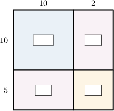
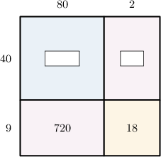
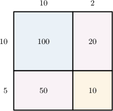
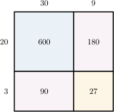
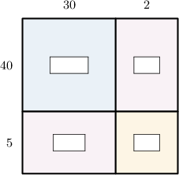
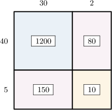
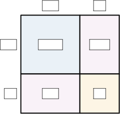
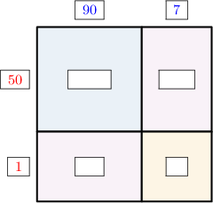
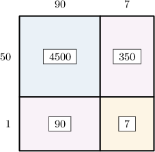

# Two-Digit by Two-Digit Multiplication Using Area Models

Source: https://www.mathacademy.com/topics/2418?courseId=75
Topic ID: 2418

## Prerequisites

- [Two-Digit by One-Digit Multiplication Using Area Models](./2415-two-digit-by-one-digit-multiplication-using-area-models.md)
- [Adding Three Multi-Digit Numbers](./3881-adding-three-multi-digit-numbers.md)

## Lesson

### Introduction

Let's take a look at the area model below.

We complete this area model by finding the areas of each small rectangle and writing these values on the diagram:

- Let's first look at the blue rectangle (the one on the top left). Its length is $10,$ and its width is $10.$ Therefore, the area of this rectangle must be Let's add this to our model:

- Now, let's look at the pink rectangle (the one on the top right). Its length is $2,$ and its width is $10.$ Therefore, the area of this rectangle must be Let's add this value to our model:

- Filling the other two missing values in the same way, we get the following:

And we're done!

### Example: Completing an Area Model

#### Question

From left to right, find the missing numbers in the area model below.

#### Explanation

We need to look at the blue and pink rectangles:

- Let's first look at the blue rectangle on the top left. Its length is $80,$ and its width is $40.$ Therefore, the area of this rectangle must be Let's add this to our model:

- Now, let's look at the pink rectangle (the one on the top right). Its length is $2,$ and its width is $40.$ Therefore, the area of this rectangle must be Let's add this to our model:

Therefore, from left to right, the missing numbers are $3,200$ and $80.$

### Using Area Models to Represent Multiplication Problems

We can use area models to represent two-digit by two-digit multiplication problems.

For example, let's consider the following area model:

Now, let's look at the big rectangle:

- its length is $10+2=12$

- its width is $10+5=15$

- its area is $100 + 20 + 50 + 10 = 180$

Therefore, this area model can be used to represent the following multiplication problem:

$$

12 \times 15 = 180

$$

### Example: Interpreting an Area Model

#### Question

The area model above can be used to represent the following multiplication problem:

$$

00

$$

What is the missing number?

#### Explanation

Let's look at the big rectangle:

- its length is $30+9=39$

- its width is $20+3=23$

- its area is $600 + 180 + 90 + 27 = 897$

Hence, this area model can be used to represent the following multiplication problem:

$$

39 \times 23= \fbox{897}

$$

Therefore, the missing number is $897.$

### Example: Using an Area Model To Multiply Two-Digit Numbers: With Scaffolding

#### Question

Using the area model below, find the value of $32 \times 45.$

#### Explanation

First, we compute the missing values. This gives the following picture:

Now, notice the following regarding the big rectangle:

- its length is $30+2=32$

- its width is $40+5=45$

- its area is $1,200 + 80 + 150 + 10 = 1,440$

Therefore, this area model can be used to represent the following multiplication problem:

$$

32 \times 45 = 1,440

$$

### Example: Using an Area Model To Multiply Two-Digit Numbers

#### Question

Using the area model below, find the value of $97 \times 51.$

#### Explanation

First, we set up the model. The numbers $97$ and $51$ can be expressed in expanded form as ${\color{blue}90}+{\color{blue}7}$ and ${\color{red}50}+{\color{red}1}.$ So, we place ${\color{blue}90}$ and ${\color{blue}7}$ above the rectangles and ${\color{red}50}$ and ${\color{red}1}$ to the left of the rectangles.

Next, we compute the missing values. This gives the following picture:

Now, notice the following regarding the big rectangle:

- its length is $90+7=97$

- its width is $50+1=51$

- its area is $4,500 + 350 + 90 + 7 = 4,947$

Therefore, this area model can be used to represent the following multiplication problem:

$$

97 \times 51 = 4,947

$$
