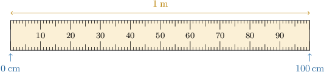

# Converting Metric Units of Length to Smaller Units

Source: https://www.mathacademy.com/topics/2427?courseId=75
Topic ID: 2427

## Prerequisites

- [Units of Length](./236-units-of-length.md)
- [Multiplying by 10, 100, and 1,000 Using the Pattern of Zeros](./2338-multiplying-by-10-100-and-1-000-using-the-pattern-of-zeros.md)

## Lesson

### Introduction

When solving problems with units, we often want to convert from one unit of measurement to another.

To convert between metric units of length, we use the following unit conversions:

- $1$ kilometer $=1,000$ meters

- $1$ meter $=100$ centimeters

- $1$ centimeter $=10$ millimeters

We can visualize equivalent units of length using measuring devices. For example, the meterstick below shows the equivalence between $1$ meter and $100$ centimeters.

Let's get some practice at converting between different units of length.

### Example: Converting Lengths From Kilometers to Meters

#### Question

The length of a cross-country skiing course is $12$ kilometers. How long is the course in meters?

#### Explanation

We need to convert $12$ kilometers into meters.

We start with the unit conversion between kilometers and meters:

$$

1\, \textrm{kilometer} = 1,000 \, \textrm{meters}

$$

The left-hand side reads $1$ kilometer, and we want to determine how many meters there are in ${\color{blue}{12}}$ kilometers. So, we multiply ** sides of the above equation by ${\color{blue}{12}}.$

$$

\begin{aligned}12×1\,kilometers & =12×1,000\,meters \\ 12\,kilometers & =12,000\,meters\end{aligned}

$$

Therefore, $12$ kilometers equals $12,000$ meters.

### Example: Converting Lengths From Meters to Centimeters

#### Question

How many centimeters are in $46$ meters?

#### Explanation

We start with the unit conversion between meters and centimeters:

$$

1\, \textrm{meter} =100\, \textrm{centimeters}

$$

The left-hand side reads $1$ meter, and we want to determine how many centimeters there are in $46$ meters. So, we multiply both sides of the above equation by $46.$

$$

\begin{aligned}46×1\,meter & =46×100\,centimeters \\ 46\,meters & =4,600\,centimeters\end{aligned}

$$

Therefore, $46$ meters equals $4,600$ centimeters.

### Example: Converting Lengths From Centimeters to Millimeters

#### Question

Express $78\,\textrm{cm}$ in millimeters.

#### Explanation

We need to convert $78$ centimeters into millimeters.

We start with the unit conversion between centimeters and millimeters:

$$

1 \,\textrm{cm} = 10 \,\textrm{mm}

$$

The left-hand side reads $1$ centimeter, and we want to determine how many millimeters there are in $78$ centimeters. So, we multiply both sides of the above equation by $78.$

$$

\begin{aligned}78×1\,cm & =78×10\,mm \\ 78\,cm & =780\,mm\end{aligned}

$$

Therefore, $78\,\textrm{cm}$ equals $780\,\textrm{mm}.$
