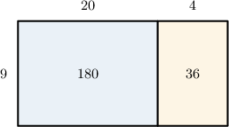

# Converting Units of Time to Smaller Units

Source: https://www.mathacademy.com/topics/2429?courseId=75
Topic ID: 2429

## Prerequisites

- [Two-Digit by Two-Digit Multiplication Using Area Models](./2418-two-digit-by-two-digit-multiplication-using-area-models.md)
- [Units of Time](./4197-units-of-time.md)

## Lesson

### Introduction

There are many ways to measure time. Some important conversions for units of time are as follows:

- $1$ week = $7$ days

- $1$ day = $24$ hours

- $1$ hour = $60$ minutes

- $1$ minute = $60$ seconds

Time is typically measured using clocks, and we can use clocks to visualize equivalent units of time.

For example, the image below shows a complete revolution of the *seconds* hand on a stopwatch. It takes precisely one minute (or $60$ seconds) for this hand to complete one full rotation.

Let's get some practice at converting between different units of time.

### Example: Converting From Weeks to Days

#### Question

Maria bought her cell phone $9$ weeks ago. How many days have passed since she purchased her cell phone?

#### Explanation

We need to convert $9$ weeks into days.

We start with the unit conversion between weeks and days:

$$
1 \,\textrm{week} = 7 \,\textrm{days}
$$

We want to figure out how many days are in $9$ weeks. So, we multiply both sides of the above equation by $9{:}$

$$
\begin{aligned}9×1\,week & =9×7\,days \\ 9\,weeks & =63\,days\end{aligned}
$$

Therefore, $9$ weeks equals $63$ days.

So, Maria bought her cell phone $63$ days ago.

### Example: Converting From Days to Hours

#### Question

$9$ days is equal to how many hours?

#### Explanation

We start with the unit conversion between days and hours:

$$
1 \, \textrm{day} = 24 \, \textrm{hours}
$$

We want to figure out how many hours are in $9$ days. So, we multiply both sides of the above equation by $9{:}$

$$
\begin{aligned}9×1\,day & =9×24\,hours \\ 9\,days & =9×24\,hours\end{aligned}
$$

We can find the value of $9\times 24$ using an area model:

According to our model,

$$
9\times 24 = 180+36 = 216.
$$

Therefore, $9$ days equals $216$ hours.

### Example: Converting From Hours to Minutes

#### Question

A plane leaves Boston bound for Madrid. The captain estimates that the flight duration will be $7$ hours. How much is this time in minutes?

#### Explanation

We need to convert $7$ hours into minutes.

We start with the unit conversion between hours and minutes:

$$
1 \, \textrm{hour} = 60 \, \textrm{minutes}
$$

We want to figure out how many minutes are in $7$ hours. So, we multiply both sides of the above equation by $7{:}$

$$
\begin{aligned}7×1\,hour & =7×60\,minutes \\ 7\,hours & =420\,minutes\end{aligned}
$$

Therefore, $7$ hours equals $420$ minutes.

So, the estimated flight duration is $420$ minutes.

### Example: Converting From Minutes to Seconds

#### Question

Express $9 \, \textrm{min}$ in seconds.

#### Explanation

We start with the unit conversion between minutes and seconds:

$$
1 \, \textrm{min} = 60 \, \textrm{s}
$$

We want to figure out how many seconds are in $9$ minutes. So, we multiply both sides of the above equation by $9{:}$

$$
\begin{aligned}9×1\,min & =9×60\,s \\ 9\,min & =540\,s\end{aligned}
$$

Therefore, $9 \, \textrm{min}$ is equal to $540 \, \textrm{s}.$
