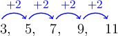
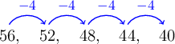
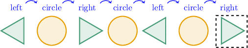
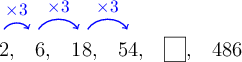

# Identifying Patterns

Source: https://www.mathacademy.com/topics/2431?courseId=75
Topic ID: 2431

## Prerequisites

- [Multi-Digit by One-Digit Multiplication Using Place Value](./2417-multi-digit-by-one-digit-multiplication-using-place-value.md)
- [Multi-Digit by One-Digit Division Using Partial Quotients](./2425-multi-digit-by-one-digit-division-using-partial-quotients.md)
- [Generating Patterns](./2430-generating-patterns.md)

## Lesson

### Introduction

Given a pattern like the one below, how can we find its rule?

$$

3,\, 5,\,7,\,9,\,11

$$

To find the rule, we inspect what is happening at each step.

We can see that the rule for this pattern is "add $2$".

### Example: Finding the Rule For a Given Pattern

#### Question

What rule describes the pattern below?

$$

56,\,52,\,48,\,44,\,40

$$

#### Explanation

The pattern starts from $56$ and subtracts $4$ on each step.

Therefore, the rule is "subtract $4$".

### Example: Finding a Missing Term in a Shape Pattern

#### Question

What is the next shape in the sequence below?

#### Explanation

We can see that the rule for the pattern is "triangle pointing left, circle, triangle pointing right, circle, and repeat."

The next shape comes after a circle, and the previous triangle points to the left. Therefore, the missing shape is a triangle pointing to the right.

### Example: Finding a Missing Term in a Pattern

#### Question

Find the missing number in the pattern below.

$$

0

$$

#### Explanation

We see that the rule for the pattern is "multiply by $3$".

The missing number comes after $54,$ so we can calculate it as follows:

$$

54\times 3 = 162

$$

So, the missing number is $162.$

Let's check our answer. Since $486$ comes after the missing number, if we multiply the missing number by $3,$ then we must get $486.$

$$

162\times 3 =486\, \quad \color{green}\checkmark

$$

### Example: Identifying True Statements

#### Question

Consider the following pattern:

$$

14,\,11,\,8,\,5

$$

Which of the following statements are true?

1. The rule is "subtract $2.$"

2. The next number in the pattern is $2.$

3. The numbers in the pattern alternate between even and odd.

#### Explanation

Let's look at each statement:

- Statement I is false. We can see that the rule for the pattern is "subtract $3.$"

- Statement II is true. The next number comes after $5,$ and is therefore equal to

- Statement III is true. When we subtract $3$ from an odd number we always obtain an even number, and when we subtract $3$ from an even number we always obtain an odd number. Therefore, the terms in the pattern alternate between even and odd.

Therefore, the correct answer is "II and III only."
