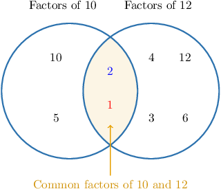

# Greatest Common Factors

Source: https://www.mathacademy.com/topics/2439?courseId=75
Topic ID: 2439

## Prerequisites

- [The Factors of a Number](./3942-the-factors-of-a-number.md)

## Lesson

### Introduction

The **greatest common factor** of two numbers is the largest number that divides both.

To find the greatest common factor of two numbers, say $10$ and $12$, we start by listing the factors for each number.

- Factors of $10$: $\quad {\color{red}{1}}, {\color{blue}2}, 5, 10$

- Factors of $12$: $\quad {\color{red}{1}}, {\color{blue}2}, 3, 4, 6, 12$

The numbers $10$ and $12$ have two factors in common, ${\color{red}{1}}$ and ${\color{blue}2}.$ But we're looking for the *greatest* common factor, which is the *largest* of these factors.

Therefore, the greatest common factor of $10$ and $12$ is ${\color{blue}{2}}.$

### Example: Finding the Greatest Common Factor of Two One-Digit Numbers

#### Question

What is the greatest common factor of $3$ and $8?$

#### Explanation

Let's list the factors of each number. Then, we find the largest number that appears in both lists:

- Factors of $3$: $\quad {\color{blue}1}, 3$

- Factors of $8$: $\quad {\color{blue}1}, 2, 4, 8$

We conclude that the greatest common factor of $3$ and $8$ is ${\color{blue}{1}}.$

### Example: Finding the Greatest Common Factor of Two Two-Digit Numbers

#### Question

What is the greatest common factor of $18$ and $27?$

#### Explanation

Let's list the factors of each number. Then, we find the largest number that appears in both lists:

- Factors of $18$: $\quad 1, 2, 3, 6, {\color{blue}9}, 18$

- Factors of $27$: $\quad 1, 3, {\color{blue}9}, 27$

We conclude that the greatest common factor of $18$ and $27$ is ${\color{blue}{9}}.$
