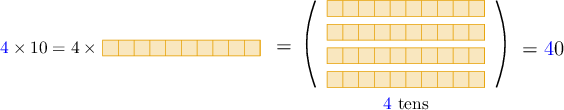

# Multiplying by 10, 100, and 1,000 Using Place Value

Source: https://www.mathacademy.com/topics/3587?courseId=75
Topic ID: 3587

## Prerequisites

- [More on Equivalent Place Value Representations](./3941-more-on-equivalent-place-value-representations.md)

## Lesson

### Introduction

We can use place value strategies to multiply any whole number by $10.$

For example, let's use our understanding of place value to solve the following multiplication problem:

$$
4 \times 10
$$

Remember that $4 \times 10$ means "$4$ groups of $10.$" Therefore,

$$
\begin{aligned}4×10 & = \\ \underset{4\,times}{\underset{}{10+10+10+10}} & = \\ 4\,tens+0\,ones & = \\ 40 & .\end{aligned}
$$

The same computation can be explained visually as follows:

So, we conclude that

$$
4\times 10 = 40.
$$

We can use the same strategy to multiply two-digit numbers by $10,$ too. Let's see an example.

### Example: Multiplying a Number by Ten

#### Question

Find the value of $35 \times 10.$

#### Explanation

Remember that $35 \times 10$ means $35$ groups of $10.$ Therefore,

$$
\begin{aligned}35×10 & = \\ \underset{35\,times}{\underset{}{10+10+⋯+10}} & = \\ 35\,tens+0\,ones & = \\ 3\,hundreds+5\,tens+0\,ones & = \\ 350 & .\end{aligned}
$$

### Example: Multiplying a Number by One Hundred

#### Question

What is $17 \times 100?$

#### Explanation

Remember that $17 \times 100$ means $17$ groups of $100.$ Therefore,

$$
\begin{aligned}17×100 & = \\ \underset{17\,times}{\underset{}{100+100+⋯+100}} & = \\ 17\,hundreds+0\,tens+0\,ones & = \\ 1\,thousands+7\,hundreds+0\,tens+0\,ones & = \\ 1,700 & .\end{aligned}
$$

### Example: Multiplying a Number by One Thousand

#### Question

Find $79 \times 1,000.$

#### Explanation

Remember that $79 \times 1,000$ means $79$ groups of $1,000.$ Therefore,

$$
\begin{aligned}79×1,000 & = \\ \underset{79\,times}{\underset{}{1,000+1,000+⋯+1,000}} & = \\ 79\,thousands+0\,hundreds+0\,tens+0\,ones & = \\ 7\,ten-thousands+9\,thousands+0\,hundreds+0\,tens+0\,ones & = \\ 79,000 & .\end{aligned}
$$
