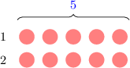
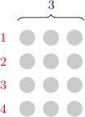
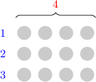

# The Relationship Between Multiplication and Division

Source: https://www.mathacademy.com/topics/3877?courseId=75
Topic ID: 3877

## Prerequisites

- None listed on the topic page.

## Lesson

### Introduction

Let's consider the following division problem:

$$

{\color{red}{10}} \div {\color{blue}{5}} = 2

$$

This tells us that ${\color{red}{10}}$ can be gathered into $2$ groups of ${\color{blue}{5}}{:}$

We can use the same model to represent the following multiplication problem:

$$

{\color{red}{10}} = {\color{blue}{5}} \times 2

$$

The order in which we multiply numbers does not matter. So, we can swap the two numbers on the right-hand side to create another multiplication problem:

$$

{\color{red}{10}} = 2\times {\color{blue}{5}}

$$

Multiplication and division can be considered "opposite" operations. And since we can swap the order of multiplication, every division problem can be expressed as *two* equivalent multiplication problems.

We usually put the result on the right-hand side when writing down an equivalent multiplication problem. Let's see an example.

### Example: Constructing an Equivalent Multiplication Problem

#### Question

What is $45\div 5 = 9$ expressed as an equivalent multiplication problem?

#### Explanation

Our division problem is as follows:

$$

{\color{red}{45}}\div {\color{blue}{5}} = 9

$$

There are two multiplication problems equivalent to the given division problem:

- ${\color{red}{45}} = {\color{blue}{5}} \times 9$

- ${\color{red}{45}} = 9 \times {\color{blue}{5}}$

When writing down a multiplication problem, we usually put the result on the right-hand side. Therefore, our equivalent problems are as follows:

- $5 \times 9 = 45$

- $9 \times 5 = 45$

### Example: Constructing Two Equivalent Multiplication Problems

#### Question

Which of the following multiplication problems are equivalent to the division problem $120\div 12 = 10?$

1. $12\times 10 = 120$

2. $120\times 12 = 10$

3. $10\times 12 = 120$

#### Explanation

Our division problem is as follows:

$$

{\color{red}{120}}\div {\color{blue}{12}} = 10

$$

There are two multiplication problems equivalent to the given division problem:

- ${\color{red}{120}} = {\color{blue}{12}} \times 10$

- ${\color{red}{120}} = 10 \times {\color{blue}{12}}$

When writing down a multiplication problem, we usually put the result on the right-hand side. Therefore, our equivalent problems are as follows:

- $12\times 10 = 120$

- $10\times 12 = 120$

Therefore, the correct answer is "I and III only."

### Constructing Equivalent Division Problems

Similarly, every multiplication problem can be expressed as *two* **equivalent** division problems.

Let's consider the following multiplication problem:

$$

{\color{red}{4}}\times {\color{blue}{3}} = 12

$$

There are two division problems equivalent to this multiplication problem:

- The first equivalent problem is ${\color{red}{4}} = 12\div {\color{blue}{3}}.$ This tells us that $12$ can be grouped into ${\color{red}{4}}$ groups of ${\color{blue}{3}}\mathbin{:}$

- The second equivalent problem is ${\color{blue}{3}} = 12\div {\color{red}{4}}.$ This tells us that $12$ can be grouped into ${\color{blue}{3}}$ groups of ${\color{red}{4}}\mathbin{:}$

We usually put the result on the right-hand side when writing down a division problem. Therefore, our equivalent problems can also be written as follows:

- $12\div 3 = 4$

- $12\div 4 = 3$

### Example: Constructing an Equivalent Division Problem

#### Question

What is $9\times 8 = 72$ expressed as an equivalent division problem?

#### Explanation

Our multiplication problem is as follows:

$$

{\color{red}{9}}\times {\color{blue}{8}} = 72

$$

There are two division problems equivalent to this multiplication problem:

- ${\color{red}{9}} = 72\div {\color{blue}{8}}$

- ${\color{blue}{8}} = 72\div {\color{red}{9}}$

When writing down a division problem, we usually put the result on the right-hand side. Therefore, our equivalent problems are as follows:

- $72\div 8 = 9$

- $72\div 9 = 8$

### Example: Constructing Two Equivalent Division Problems

#### Question

Which of the following division problems are equivalent to the multiplication problem $9\times 6 = 54?$

1. $54\div 6 = 9$

2. $9\div 6 = 54$

3. $9\div 54 = 6$

#### Explanation

Our multiplication problem is as follows:

$$

{\color{red}{9}}\times {\color{blue}{6}} = 54

$$

There are two division problems equivalent to this multiplication problem:

- ${\color{red}{9}} = 54\div {\color{blue}{6}}$

- ${\color{blue}{6}} = 54\div {\color{red}{9}}$

When writing down a division problem, we usually put the result on the right-hand side. Therefore, our equivalent problems are as follows:

- $54\div 6 = 9$

- $54\div 9 = 6$

Therefore, the correct answer is "I only."
