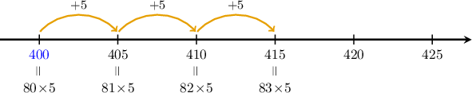

# Multiplying Numbers Using Repeated Addition

Source: https://www.mathacademy.com/topics/3878?courseId=75
Topic ID: 3878

## Prerequisites

- [Multiplying Whole Numbers Ending in Zeros](./488-multiplying-whole-numbers-ending-in-zeros.md)
- [The Multiples of a Number](./2206-the-multiples-of-a-number.md)

## Lesson

### Introduction

We can use repeated addition to multiply large numbers.

For example, suppose we have the following multiplication problem:

Let's use this result to generate some more multiplication facts:

- We can find by adding to this result:

- We can find by adding to the previous result:

- We can find by adding to the previous result:

And so on.

We can visualize this process using a number line diagram.

Note that etc., are all multiples of

### Example: Multiplying Two-Digit Numbers by One-Digit Numbers

#### Question

You're given the following multiplication problem:

$$
90 \times 2 = 180
$$

Use this to find the value of $92 \times 2.$

#### Explanation

We start with the given multiplication problem:

$$
90 \times 2 = {\color{blue}{180}}
$$

We can find the correct answer for $92 \times 2$ using repeated addition:

$$
\begin{aligned}91×2 & =180+2=182 \\ 92×2 & =182+2=184\end{aligned}
$$

Therefore, $92 \times 2 = 184.$

### Example: Multiplying Three-Digit Numbers by One-Digit Numbers

#### Question

You're given the following multiplication problem:

$$
110 \times 7 = 770
$$

Use this to find the value of $113 \times 7.$

#### Explanation

We start with the given multiplication problem:

$$
110 \times 7 = {\color{blue}{770}}
$$

We can find the correct answer for $113 \times 7$ using repeated addition:

$$
\begin{aligned}111×7 & =770+7=777 \\ 112×7 & =777+7=784 \\ 113×7 & =784+7=791\end{aligned}
$$

Therefore, $113 \times 7 = 791.$

### Example: Multiplying Four-Digit Numbers by One-Digit Numbers

#### Question

You're given the following multiplication problem:

$$
1,200 \times 5 = 6,000
$$

Use this to find the value of $1,204 \times 5.$

#### Explanation

We start with the given multiplication problem:

$$
1,200 \times 5 = {\color{blue}{6,000}}
$$

We can find the correct answer for $1,204 \times 5$ using repeated addition:

$$
\begin{aligned}1,201×5 & =6,000+5=6,005 \\ 1,202×5 & =6,005+5=6,010 \\ 1,203×5 & =6,010+5=6,015 \\ 1,204×5 & =6,015+5=6,020\end{aligned}
$$

Therefore, $1,204 \times 5 = 6,020.$
