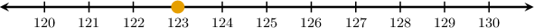
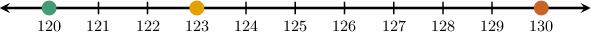
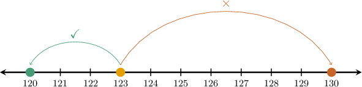
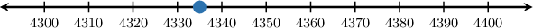
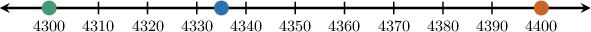
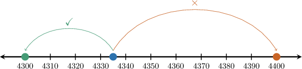

# Rounding Down Whole Numbers

Source: https://www.mathacademy.com/topics/3883?courseId=75
Topic ID: 3883

## Prerequisites

- [The Multiples of a Number](./2206-the-multiples-of-a-number.md)
- [Multiplying by 10, 100, and 1,000 Using the Pattern of Zeros](./2338-multiplying-by-10-100-and-1-000-using-the-pattern-of-zeros.md)
- [Comparing Whole Numbers Using Place Value](./3919-comparing-whole-numbers-using-place-value.md)

## Lesson

### Introduction

When we **round a number to the nearest ten,** we find the closest multiple of ten to our number.

For example, let's round the following number to the nearest ten:

$$

123

$$

We begin by drawing a number line:

Looking at the number line, the closest multiples of ten to $123$ are $120$ and $130.$

Let's add these multiples of $10$ to our diagram.

Now, since $123$ is closer to ${\color{DarkGreen}120}$ than ${\color{SaddleBrown}130},$ this is the number we round to.

Therefore, $123$ rounded to the nearest ten is $120.$

### Recognizing Multiples of 10 and 100

We can use the following rules to recognize multiples of $10$ and $100{:}$

- Multiples of $10$ always end in *at least* one zero. For example, all the following numbers are multiples of $10{:}$

- Similarly, multiples of $100$ always end in *at least* two zeros. For example, all the following numbers are multiples of $100{:}$

Let's look at an example of rounding up to the nearest $100.$

### Example: Rounding Down Using a Number Line

#### Question

Using the number line below, round $4,335$ to the nearest hundred.

#### Explanation

Rounding a number to the nearest hundred means finding the closest multiple of one hundred to our number.

The closest multiples of $100$ to $4,335$ are $4,300$ and $4,400.$

Let's add these multiples of $100$ to our diagram.

Since $4,335$ is closer to ${\color{DarkGreen}4,300}$ than ${\color{SaddleBrown}4,400},$ this is the number we round to.

Therefore, $4,335$ rounded to the nearest hundred is $4,300.$

### Rounding Down Whole Numbers Using Place Value Charts

We can round whole numbers using a place value chart.

To demonstrate, let's again round the following number to the nearest ten:

$$

123

$$

We start by writing our number's digits in a place value chart. Since we're rounding to the nearest *ten*, we highlight the tens place:

We then look one digit to the right in the chart (i.e., the *ones* place) and compare it to the number $5{:}$

Since $\color{red}3$ is *less than* $5$, we round *down*. To do this, we put $\color{blue}0$ in the ones place:

And that's it!

Therefore, we conclude that $123$ rounded to the nearest ten is $120.$

### Example: Rounding Down to the Nearest Ten

#### Question

Round $25,234$ to the nearest ten.

#### Explanation

We start by writing our number into a place value chart. Notice the ** place:

We then look one digit to the right in the chart (this will be the ** place) and compare it to the number $5{:}$

Since $\color{red}4$ is ** $5$, we round **. To do this, we put $\color{blue}0$ in the ones place:

Therefore, $25,234$ rounded to the nearest ten is $25,230.$

### Rounding Down to Other Value Places

We can use a similar method to round whole numbers to the nearest hundred, thousand, ten-thousand, and so on.

For example, let's round $1,824$ to the nearest hundred.

We start by writing our number into a place value chart. But this time, since we're rounding to the nearest *hundred*, we highlight the hundreds place:

We then look one digit to the right in the chart (this will be the *tens* place) and compare it to the number $5{:}$

Since $\color{red}2$ is *less than* $5$, we round *down*. To do this, we put $\color{blue}0$ in *all* places to the right of the hundreds (both tens and ones):

Therefore, $1,824$ rounded to the nearest hundred is $1,800.$

### Example: Rounding Down to the Nearest Hundred

#### Question

Round $200,238$ to the nearest hundred.

#### Explanation

We start by writing our number into a place value chart. Notice the ** place:

We then look one digit to the right in the chart (this will be the ** place) and compare it to the number $5{:}$

Since $\color{red}3$ is ** $5$, we round **. To do this, we put $\color{blue}0$ in all places to the right of the hundreds (into tens and ones):

Therefore, $200,238$ rounded to the nearest hundred is $200,200.$

### Example: Rounding Down to the Nearest Thousand, Ten-Thousand, or Hundred-Thousand

#### Question

Round $7,452$ to the nearest thousand.

#### Explanation

We start by writing our number into a place value chart. Notice the ** place:

We then look one digit to the right in the chart (this will be the ** place) and compare it to the number $5{:}$

Since $\color{red}4$ is ** $5$, we round **. To do this, we put $\color{blue}0$ in all places to the right of the thousands (into hundreds, tens, and ones):

Therefore, $7,452$ rounded to the nearest thousand is $7,000.$
