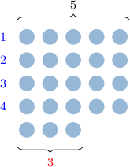
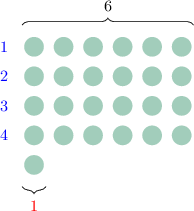
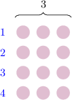
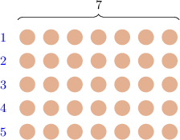
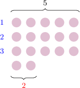

# Understanding Remainders Using Models

Source: https://www.mathacademy.com/topics/3888?courseId=75
Topic ID: 3888

## Prerequisites

- None listed on the topic page.

## Lesson

### Introduction

Let's consider the following division problem:

$$

23 \div 5

$$

We can visualize this division problem by arranging $23$ objects into rows with $5$ objects in each row.

The bottom row does not contain $5$ objects. This tells us that $23$ *cannot* be divided evenly into groups of $5.$ Nonetheless, we can still solve this division problem:

- We have ${\color{blue}4}$ full rows. This tells us that we can create ${\color{blue}4}$ full groups of $5$ from $23.$

- The incomplete row contains the remaining ${\color{red}3}$ objects.

We write the solution to our division problem as follows:

$$

23 \div 5 = {\color{blue}4} \, \textrm{R} \, {\color{red}3}

$$

Note the following:

- The number ${\color{blue}4}$ is the whole number part of the division (also called the **quotient**).

- The number ${\color{red}3}$ is called the **remainder.**

- In words, we'd say "$23$ divided by $5$ equals ${\color{blue}4}$ remainder ${\color{red}3}.$"

### Example: Identifying a Quotient and Remainder From a Model

#### Question

Given the model above, evaluate $25 \div 6.$

#### Explanation

We want to divide $25$ by $6.$

To solve this division problem, we arrange $25$ objects in rows, placing $6$ objects in each row.

- The number of full rows gives us the ** (also called the **).

- If there is an incomplete row at the end, the number of objects in that row gives us the **. If there are no incomplete rows, the remainder equals $0.$

We have the following:

- $4$ full rows. So, the whole number part is ${\color{blue}4}.$

- $1$ object in the incomplete row. So, the remainder is ${\color{red}1}.$

Therefore,

$$

25 \div 6 = {\color{blue}4} \, \textrm{R} \, {\color{red}1}.

$$

### Cases When the Remainder is Zero

You might wonder what happens to the remainder when a division can be carried out evenly.

Let's consider the following example:

$$

12 \div 3

$$

As before, we visualize the division by arranging $12$ objects in rows, placing $3$ objects in each row:

In our model above, we have the following:

- ${\color{blue}4}$ full rows. So, the whole number part (or quotient) equals ${\color{blue}4}.$

- There are no incomplete rows. This means that the remainder equals ${\color{red}0}.$

Therefore, we can write the solution to this division problem as

$$

12 \div 3 = {\color{blue}4} \, \textrm{R} \, {\color{red}0}.

$$

Since the remainder equals zero, we can drop this part. This gives

$$

12 \div 3 = {\color{blue}4}.

$$

### Example: Solving a Division Problem When There is No Remainder

#### Question

Given the model above, find the quotient and remainder of $35 \div 7.$

#### Explanation

We want to divide $35$ by $7.$

To solve this division problem, we arrange $35$ objects in rows, placing $7$ objects in each row.

- The number of full rows gives us the ** (also called the **).

- If there is an incomplete row at the end, the number of objects in that row gives us the **. If there are no incomplete rows, the remainder equals $0.$

We have the following:

- $5$ full rows. So, the quotient is ${\color{blue}5}.$

- There are no incomplete rows. So, the remainder is ${\color{red}0}.$

Therefore, $35 \div 7 = 5,$ which can be written as

$$

35 \div 7 = {\color{blue}5} \, \textrm{R} \, {\color{red}0}.

$$

### Example: Solving a Division Problem by Completing a Model

#### Question

Complete the diagram above by arranging $17$ objects in rows with $5$ objects per row, and use this to find $17 \div 5.$

#### Explanation

We want to divide $17$ by $5.$

To solve this division problem, we arrange $17$ objects in rows, placing $5$ objects in each row.

- The number of full rows gives us the ** (also called the **).

- If there is an incomplete row at the end, the number of objects in that row gives us the **. If there are no incomplete rows, the remainder equals $0.$

We have the following:

- $3$ full rows. So, the quotient is ${\color{blue}3}.$

- $2$ object in the incomplete row. So, the remainder is ${\color{red}2}.$

Therefore,

$$

17 \div 5 = {\color{blue}3} \, \textrm{R} \, {\color{red}2}.

$$
