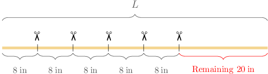

# Solving Multistep Word Problems Using Number Operations

Source: https://www.mathacademy.com/topics/3904?courseId=75
Topic ID: 3904

## Prerequisites

- [Two-Digit by One-Digit Multiplication Using Place Value](./2416-two-digit-by-one-digit-multiplication-using-place-value.md)
- [Word Problems Involving Additive and Multiplicative Comparison](./3903-word-problems-involving-additive-and-multiplicative-comparison.md)
- [Subtracting Three-Digit Numbers](./3907-subtracting-three-digit-numbers.md)

## Lesson

### Introduction

We can use addition, subtraction, and multiplication to solve real-world multistep problems.

For example, let's consider the following situation:

*Bob cut $5$ pieces of rope from a larger rope. Each piece measured $8\,\textrm{in}$ long. If the remaining rope measures $20\,\textrm{in},$ how long was the rope before Bob cut it into pieces?*

Let's start by writing down the important information:

- There are $5$ pieces.

- Each piece is $8\,\textrm{in}$ long.

- The remaining rope measures ${\color{red}20}\,\textrm{in}.$

Let the length of the rope before it was cut be represented by the letter $L.$ This is the number we want to find.

We can visualize this info using the following diagram for the rope:

Now, we can deduce the following:

- There are $5$ pieces of rope, each of which is $8\,\textrm{in}$ long. Therefore, the total amount of rope that Bob cut measured

- The total length of the rope before cutting, $L$, equals the total length Bob cut (${\color{blue}{40}}\,\textrm{in}$) plus the remaining rope length (${\color{red}{20}}\,\textrm{in}$). Therefore, the length of the rope before it was cut, in inches, is

Calculating the final sum, we get

$$

L = {\color{blue}{40}} + {\color{red}{20}} = 60.

$$

Therefore, the rope was $60\,\textrm{in}$ long before it was cut.

### Example: Solving Problems Involving Multiplication Followed by Addition or Subtraction

#### Question

Olivia wants to pack $8$ toy blocks in a box. Each toy block weighs $42\,\textrm{g}$ and the box weighs $214\,\textrm{g}.$ What is the total weight of the box with the blocks inside?

#### Explanation

Let's start by writing down the important information:

- There are $8$ toy blocks.

- Each toy block weighs $42\,\textrm{g}.$

- The weight of the box is $214\,\textrm{g}.$

Let $W$ represent the total weight of the box with the blocks inside. This is the number we want to find.

- There are $8$ toy blocks, and each toy block weighs $42\,\textrm{g}.$ Therefore, the total weight of the blocks (in grams) is

- The total weight, $W$, equals the weight calculated above $({\color{blue} 336}\,\textrm{g})$ plus the weight of the box $({\color{red}214}\,\textrm{g}).$ Therefore, the total weight of the box with the blocks inside (in grams) is

Calculating the final sum, we get

$$

W = 336 + 214 = 550.

$$

Therefore, the total weight of the box with the blocks inside is $550\,\textrm{g}.$

### Example: Solving Problems Involving Addition or Subtraction Followed by Multiplication

#### Question

On Monday, Nicholas ate $3$ donuts. On Tuesday, he ate $4$ more donuts than on Monday. If each donut weighs $28\,\textrm{g},$ how many grams of donuts did Nicholas eat on Tuesday?

#### Explanation

Let's start by writing down the important information:

- On Monday, Nicholas ate $3$ donuts.

- On Tuesday, he ate $4$ more donuts than on Monday.

- Each donut weighs $28\,\textrm{g}.$

Let $W$ be the weight of the donuts Nicholas ate on Tuesday, which is the number we want to find.

- The number of donuts Nicholas ate on Tuesday is $4$ ** than the number of donuts he ate on Monday $(3).$ Therefore, the number of donuts Nicholas ate on Tuesday is

- Nicholas ate ${\color{blue}7}$ donuts on Tuesday, and each donut weighs $28\,\textrm{g}.$ Therefore, the weight of the donuts Nicholas ate on Tuesday (in grams) is

Therefore, on Tuesday, Nicholas ate $196\,\textrm{g}$ of donuts.

### Example: Solving Problems Involving Two Multiplications With Addition or Subtraction

#### Question

A chemistry teacher has $9$ vials, each containing $21\,\textrm{ml}$ of acid solution. He gives one vial to each of his $8$ students to perform an experiment. Each student uses $10\,\textrm{ml}$ of the acid solution. What is the total amount of acid solution left after the experiment?

#### Explanation

Let's start by writing down the important information:

- Initially, there are $9$ vials, and each vial contains $21\,\text{ml}$ of acid solution.

- Each of the $8$ students uses $10\,\text{ml}$ of acid solution.

Let $A$ represent the total amount of acid solution left after the experiment. This is the number we want to find.

- Initially, there are $21\,\text{ml}$ of acid solution in each of the $9$ vials. Therefore, the initial amount (in milliliters) of the acid solution is

- Each of the $8$ students uses $10\,\text{ml}$ of acid solution. Therefore, the amount (in milliliters) of acid solution used during the experiment is

To find the total amount of acid solution left after the experiment, we subtract our two values:

$$

A = {\color{red}{189}} - {\color{blue}{80}} = 109

$$

Therefore, there are $109\,\text{ml}$ of acid solution left after the experiment.
