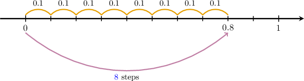
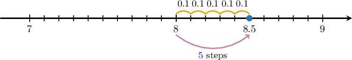
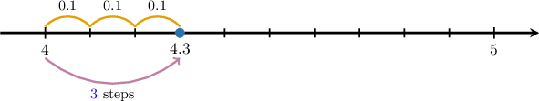
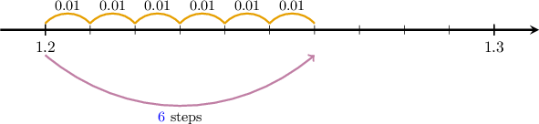
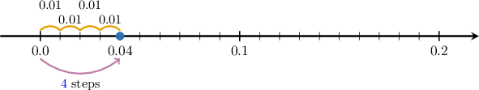
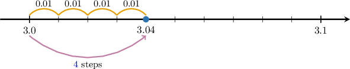

# Plotting Decimals on Number Lines

Source: https://www.mathacademy.com/topics/3915?courseId=75
Topic ID: 3915

## Prerequisites

- [Decimal Fractions](https://www.mathacademy.com/topics/decimal-fractions-2341)
- [Modeling Mixed Numbers Using Number Lines](https://www.mathacademy.com/topics/modeling-mixed-numbers-using-number-lines-7008)

## Lesson

### Introduction

We can plot decimals on number lines, just as we do with fractions and mixed numbers.

To demonstrate how this works, let's plot the following decimal on a number line:

$$
0.8
$$

First, since $0.8$ lies between the whole numbers $0$ and $1,$ we start by creating a number line between these two whole numbers.

Now, notice that $0.8$ has one decimal place. In other words, the decimal part goes up to *tenths.* So, we split the line segment between $0$ and $1$ into $10$ equal parts. Each part gives $\dfrac{1}{10} = 0.1$ (one-tenth) of a whole.

The decimal ${\color{red}0}.\!{\color{blue}8}$ has ${\color{red}0}$ ones and ${\color{blue}8}$ tenths. So, we start at the point $\color{red}0$ and move $\color{blue}8$ steps to the right:

Therefore, we conclude that the decimal $0.8$ plotted on a number line looks as follows:

Let's now look at an example of a decimal containing a whole number part *and* a decimal part.

### Example: Plotting Decimals Up to Tenths

#### Question

What decimal is shown as the plotted point on the number line below?

#### Explanation

Each line segment between two whole numbers is split into $10$ equal parts. So, each part gives $\dfrac{1}{10} = 0.1$ (one-tenth) of a whole.

Now, notice that our point is $\color{blue}5$ steps to the right of ${\color{red}8}.$

The decimal has $\color{red}8$ ones and $\color{blue}5$ tenths. Therefore, the point represents the decimal ${\color{red}8}.\!{\color{blue}5}.$

### Example: Identifying Number Lines Containing Decimals Up to Tenths

#### Question

Plot the number $4.3$ on the number line below.

#### Explanation

Each of the line segments between the whole numbers $4$ and $5$ is split into $10$ equal parts. So, each part gives $\dfrac{1}{10} = 0.1$ (one-tenth) of a whole.

The decimal ${\color{red}4}.\!{\color{blue}3}$ has ${\color{red}4}$ ones and ${\color{blue}3}$ tenths. So, we start at the point $\color{red}4$ and move $\color{blue}3$ steps to the right:

### Plotting Decimals Up to Hundredths on a Number Line

We can plot decimals up to hundredths on a number line in a similar way.

For example, let's plot the following decimal on a number line:

$$
1.26
$$

First, notice that $1.26$ lies between two *tenths*, namely $1.2$ and $1.3.$ So, we start by creating a number line between these tenths.

Now, notice that $1.26$ has *two* decimal places. In other words, the decimal part goes up to *hundredths.* So, we split the line segment between $1.2$ and $1.3$ into $10$ equal parts. Each part gives $\dfrac{1}{100} = 0.01$ (one-hundredth) of a whole.

The decimal ${\color{red}1}.\!{\color{red}2}{\color{blue}6}$ has ${\color{red}1}$ one, ${\color{red}2}$ tenths, and $\color{blue}6$ hundredths. So, we start at the point $\color{red}1.2$ and move $\color{blue}6$ steps to the right:

Therefore, we conclude that the decimal $1.26$ plotted on a number line looks as follows:

### Example: Plotting Decimals Up to Hundredths

#### Question

What decimal is shown as the plotted point on the number line below?

#### Explanation

The line segment between each tenth is split into $10$ equal parts. So, each part gives $\dfrac{1}{100} = 0.01$ (one-hundredth) of a whole.

Notice that our point is $\color{blue}4$ steps to the right of ${\color{red}0.0}.$

Hence, the decimal has ${\color{red}0}$ ones, ${\color{red}0}$ tenths, and ${\color{blue}4}$ hundredths. Therefore, the point represents the decimal $\bbox[3pt, Gainsboro]{\color{blue}{\color{red}0.0}{\color{blue}4}}.$

### Example: Identifying Number Lines Containing Decimals Up to Hundredths

#### Question

Plot the number $3.04$ on the number line below.

#### Explanation

Each of the line segments between the tenths $3.0$ and $3.1$ is split into $10$ equal parts. So, each part gives $\dfrac{1}{100} = 0.01$ (one-hundredth) of a whole.

The decimal ${\color{red}3.0}{\color{blue}4}$ has ${\color{red}3}$ ones, ${\color{red}0}$ tenths, and ${\color{blue}4}$ hundredths. So, we start at the point $\color{red}3.0$ and move $\color{blue}4$ steps to the right:

