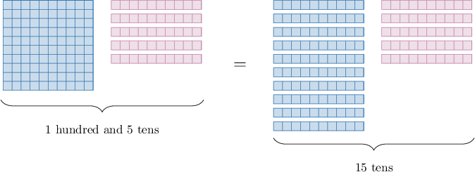

# Rewriting Numbers Ending in Zeros

Source: https://www.mathacademy.com/topics/3924?courseId=75
Topic ID: 3924

## Prerequisites

- [Multiplying by 10, 100, and 1,000 Using the Pattern of Zeros](./2338-multiplying-by-10-100-and-1-000-using-the-pattern-of-zeros.md)

## Lesson

### Introduction

When a number ends in a zero, it's easy to express that number in terms of tens.

For example, let's consider the following number:

$$

15{\color{blue}{0}}

$$

Notice that this number ends in a zero. Therefore, we can write it as a multiple of $10$ as follows:

$$

15{\color{blue}{0}} = 15 \times 1{\color{blue}{0}}

$$

Therefore, $150$ is the same as "$15$ tens."

In the future, we'll see how this method can be used to solve problems involving multiplication and division easily.

### Example: Rewriting a Number Ending in One Zero

#### Question

Write $5,860$ in terms of tens.

#### Explanation

We know that

$$

5,860 = 586 \times 10.

$$

Therefore, $5,860$ is the same as $586$ tens.

### Writing a Number in Terms of Hundreds

When a number ends in two zeros, we can easily express it in terms of hundreds.

For example, let's consider the following number:

$$

6,2{\color{blue}{00}}

$$

Notice that this number ends in two zeros. Therefore, we can write it as a multiple of $100$ as follows:

$$

6,2{\color{blue}{00}} = 62 \times 1{\color{blue}{00}}.

$$

Therefore, $6,200$ is the same as "$62$ hundreds."

Similarly, when a number ends in three zeros, it's easy to express it in terms of thousands. Let's see an example.

### Example: Rewriting a Number Ending in Two or Three Zeros

#### Question

What is $99,000$ in terms of thousands?

#### Explanation

We know that

$$

99,000 = 99 \times 1,000.

$$

Therefore, $99,000$ is the same as $99$ thousands.
