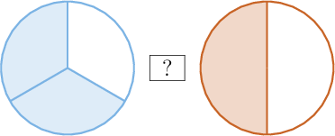
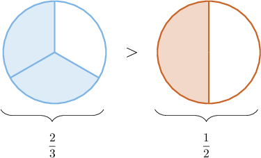
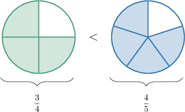
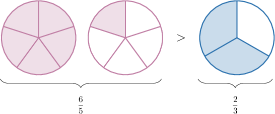
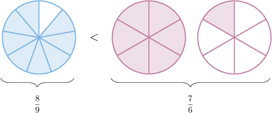

# Comparing Fractions Using Unit Benchmarks

Source: https://www.mathacademy.com/topics/3937?courseId=75
Topic ID: 3937

## Prerequisites

- [Comparing Fractions](https://www.mathacademy.com/topics/comparing-fractions-538)
- [Converting Improper Fractions to Mixed Numbers](https://www.mathacademy.com/topics/converting-improper-fractions-to-mixed-numbers-2359)

## Lesson

### Introduction

We can compare two fractions that are one piece short of a whole by finding which is closer to one whole.

For example, let's determine which inequality symbol ($>$ or $<$) makes the comparison statement below true:

$$
\,\,?\,\,
$$

We'll start by drawing a fraction model:

Now, note the following:

- Both fractions are one piece short of a whole.

- However, since thirds are *smaller* than halves, $\dfrac{2}{3}$ must be *closer* to one whole than $\dfrac{1}{2}.$

- This means that $\dfrac23$ is greater than $\dfrac12.$

Let's add the correct inequality symbol to our diagram.

Therefore, we conclude that

$$
\dfrac{2}{3} > \dfrac{1}{2}.
$$

Determining whether a fraction is greater than or less than $1,$ or which of two fractions is closer to $1,$ is known as **comparing using the benchmark of $1.$**

### Example: Comparing Fractions That Are One Part Short of a Whole

#### Question

$$
\dfrac{3}{4} \,\square \,\dfrac{4}{5}
$$

Using a benchmark of $1,$ determine which symbols could replace the empty box above to make the statement true.

1. $<$

2. $=$

3. $>$

#### Explanation

Notice that the numerator is one less than the denominator for both fractions. In other words, each fraction is one piece short of a whole.

Since fifths are smaller than quarters, $\dfrac{3}{4}$ is further from one whole than $\dfrac{4}{5}.$

This means that $\dfrac34$ is smaller than $\dfrac45{.}$

Therefore, the correct statement is the following:

$$
\dfrac{3}{4} < \dfrac{4}{5}
$$

So, the correct answer is "I only."

### Comparing Proper and Improper Fractions

Comparing proper fractions with improper fractions is straightforward.

In general,

- a proper fraction is *always* smaller than one, and

- an improper fraction is *always* greater than one.

- Therefore, a proper fraction is *always smaller than* an improper fraction.

Let's determine which inequality symbol makes the comparison statement below true:

$$
00
$$

Note the following:

- For the fraction $\dfrac65,$ the numerator $(6)$ is greater than the denominator $(5).$ Therefore, $\dfrac65$ is greater than $1.$

- For the fraction $\dfrac23,$ the numerator $(2)$ is less than the denominator $(3).$ Therefore, $\dfrac23$ is smaller than $1.$

- Since $\dfrac65$ is greater than $1,$ yet $\dfrac23$ is less than $1,$ we conclude that

We can confirm this result using a fraction model:

### Example: Comparing Fractions That Lie Either Side of One

#### Question

$$
\dfrac 89 \,\square \,\dfrac 76
$$

Using a benchmark of $1,$ determine which symbols could replace the empty box above to make the statement true.

1. $>$

2. $=$

3. $<$

#### Explanation

Notice the following:

- For the fraction $\dfrac{8}{9},$ the numerator $(8)$ is ** the denominator $(9).$ It is a proper fraction, so it must be ** $1.$

- For the fraction $\dfrac{7}{6},$ the numerator $(7)$ is ** the denomionator $(6).$ It is an improper fraction, so it must be ** $1.$

Therefore, the correct statement is the following:

$$
\dfrac 8 9 < \dfrac 7 6
$$

We can also deduce this from a fraction model:

So, the correct answer is "III only."

### Example: Comparing Fractions by Converting Them to Mixed Numbers

#### Question

$$
\dfrac 74 \,\square \,\dfrac 8 5
$$

By converting both fractions to mixed numbers, determine which symbols could replace the empty box above to make the statement true.

1. $=$

2. $>$

3. $<$

#### Explanation

First, let's convert our improper fractions to mixed numbers:

- Converting $\dfrac74$ to a mixed number, we get

- Converting $\dfrac85$ to a mixed number, we get

So, the problem statement is now as follows:

$$
1\dfrac34 \,\,\square \,\,1\dfrac35
$$

Since the whole number part is the same for both fractions, we only need to compare the fractional parts.

Now, since $\dfrac34$ is greater than $\dfrac35$ (the numerators are the same, and quarters are larger than fifths), we have that

$$
1\dfrac34 \,\, > \,\,1\dfrac35.
$$

Therefore, the correct statement is

$$
\dfrac74 > \dfrac85.
$$

So, the correct answer is "II only."
