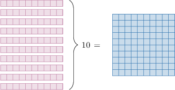
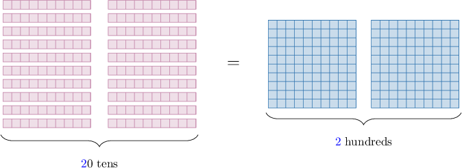

# More on Equivalent Place Value Representations

Source: https://www.mathacademy.com/topics/3941?courseId=75
Topic ID: 3941

## Prerequisites

- [Equivalent Place Value Representations](./3921-equivalent-place-value-representations.md)

## Lesson

### Introduction

In this lesson, we'll expand our understanding of equivalent place values.

In a previous lesson, we saw that

$$

10\,\textrm{tens} = 1\,\textrm{hundreds}.

$$

We can picture this fact using a diagram:

How can we use this to express "$20$ tens" in terms of hundreds?

The first thing to realize is that

$$

20\,\textrm{tens} = 10\,\textrm{tens} + 10\,\textrm{tens}.

$$

Now, since "$10$ tens" is the same as "$1$ hundred", we have

$$

\begin{aligned}20\,tens & =10\,tens+10\,tens \\ & =1\,hundreds+1\,hundreds \\ & =2\,hundreds.\end{aligned}

$$

So, we conclude that

$$

{\color{blue}{2}}0\,\textrm{tens} = {\color{blue}{2}}\,\textrm{hundreds}.

$$

This equivalence can also be expressed using a diagram:

### A Pattern for Dealing With Multiple Tens

Using similar arguments, we're able to create the following pattern:

- ${\color{blue}{1}}0$ tens is equivalent to ${\color{blue}{1}}$ hundred

- ${\color{blue}{2}}0$ tens is equivalent to ${\color{blue}{2}}$ hundreds

- ${\color{blue}{3}}0$ tens is equivalent to ${\color{blue}{3}}$ hundreds

- ${\color{blue}{4}}0$ tens is equivalent to ${\color{blue}{4}}$ hundreds

- ${\color{blue}{5}}0$ tens is equivalent to ${\color{blue}{5}}$ hundreds

- $\vdots$

- ${\color{blue}{9}}0$ tens is equivalent to ${\color{blue}{9}}$ hundreds

By combining this pattern with our understanding of expanded form, we can find more equivalent place value representations.

Let's see an example.

### Example: Expanding a Number With Two Digits in the Tens Place

#### Question

What is "$76$ tens" expressed in terms of hundreds and tens?

#### Explanation

Since $76 = 70 + 6,$ we can write $76$ tens as

$$

70\,\textrm{tens} + 6\,\textrm{tens}.

$$

Now, since $70$ tens is the same as $7$ hundreds, the statement above is equal to

$$

7\,\textrm{hundreds} + 6\,\textrm{tens}.

$$

Therefore, "$76$ tens" is equivalent to "$7$ hundreds and $6$ tens".

### A Pattern for Dealing With Multiple Hundreds

Using similar arguments to what we saw previously, we're able to establish the following pattern for multiple hundreds.

- ${\color{blue}{1}}0$ hundreds is equivalent to ${\color{blue}{1}}$ thousand

- ${\color{blue}{2}}0$ hundreds is equivalent to ${\color{blue}{2}}$ thousands

- ${\color{blue}{3}}0$ hundreds is equivalent to ${\color{blue}{3}}$ thousands

- ${\color{blue}{4}}0$ hundreds is equivalent to ${\color{blue}{4}}$ thousands

- ${\color{blue}{5}}0$ hundreds is equivalent to ${\color{blue}{5}}$ thousands

- $\vdots$

- ${\color{blue}{9}}0$ hundreds is equivalent to ${\color{blue}{9}}$ thousands

Similar patterns exist for multiple thousands, ten-thousands, hundred-thousands, etc.

### Example: Expanding a Number With Two Digits in the Hundreds Place

#### Question

Express "$68$ hundreds" in terms of thousands and hundreds.

#### Explanation

Since $68 = 60 + 8,$ we can write $68$ hundreds as

$$

60\,\textrm{hundreds} + 8\,\textrm{hundreds}.

$$

Now, since $60$ hundreds is the same as $6$ thousands, the statement above is equal to

$$

6\,\textrm{thousands} + 8\,\textrm{hundreds}.

$$

Therefore, "$68$ hundreds" is equivalent to "$6$ thousands and $8$ hundreds".

### Three-Digits in One Place Value

When there are more than two digits in one place value, it's usually easier to use a place value chart to find an equivalent representation.

For example, let's find an equivalent place value representation for "${\color{red}{5}}{\color{blue}{0}}{\color{magenta}{1}}$ hundreds".

We start with its place value chart:

There are three digits in the "hundreds" column. Therefore,

- we move the first digit $({\color{red}{5}})$ *two* places to the *left* (to the "ten-thousands" column), and

- we move the second digit $({\color{blue}{0}})$ *one* place to the *left* (to the "thousands" column).

This gives the following place value chart:

Therefore, "${\color{red}{5}}{\color{blue}{0}}{\color{magenta}{1}}$ hundreds" is equivalent to "${\color{red}{5}}$ ten-thousands and ${\color{magenta}{1}}$ hundred."

### Example: Expanding a Number With Three Digits in One Place Value

#### Question

Express "$947$ tens" in terms of thousands, hundreds, and tens.

#### Explanation

Let's write "${\color{red}{9}}{\color{blue}{4}}{\color{magenta}{7}}$ tens" in a place value chart:

There are three digits in the "tens" column. Therefore,

- we move the first digit $({\color{red}{9}})$ two places to the left (to the "thousands" column), and

- we move the second digit $({\color{blue}{4}})$ one place to the left (to the "hundreds" column).

This gives the following place value chart:

Therefore, "${\color{red}{9}}{\color{blue}{4}}{\color{magenta}{7}}$ tens" is equivalent to "${\color{red}{9}}$ thousands, ${\color{blue}{4}}$ hundreds, and ${\color{magenta}{7}}$ tens."
