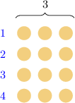
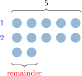
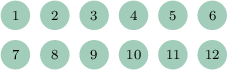
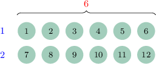
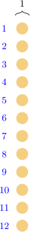
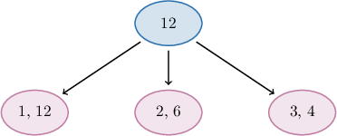

# The Factors of a Number

Source: https://www.mathacademy.com/topics/3942?courseId=75
Topic ID: 3942

## Prerequisites

- [Products and Factors](https://www.mathacademy.com/topics/products-and-factors-122)
- [Understanding Remainders Using Models](https://www.mathacademy.com/topics/understanding-remainders-using-models-3888)

## Lesson

### Introduction

A number is a **factor** of another number if it divides the number with no remainder.

Let's consider some of the factors of $12\mathbin{:}$

- $3$ is a factor of $12$ because $3$ divides $12$ with no remainder:

- However, $5$ is *not* a factor of $12$ because it's *not* possible to group $12$ into $5$s with no remainder:

### Example: Recognizing Factors Using Diagrams

#### Question

Using the diagram above, determine which of the following numbers is a factor of $12.$

1. $5$

2. $6$

3. $8$

#### Explanation

A number is a factor of another number if it divides the number with no remainder.

The rectangular array in the diagram has a length of ${\color{red}{6}},$ a width of ${\color{blue}2},$ and $12$ dots in total.

The diagram tells us that we can group $12$ into $\color{blue}2$ groups of $\color{red}6$ with no remainder. Therefore, $\color{blue}2$ and $\color{red}6$ are factors of $12.$

From the given options, the correct answer is ${\color{red}{6}}.$

### The Factors of a Number Always Include Itself and One

It's important to recognize that the factors of a whole number *always* include the number itself, and $1.$

Let's consider some more factors of $12\mathbin{:}$

- $12$ is a factor of $12$ because $12$ can be grouped into $12$s with no remainder:

- $1$ is a factor of $12$ because $12$ can be grouped into $1$s with no remainder:

### Example: Recognizing Factors

#### Question

Which of the following numbers is a factor of $14?$

1. $4$

2. $5$

3. $7$

#### Explanation

A number is a factor of another number if it divides the number with no remainder.

- Of the given numbers, only $7$ divides $14$ with no remainder.

- The other numbers are ** factors of $14.$ For example, $4$ is ** a factor of $14$ because it's not possible to group $14$ into $4$s with no remainder: Likewise, $5$ is ** a factor of $14$ because it's ** possible to group $14$ into $5$s with no remainder:

Therefore, the correct answer is $7.$

### Factor Pairs

Two numbers form a **factor pair** of another number if they multiply to give that number.

Let's list all of the factor pairs of $12\mathbin{:}$

- $1$ and $12$ is a factor pair of $12$ because $1\times 12 = 12$

- $2$ and $6$ is a factor pair of $12$ because $2\times 6 = 12$

- $3$ and $4$ is a factor pair of $12$ because $3\times 4 = 12$

There are no more factor pairs. So, $12$ has $3$ factor pairs in total.

When counting the number of factor pairs, we should only count each pair once. We do not get another factor pair by swapping the order of the factors. This means that, for example, the factor pair $6$ and $2$ is the *same* as the factor pair $2$ and $6.$

To check whether two numbers form a factor pair of a third number, we multiply them. Let's see an example.

### Example: Recognizing Factor Pairs

#### Question

Which of the following are factor pairs of $20?$

1. $2$ and $10$

2. $3$ and $6$

3. $4$ and $5$

#### Explanation

Two numbers form a factor pair of another number if they multiply to give that number.

For example, $2$ and $3$ is a factor pair of $6$ because $2 \times 3 = 6.$

With that in mind, let's examine each pair:

- $2$ and $10$ is a factor pair of $20$ because

- $3$ and $6$ is ** a factor pair of $20$ because

- $4$ and $5$ is a factor pair of $20$ because

Therefore, the correct answer is "I and III only."

****: The symbol $\neq$ means "not equal to."

### Example: Identifying All Factors of a Number

#### Question

The factors of $18,$ from smallest to largest, are shown in the list below. Find the missing factors.

$\qquad$ $1, \qquad \bbox[3pt,border:solid black 1pt]{\phantom{A}} {\phantom{}}\,, \qquad \bbox[3pt,border:solid black 1pt]{\phantom{A}} {\phantom{}}\,, \qquad 6, \qquad 9, \qquad \bbox[3pt,border:solid black 1pt]{\phantom{A}} {\phantom{}}$

#### Explanation

We can express $18$ as a product of factor pairs as follows:

$$
\begin{aligned}1×18 & =18 \\ 2×9 & =18 \\ 3×6 & =18\end{aligned}
$$

Therefore, the factors of $18$ are

$$
1, \qquad \bbox[3pt,Gainsboro]{\color{blue}2}, \qquad \bbox[3pt,Gainsboro]{\color{blue}3}, \qquad 6, \qquad 9, \qquad \bbox[3pt,Gainsboro]{\color{blue}18}.
$$
