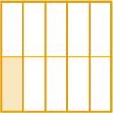

# Writing Unit Fractions in Words

Source: https://www.mathacademy.com/topics/3951?courseId=75
Topic ID: 3951

## Prerequisites

- [The Multiples of a Number](./2206-the-multiples-of-a-number.md)
- [Writing Whole Numbers in Words](./3885-writing-whole-numbers-in-words.md)
- [Modeling Fractions Using Number Lines](./7003-modeling-fractions-using-number-lines.md)

## Lesson

### Introduction

In this lesson, we'll learn how to write fractions in words.

The names of the unit fractions with denominators from one to twenty are listed below.

Note the following:

- $\dfrac14$ is commonly referred to as *"one-quarter."*

- Aside from *"one-whole,"* *"one-half,"* and *"one-third,"* the fraction names follow a pattern, e.g., *"one-fourth, one-fifth, one-sixth, one-seventh,..."*. Understanding this pattern makes it easier to remember.

- **Watch Out!** Don't forget the hyphen!

### A Systematic Way of Writing Fractions in Words

There is a systematic way to write fractions in words. We'll cover some key ideas now, as this will help us later.

Let's consider the following fraction:

$$
\dfrac{\color{red}1}{\color{blue}9}
$$

We write the fraction in words as follows:

- The numerator is ${\color{red}1},$ so we write "one": $\qquad$ "*one*"

- The denominator is ${\color{blue}9},$ so we write "ninth": $\qquad$ "*one ninth*"

- Finally, since there is no hyphen, we place one between the two words: $\qquad$ "*one-ninth*"

Therefore, the fraction $\dfrac{1}{9}$ written in words is *one-ninth.*

### Example: Expressing Unit Fractions With Denominators Between 2 and 19 in Words

#### Question

Write the fraction $\dfrac{1}{14}$ in words.

#### Explanation

Let's write the fraction $\dfrac{\color{red}1}{\color{blue}14}$ in words:

- The numerator is ${\color{red}1},$ so we write "one": $\qquad$ "**"

- The denominator is ${\color{blue}14},$ so we write "fourteenth": $\qquad$ "**"

- Finally, since there is no hyphen, we place one between the two words: $\qquad$ "**"

Therefore, the fraction $\dfrac{1}{14}$ written in words is **

### Example: Expressing Unit Fractions With Denominators Between 2 and 19 in Words Given a Model

#### Question

#### Explanation

There are ${\color{blue}10}$ parts of the shape in total, and ${\color{red}1}$ part is shaded. So, the fraction model shows $\dfrac{\color{red}1}{\color{blue}10},$ which we write in words as follows:

- The numerator is ${\color{red}1},$ so we write "one": $\qquad$ "**"

- The denominator is ${\color{blue}10},$ so we write "tenth": $\qquad$ "**"

- Finally, since there is no hyphen, we place one between the two words: $\qquad$ "**"

Therefore, the fraction $\dfrac{1}{10}$ written in words is **

### Denominators From 21 to 99

Unit fractions with denominators from $21$ to $99$ follow a consistent naming pattern (excluding multiples of $10$). To see this pattern clearly, let’s begin with denominators from $21$ to $39$:

**Watch Out!** We have excluded $\dfrac{1}{30}$ from our tables. Fractions whose denominators are multiples of $10$ follow a different pattern. We'll discuss these separately.

The pattern in these tables extends to denominators of $99$ (excluding multiples of ten). For example:

- $\dfrac{1}{52}$ in words is *"one fifty-second."*

- $\dfrac{1}{65}$ in words is *"one sixty-fifth."*

- $\dfrac{1}{88}$ in words is *"one eighty-eighth."*

When writing fractions in words, it's a good idea to approach this systematically. Let's see an example.

### Example: Expressing Unit Fractions With Denominators Between 21 and 99 in Words

#### Question

Write the fraction $\dfrac{1}{73}$ in words.

#### Explanation

Let's write the fraction $\dfrac{\color{red}1}{\color{blue}73}$ in words:

- The numerator is ${\color{red}1},$ so we write "one": $\qquad$ "**"

- The denominator is ${\color{blue}73},$ so we write "seventy-third": $\qquad$ "**"

- Since there is already a hyphen, we do nothing else.

Therefore, the fraction $\dfrac{1}{73}$ written in words is **

### Unit Fractions Whose Denominators are Multiples of Ten

Finally, unit fractions whose denominators are multiples of ten have their own names. We list the most common below:

### Example: Expressing Unit Fractions Whose Denominators are Multiples of Ten

#### Question

Write the fraction $\dfrac{1}{100}$ in words.

#### Explanation

Let's write the fraction $\dfrac{\color{red}1}{\color{blue}100}$ in words:

- The numerator is ${\color{red}1},$ so we write "one": $\qquad$ "**"

- The denominator is ${\color{blue}100},$ so we write "hundredth": $\qquad$ "**"

- Finally, since there is no hyphen, we place one between the two words: $\qquad$ "**"

Therefore, the fraction $\dfrac{1}{100}$ written in words is **
