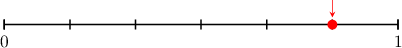

# Writing Fractions in Words

Source: https://www.mathacademy.com/topics/3959?courseId=75
Topic ID: 3959

## Prerequisites

- [Writing Unit Fractions in Words](https://www.mathacademy.com/topics/writing-unit-fractions-in-words-3951)

## Lesson

### Introduction

In this lesson, we'll learn how to write non-unit fractions in words.

For example, let's consider the following fraction:

$$
\dfrac{\color{red}3}{\color{blue}8}
$$

We can use our usual procedure to write this fraction in words:

- The numerator is ${\color{red}3},$ so we write "three": $\qquad$ "*three*"

- The denominator is ${\color{blue}8},$ and since the numerator is greater than $1,$ so we write "eighths" (plural): $\qquad$ "*three eighths*"

- Since there is no hyphen, we place a hyphen in between the two words: $\qquad$ "*three-eighths*"

Therefore, the fraction $\dfrac38$ written in words is *three-eighths.*

### A Second Example

Let's now consider the fraction

$$
\dfrac{\color{red}5}{\color{blue}27}.
$$

We write the fraction in words as follows:

- The numerator is ${\color{red}5},$ so we write "five": $\qquad$ "*five*"

- The denominator is ${\color{blue}27},$ and since the numerator is greater than $1,$ so we write "twenty-sevenths": $\qquad$ "*five twenty-sevenths*"

- Since there is already a hyphen, we do nothing else.

Therefore, the fraction $\dfrac{5}{27}$ written in words is *five twenty-sevenths.*

### Example: Expressing a Fraction With a Denominator Between 1 and 20 in Words

#### Question

Write the fraction $\dfrac{4}{15}$ in words.

#### Explanation

Let's write the fraction $\dfrac{\color{red}4}{\color{blue}15}$ in words:

- The numerator is ${\color{red}4},$ so we write "four": $\qquad$ "**"

- The denominator is ${\color{blue}15}$ and the numerator is greater than $1,$ so we write "fifteenths": $\qquad$ "**"

- Since there is no hyphen, we place a hyphen in between the two words: $\qquad$ "**"

Therefore, the fraction $\dfrac{4}{15}$ written in words is **

### Example: Expressing a Fraction in Words Given a Model

#### Question

In words, which fraction is represented by the model above?

#### Explanation

The line is split into ${\color{blue}6}$ parts, and the number is located ${\color{red}5}$ steps from $0$ (left to right). So, the fraction model shows $\dfrac{\color{red}5}{\color{blue}6},$ which we write in words as follows:

- The numerator is ${\color{red}5},$ so we write "five": $\qquad$ "**"

- The denominator is ${\color{blue}6}$ and the numerator is greater than $1,$ so we write "sixths": $\qquad$ "**"

- Since there is no hyphen, we place a hyphen in between the two words: $\qquad$ "**"

Therefore, the fraction $\dfrac56$ written in words is **

### Example: Expressing a Fraction With a Denominator Greater Than 20 in Words

#### Question

Write the fraction $\dfrac{83}{90}$ in words.

#### Explanation

Let's write the fraction $\dfrac{\color{red}83}{\color{blue}90}$ in words:

- The numerator is ${\color{red}83},$ so we write "eighty-three": $\qquad$ "**"

- The denominator is ${\color{blue}90}$ and the numerator is greater than $1,$ so we write "ninetieths": $\qquad$ "**"

- There is a hyphen, so we do nothing else.

Therefore, the fraction $\dfrac{83}{90}$ written in words is **
